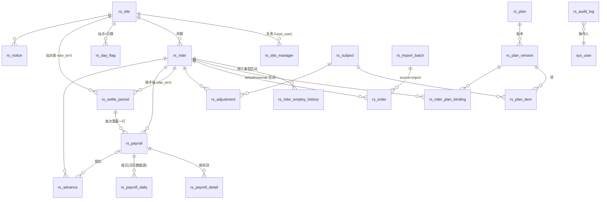
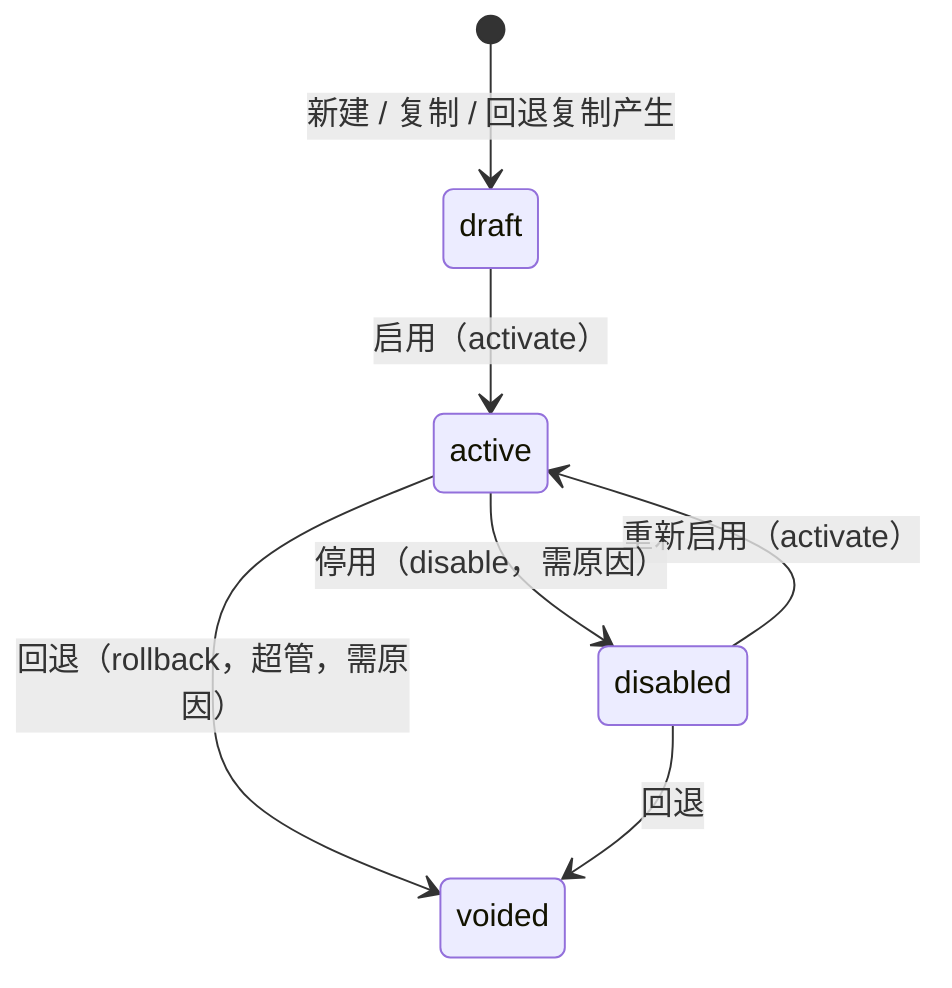
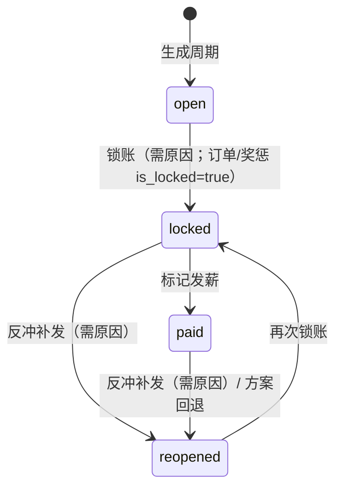
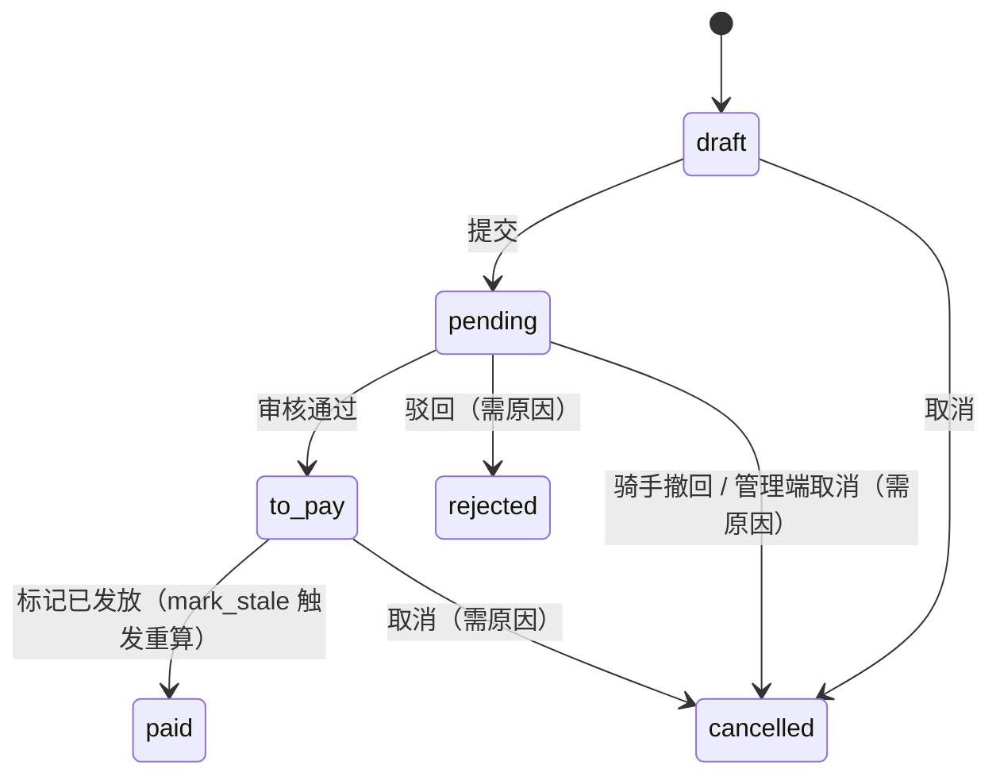

# 04 · 领域模型与术语

> 字段级定义以 `docs/设计/00-架构决策纲要.md` §1 为唯一规格源；本文讲**对象之间怎么关联、状态怎么流转、算薪怎么走**，让新人 10 分钟建立心智模型。类名↔表名↔文件对照见 `03-后端骨架说明.md` §1。

## 1. 一句话模型

> **站点**下有**骑手**；骑手在不同日期区间**绑定**不同的**薪资方案版本**；方案版本由若干**方案项**组成，每项 = 一个**科目** + 触发**条件** + 计算**公式** + 所属**阶段**；**结算周期**把一段日期内的**订单**、**奖惩**、**日标记**喂给引擎，产出**薪资单**及其**明细**/**日汇总**；周期**锁账/发薪**后数据不可变，纠错走**反冲补发**；骑手可申请**预支**，在下次算薪中抵扣。

## 2. 关系图



## 3. 核心概念

### 3.1 主数据

- **站点 `rs_site`**：结算周期类型 `settle_cycle`（半月/月/自定义 `cycle_config.anchor_day`）、站点级预支上限。**数据范围边界**：非超管/薪资管理员只能看 `rs_site_manager` 里自己负责的站点。
- **骑手 `rs_rider`**：`job_no` 工号（也是登录名）、`employ_type` 当前用工类型（**只是快照**，真源是用工历史）、`status` 在职/离职、`user_id` 关联 FBA 账号（可为空 = 未开通 H5）。
- **用工类型历史 `rs_rider_employ_history`**：`[start_date, end_date]` 区间 + `employ_type`，同一骑手不重叠；`end_date=null` 为当前段。新增一段会自动把上一开放段收尾到 `start_date-1`，并同步 `rs_rider.employ_type`（若新段覆盖今天）。算薪按日取类型（`_employ_on`）。
- **科目 `rs_subject`**：薪资构成的「账目名」。`direction` 奖/惩决定金额符号；`fee_mode` 定额/公式；`entry_granularity` 手工录入时按日/按周期。`is_builtin` 内置科目（`BASE_UNIT_PRICE`、`BASE_SALARY`、`COMMISSION`、`GUARANTEE_TOPUP`、`BONUS_*`、`PENALTY_*`…）不可删。

### 3.2 方案

- **方案 `rs_plan`**：命名容器（`name`、`short_name`、`color` 用于日历色带）。
- **方案版本 `rs_plan_version`**：真正被绑定和计算的对象。`version_no` 递增、`status` 状态机（§4.1）、`mode_tag` 模式标签（纯按单/底薪加提成/纯提成/保底加提成/自定义，仅展示与筛选）、`items_hash` 用于判断是否与上一版内容相同、`copied_from_id` 回退/复制来源。
- **方案项 `rs_plan_item`**：`stage`（逐单/按日/按周期）+ `subject_id` + `condition_json` + `formula_json` + `sort_order`。**同阶段按 `sort_order` 顺序执行**，周期阶段引用「本期已计金额」的保底项必须最后。
  - `condition_json`：`{条件:[{字段,运算符,值}], 逻辑:'且'|'或'}`，空 = 无条件。
  - `formula_json.类型`：`固定金额 | 字段乘单价 | 阶梯 | 表达式`。阶梯有 `模式: 全量落档 | 分段累进`，`计价: 固定金额 | 按单价`，档位 `[下限, 上限|null, 值]` 含下不含上。
  - 引擎字段名全中文（`配送距离`、`送达时刻`、`周期有效单量`、`方案期内单量`、`本期已计金额`、`方案生效天数`、`周期天数` …），完整注册表 `engine/fields.py`，前端 `GET /engine/fields`。
- **方案绑定 `rs_rider_plan_binding`**：骑手 × 版本 × `[start_date, end_date]` × `binding_type`。
  - `default`：常规方案；`override`：临时覆盖（活动期等）。
  - 规则：同类型区间不重叠；只能绑 `active` 版本；某一天 override 优先于 default；都没有 → 「无方案」日。
  - **`service/rider_service.py` 模块级函数 `resolve_effective_plans(db, rider_id, start, end)` 是「某天用哪个版本」的唯一真源**（纯函数版 `resolve_effective_plans_from_bindings` 供单测），日历、H5、算薪段解析都 `from ...rider_service import resolve_effective_plans`，不要各自实现。

### 3.3 事实数据

- **订单 `rs_order`**：最小算薪单元。`biz_date` 业务日、`status`（已完成/已取消/异常/退款，只有已完成计「有效单量」）、距离/重量/金额/下单时刻/送达时刻、`source` 导入/补录、`is_locked`。导入走 **导入批次 `rs_import_batch`**（xlsx，`RIDER_SALARY_IMPORT_MAX_ROWS`）。
- **奖惩 `rs_adjustment`**：手工录入的科目金额（按日或按周期），`signed_amount` 由方向决定符号。
- **日标记 `rs_day_flag`**：站点 × 日期的布尔环境（恶劣天气/高温/大促），供条件引用。节假日不在此表，来自 `chinese-calendar`。

### 3.4 结算

- **结算周期 `rs_settle_period`**：`[start_date, end_date]` + `status`（§4.2）。`rider_id=0` 站点级（覆盖全站），`rider_id>0` 骑手级（离职结算等）。**骑手级优先**：站点级算薪/锁账跳过已被骑手级周期覆盖的骑手与日期。
- **薪资单 `rs_payroll`**：骑手 × 周期 × 计算轮次。`kind` 正常/反冲/补发，`status`（§4.3），`stale=true` 表示源数据变过需重算，`gross/deduction_total/advance_deduction/net`，`warnings`（如缺送达时间）。
- **薪资明细 `rs_payroll_detail`**：按科目的金额与 `calc_trace`（命中的项、公式、中间值），`source` 公式/手工/预支抵扣/反冲。
- **日汇总 `rs_payroll_daily`**：按日金额 + 当日方案版本，日历页面直接读它。
- **预支 `rs_advance`**：骑手 H5 发起（创建即 `pending`），管理端审批/发放（§4.4）。`remaining_amount` 剩余待抵扣，算薪时按 cap 扣减；**draft 薪资单重算前必须先回滚上次抵扣再重扣**。
- **公告 `rs_notice`**、**审计 `rs_audit_log`**（模块/动作/对象/原因/before/after/操作人/trace_id）。

## 4. 状态机

### 4.1 方案版本 `PlanVersionStatus`



- 转移实现：`plan_service.activate`（拒绝 `voided`；要求 ≥1 条项、`trial_passed=true` 且 `trial_hash == items_hash`，即**必须先试算且内容未变**）、`plan_service.disable`（仅 `active` → `disabled`）、`plan_service.copy`（复制为新 `draft`）、`plan_service.delete_version`（仅未使用过的 `draft` 可逻辑删除）。
- 回退在 **`service/rollback_service.py` `rollback`**：原版本置 `voided` + `voided_time`，同时复制出一个新 `draft` 并返回其 Detail（含 id）；把受影响周期置 `reopened` 并解除 `is_locked`；存在 `paid` 薪资单时 `confirm_text` 必须为「确认回退」。未启用过的 `draft` 不允许回退（提示直接删除）。
- 只有 `draft` 可编辑项；`active` 才可被绑定；被算薪使用过的版本（`is_used`）不可删。

### 4.2 结算周期 `PeriodStatus`



- 合法转移表在 `period_service._ALLOWED_TRANSITIONS`（5 条，如上）。**没有「解锁回 open」**：锁错了只能走反冲补发到 `reopened`。只有 `open` 且**尚无任何薪资结果**的周期可删除。
- `locked/paid` 期间对该范围的订单、奖惩、绑定、日标记、用工历史写操作一律 403（`assert_not_locked`）；`reopened` 会解除 `is_locked` 允许纠错。
- 反冲：对 `paid` 薪资单生成 `kind=reversal` 负数薪资单，再算 `supplement`。

### 4.3 薪资单 `PayrollStatus`

`draft`（可重算、可 stale）→ `finalized`（锁账时定稿）→ `paid`（发薪）；`voided` 作废。`stale` 只对 `draft` 有意义。

### 4.4 预支 `AdvanceStatus`



- 合法转移表在 `advance_service` 顶部（7 条，如上）；非法转移 → 400「预支单当前状态为 X，不允许执行 Y」。在途状态 `IN_FLIGHT_STATUSES = {pending, to_pay}`。
- `draft` 只存在于枚举与转移表中：H5 提交（`crud/advance.py create`）直接落 `pending`，当前没有产生 `draft` 行的入口。

- 同一骑手同时只能有一张在途单（pending/to_pay）；额度 = 骑手级 > 站点级 > 全局 `RIDER_SALARY_ADVANCE_LIMIT_DEFAULT`。
- `deduct_status` 未抵扣/部分/已抵扣 随算薪更新。

## 5. 算薪流水线（`engine/` + `service/calc_service.py`）

```
resolve_segments(rider, period)            # 按绑定切成若干 [start,end] × 版本 段（含无方案段）
for 每段:
  ctx = CalcInput(订单, 奖惩, 日标记, 用工历史, 段内 items)
  per_order 阶段: 对每笔有效订单，按 sort_order 逐项 (条件 → 公式) 累加到科目
  daily     阶段: 对每天，字段如 日有效单量/日逐单金额 可用
  period    阶段: 对整段，字段如 周期有效单量/方案期内单量/本期已计金额/方案生效天数/周期天数 可用
合并各段 → 加手工奖惩 → 预支抵扣（cap=应发） → gross / deduction / net → 写 payroll + detail + daily
```

- `run_calc_pipeline(CalcInput) -> CalcResult` 是纯函数，可脱离数据库单测。
- 试算 `trial_rider_range(forced_plan_version=...)` 不落库；`RIDER_SALARY_TRIAL_MAX_ORDERS` 限制订单数。
- 单量口径（纲要 §10 #26–#31）：`周期有效单量` = 结算周期内已完成单；`方案期内单量` = 该方案段内已完成单；跨段方案分别计算再合并。
- 时段字段以 Asia/Shanghai 取时分。

## 6. 权限与角色

| 角色 | 数据范围 | 能做什么 |
|---|---|---|
| 超级管理员（FBA `is_superuser`） | 全部 | 一切，含 `rs:plan:rollback` |
| 薪资管理员 92001 | 全部站点 | 全部菜单与按钮，不含回退 |
| 站点负责人 92002 / 副负责人 92003 | `rs_site_manager` 中的站点 | 骑手（不含开户）、订单、奖惩、日标记、周期（不含反冲）、日历、预支、公告、日志；科目/方案只读 |
| 骑手 92004 | 本人 | 仅 H5 `/me/*`，不绑任何管理菜单 |

权限码格式 `rs:<module>:<action>`，全表见 `03-后端骨架说明.md` §5 与 `init.sql`。

## 7. 术语表（中 ↔ 英 ↔ 代码）

| 中文 | 英文/代码 | 说明 |
|---|---|---|
| 站点 | site `rs_site` | 配送站 |
| 骑手 | rider `rs_rider` | 工号 `job_no` |
| 用工类型 | employ_type `part_time/full_time` | 兼职/全职 |
| 科目 | subject `rs_subject` | 薪资构成账目 |
| 方案 / 版本 / 项 | plan / plan_version / plan_item | 容器 / 可计算实体 / 规则 |
| 绑定 | binding `default/override` | 骑手在区间内用哪个版本 |
| 阶段 | stage `per_order/daily/period` | 逐单/按日/按周期 |
| 条件 / 公式 | condition_json / formula_json | 中文字段的结构化 JSON |
| 阶梯 | ladder `全量落档/分段累进` | 单量或距离分档 |
| 保底 | guarantee `GUARANTEE_TOPUP` | 应发不足时补差 |
| 结算周期 | settle period `rs_settle_period` | 站点级 rider_id=0 |
| 锁账 / 发薪 / 反冲 / 补发 | lock / mark-paid / reversal / supplement | 周期与薪资单动作 |
| 薪资单 / 明细 / 日汇总 | payroll / detail / daily | 结果三表 |
| 重算标记 | stale | 源数据变更后 draft 薪资单需重算 |
| 预支 | advance `rs_advance` | 骑手借支，算薪抵扣 |
| 日标记 | day flag `rs_day_flag` | 天气/高温/大促 |
| 有效单量 | valid order count | `status=completed` 的订单数 |
| 审计 | audit `rs_audit_log` | 写操作留痕 |
| 可见站点 | visible site ids | 数据范围过滤结果，`None`=全部 |
