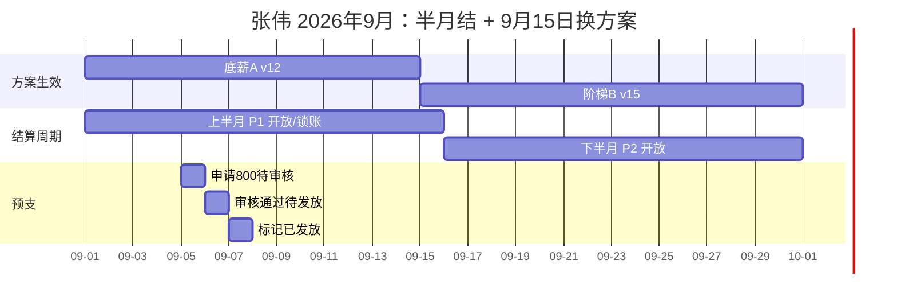
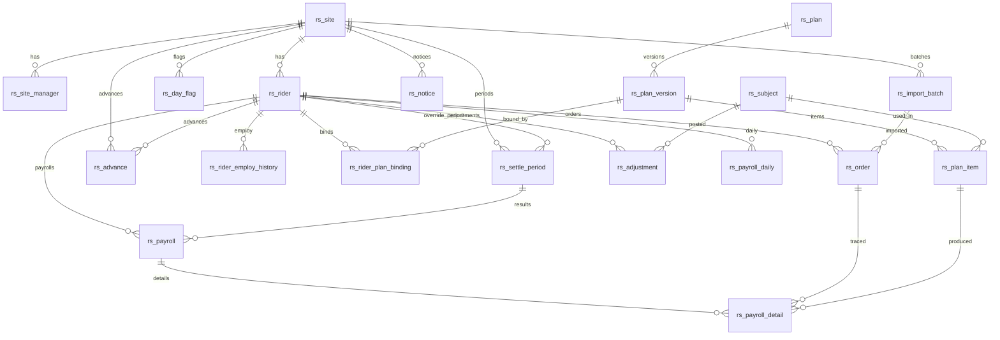
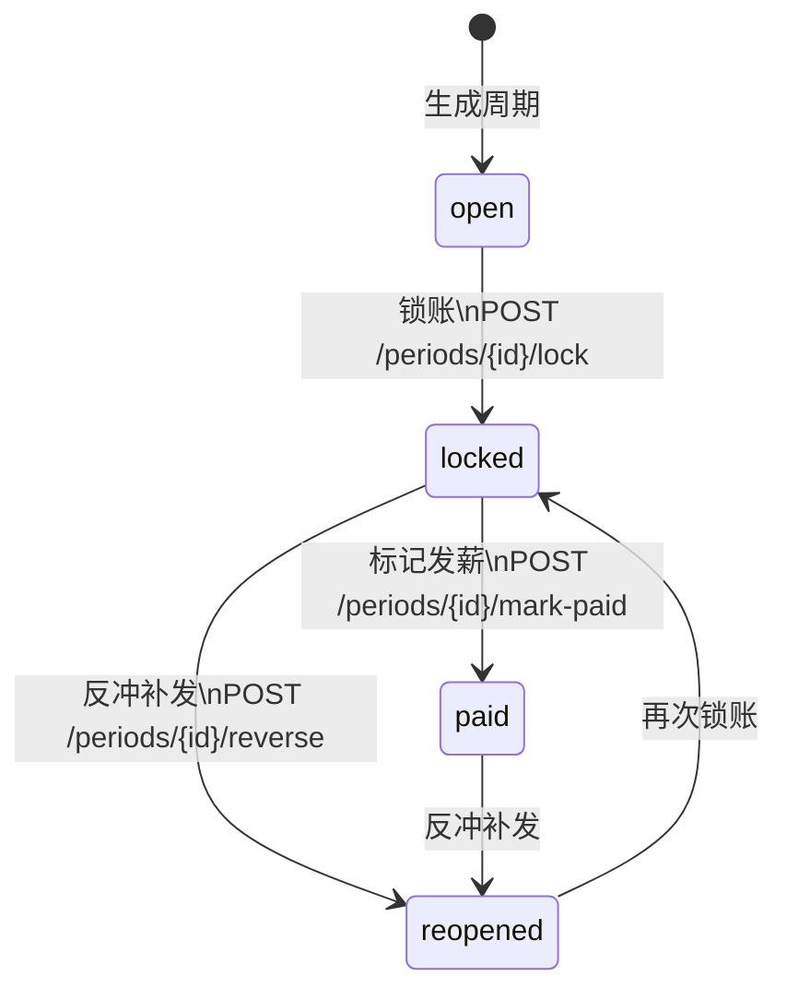
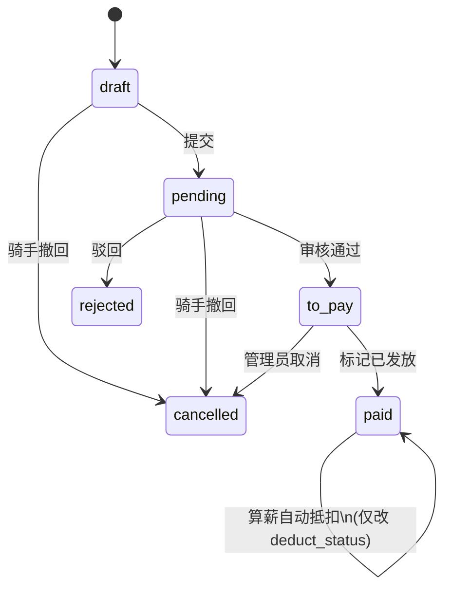
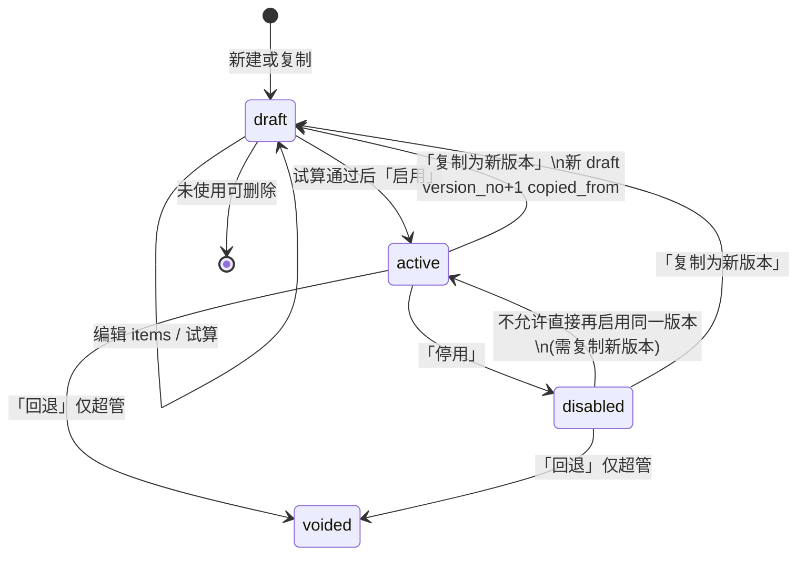
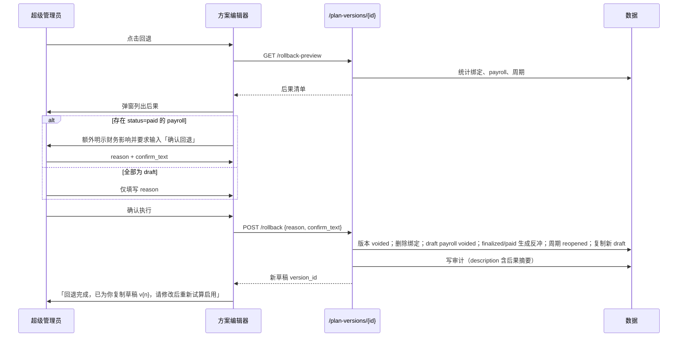

# 骑手薪资管理平台 · 产品方案

> **规格关系**：本文是对《00-架构决策纲要》的产品级展开，供产品/研发/测试直接使用。对象模型、状态机、公式引擎、流水线、权限与接口路径以纲要为准，本文不推翻任何已拍板决策。若发现纲要内部矛盾或未决项，仅收录于文末「附录 C：待架构师确认的问题」。
>
> **技术底座（摘自纲要，产品侧约束）**：后端插件 `backend/plugin/rider_salary`，接口前缀 `/api/v1/rider-salary`；前端插件 `apps/web-antdv-next/src/plugins/rider-salary`；路由前缀 `/rider-salary`，骑手 H5 前缀 `/rider-h5`；表前缀 `rs_`；权限码前缀 `rs:`；菜单目录「骑手薪资」。人可见文本全部中文。平台**只算薪、展示、导出**，不做打款与税务。
>
> **金额与精度**：金额 `Numeric(12,2)`；距离公里 `Numeric(8,2)`；重量斤 `Numeric(8,2)`；单价 `Numeric(10,4)`；计薪按项 `ROUND_HALF_UP` 到 2 位后再汇总。

---

## 1. 产品定位与核心流程（从导入订单明细到锁账导出）

### 1.1 一句话定位

面向国内即时配送站点的骑手薪资管理平台：以**订单明细**为最小算薪单元，用**公式引擎**配置差异化计薪方案（可按日期切换），叠加**手工奖惩科目**与**预支抵扣**，按站点/骑手结算周期产出应发、代扣、实发，支持锁账、反冲补发、受控回退与骑手 H5 预支；历史结果必须可复现。

### 1.2 用户角色

| 角色 | FBA/权限标识 | 数据范围 | 产品职责（摘要） |
|---|---|---|---|
| 超级管理员 | FBA 内置 superuser | 全部站点 | 全部业务 + **唯一**可执行方案回退（`rs:plan:rollback`） |
| 薪资管理员 | 角色 `rs_admin` | 全部站点 | 全部业务操作，**无回退入口** |
| 站点负责人 | 角色 `rs_site_owner`，`rs_site_manager.role=owner` | 仅本站点（每站 owner 至多 1 个） | 本站导入/纠错、奖惩、日标记、算薪、日历、预支审核、公告、骑手档案；**不含开通账号** |
| 副负责人 | 角色 `rs_site_deputy`，`rs_site_manager.role=deputy` | 仅本站点 | 与负责人相同 |
| 骑手 | 角色 `rs_rider` | 仅本人（`/me/*`） | H5 看日历/方案/预计工资/奖惩/公告，提交与撤回预支 |

预支审核推送对象 = 该骑手所属站点的全部 `owner` + `deputy`；超级管理员与薪资管理员可处理所有站点。站点数据范围在 Service 层过滤：`可见站点(user) = 全部（超管/rs_admin）| rs_site_manager 中的 site_id`。

### 1.3 端到端主流程

主链路固定为：**建站点与骑手 → 定义科目 → 配置方案并试算启用 → 绑定方案 → 导入订单明细 → 录入奖惩/日标记 → 算薪 → 日历核对 → 锁账 → 导出**。预支申请、审核、标记发放与发薪抵扣**贯穿**算薪与导出，不插入为串行步骤。

```mermaid
flowchart TD
  A[建站点与骑手<br/>POST /sites /riders] --> B[定义科目<br/>GET/POST /subjects]
  B --> C[配置方案项 + 强制试算 + 启用<br/>/plan-versions /trial /activate]
  C --> D[绑定默认/覆盖方案<br/>/riders/{id}/bindings]
  D --> E[导入或补录订单明细<br/>/orders/import /orders]
  E --> F[录入奖惩 + 日标记<br/>/adjustments /day-flags]
  F --> G[生成周期并算薪<br/>/periods/generate /calculate]
  G --> H[日历核对<br/>/calendar/{rider_id}]
  H --> I{存在 stale 或无方案日?}
  I -->|是：改数据后重算| F
  I -->|否| J[锁账<br/>POST /periods/{id}/lock]
  J --> K[标记发薪可选<br/>/mark-paid]
  K --> L[导出薪资 xlsx<br/>GET /periods/{id}/export]
  P1[骑手提交预支<br/>POST /me/advances] --> P2[站点负责人审核<br/>/advances/{id}/approve]
  P2 --> P3[管理员标记已发放<br/>/mark-paid]
  P3 -.->|算薪时按 remaining 抵扣| G
  L -.->|预支明细另导| P4[GET /advances/export]
```

#### 1.3.1 各步触发者、前置条件与失败文案

| 步骤 | 触发者 | 前置条件 | 成功后写什么 | 失败提示（原文） |
|---|---|---|---|---|
| 建站点 | 超管/薪资管理员 | `code` 唯一 | `rs_site` | 「站点编码已存在」 |
| 配负责人 | 同上 | 每站 `owner`≤1；`(site_id,user_id)` 唯一 | `rs_site_manager` | 「该站点已存在负责人，请先调整原负责人」 / 「该用户已是本站管理人员」 |
| 建骑手 | 超管/薪资管理员/本站负责人 | `job_no` 唯一；`site_id` 存在且启用 | `rs_rider` + 首条用工历史 | 「工号已存在」 / 「所属站点不存在或已停用」 |
| 开通账号 | 仅超管/薪资管理员 | `user_id` 为空；骑手在职 | 创建 FBA `sys_user`（username=工号），绑定角色 `rs_rider`，回写 `user_id` | 「该骑手已开通账号」 / 「离职骑手不能开通账号」 |
| 定义科目 | 超管/薪资管理员 | `code` 唯一 | `rs_subject` | 「科目编码已存在」 |
| 保存方案项 | 超管/薪资管理员 | 版本 `status=draft` 且 `is_used=false`；字段与阶段匹配；阶梯档位合法 | `rs_plan_item` + 编译 `condition_expr`/`formula_expr` | 见 §3 / §8 |
| 试算 | 同上 | items 非空；指定骑手与日期或 `order_ids` | 内存跑流水线不落库；回写 `trial_hash`/`trial_snapshot`/`trial_passed` | 「试算区间内没有可用订单，请更换骑手或日期」 |
| 启用版本 | 同上 | `trial_passed=true` 且 `trial_hash==当前 items 哈希` | `status=active`，写 `activated_time` | 「方案内容已变更，请重新试算」 / 「请先完成试算再启用」 |
| 绑定方案 | 超管/薪资管理员/本站负责人 | 版本 `status=active`；override 必填两端；同类型区间不重叠 | `rs_rider_plan_binding` | 「只能绑定已启用的方案版本」 / 「该区间与已有覆盖绑定重叠」 / 「该区间与已有默认绑定重叠」 / 「结束日期不能早于开始日期」 |
| 导入订单 | 超管/薪资管理员/本站负责人 | 文件为 xlsx/csv；表头匹配模板 | `rs_order` + `rs_import_batch`；受影响 draft payroll `stale=true` | 行级中文原因，见 §8；整批事务默认不留半成品 |
| 纠错/补录 | 同上 | 目标日所属周期未锁；纠错/删除必填 `reason` | 更新订单并 `mark_stale` | 「请填写修改原因」 / 「所属周期已锁账，请走反冲补发后再调整」 |
| 录入奖惩 | 同上 | 科目启用；金额规则见科目；`remark` 必填 | `rs_adjustment`；`mark_stale` | 「请填写备注」 / 「上期补差以外的科目金额必须大于 0」 |
| 日标记 | 同上 | 按站点×月批量 | `rs_day_flag` 唯一 `(site_id,biz_date)`；`mark_stale` | 「不能为已锁账日期修改日标记」 |
| 生成周期 | 同上 | 站点/骑手周期配置有效 | `rs_settle_period` 按需生成 | 「该区间周期已存在」 |
| 算薪 | 同上 | 周期 `open` 或 `reopened`；目标 payroll 为 `draft` | 写 `rs_payroll`/`detail`/`daily`；`calc_version+1`；`stale=false` | 「已定稿结果不可重算，请走反冲补发」 |
| 日历核对 | 有 `rs:calendar:view` | 选站点+骑手+月 | 只读 | 无方案日格显示警示，见 §5 |
| 锁账 | 超管/薪资管理员/本站负责人 | 必填 `reason`；所有 draft payroll `stale=false` | 周期 `locked`；订单/奖惩 `is_locked=true`；payroll `draft→finalized`；方案版本 `is_used=true` | 「请填写锁账原因」 / 「存在需重算的薪资结果，请先重算」 |
| 标记发薪 | 同上 | 周期已 `locked` | `status=paid`（**不打款**） | 「仅已锁账周期可标记发薪」 |
| 导出 | 有 `rs:period:export` | 周期已算过或允许空表 | xlsx 三表：汇总/明细/奖惩 | 「当前周期还没有薪资结果，请先算薪」 |
| 预支提交 | 骑手本人 | 在职；无进行中单；金额≤上限 | `rs_advance` `draft→pending` | 见 §8 |
| 预支审核 | 本站 owner/deputy、薪资管理员、超管 | `pending` | `to_pay` 或 `rejected` | 「该申请不在待审核状态」 / 「无权审核其他站点的预支申请」 |

### 1.4 主流程示例数据（贯穿后文）

| 对象 | 字段 | 示例值 |
|---|---|---|
| 站点 | code / name / settle_cycle | `CHA001` / 朝阳一站 / `half_month`（§1.5 时间线）或 `month`（§4.3 算例） |
| 站点预支上限 | advance_limit | `3000.00`（空则用全局 `RIDER_SALARY_ADVANCE_LIMIT_DEFAULT=3000`） |
| 骑手 | job_no / name / employ_type | `RS20260018` / 张伟 / `full_time` |
| 入职 | hire_date | `2025-03-01` |
| 骑手预支上限 | advance_limit | `空`（跟随站点 3000） |
| 方案 A | code / name / short_name / color | `PLAN_BASE_A` / 全职底薪加提成 / 底薪A / `#1677ff` |
| 方案 A 版本 | version_no / id / mode_tag | `3` / `12` / 底薪加提成 |
| 方案 B | code / name / short_name / color | `PLAN_TIER_B` / 旺季单量阶梯 / 阶梯B / `#fa8c16` |
| 方案 B 版本 | version_no / id / mode_tag | `1` / `15` / 单量阶梯 |
| 默认绑定 | binding_type / 区间 / 版本 | `default` / 2026-01-01 ~ 空 / 版本 12 |
| 覆盖绑定 | binding_type / 区间 / 版本 | `override` / 2026-09-15 ~ 2026-09-30 / 版本 15 |
| 预支单 | amount / status / remaining | `800.00` / `paid` / 先 800 后随算薪抵扣 |

用工类型变化**不**自动改方案；9 月张伟保持全职，引擎字段「用工类型」按日取自 `rs_rider_employ_history`。

### 1.5 「月中换方案 + 半月结」示例时间线

**场景**：朝阳一站 `settle_cycle=half_month`，`cycle_config` 固定为每月 1–15 / 16–月末。张伟 9 月 15 日起覆盖绑定切换到阶梯B。预支在上半月已发放，于上半月算薪时抵扣。



#### 1.5.1 日历上的关键日期

| 日期 | 事件 | 当日生效方案 | 所属周期 | 当日有效单量 | 产品可见结果 |
|---|---|---|---|---|---|
| 2026-09-01 | P1 生成（首次算薪或手动生成）；全勤奖挂在周期首日 | 底薪A v12 | P1 `09-01~09-15` | 22 | 色带「底薪A」起始 |
| 2026-09-05 | 张伟 H5 提交预支 800，原因「房租」 | 底薪A v12 | P1 | 19 | 工作台「待审核预支 +1」 |
| 2026-09-06 | 负责人审核通过 | 底薪A v12 | P1 | 21 | 状态 `to_pay` |
| 2026-09-07 | 管理员导出预支明细并标记已发放 | 底薪A v12 | P1 | 20 | `paid`，`remaining_amount=800` |
| 2026-09-08 | 录入超时扣罚 50 | 底薪A v12 | P1 | 18 | 日历格净额变红 |
| 2026-09-14 | 底薪A 最后一天；色带在 14/15 交界断开 | 底薪A v12 | P1 | 24 | 色带右端收住 |
| 2026-09-15 | 覆盖绑定生效；P1 最后一天；阶梯B 只覆盖 1 天 | 阶梯B v15 | P1 | 20 | 新色带「阶梯B」左端出现 |
| 2026-09-16 | P2 开始，仍为阶梯B | 阶梯B v15 | P2 `09-16~09-30` | 28 | 色带跨周续接，不换色 |
| 2026-09-20 | 录入好评奖 80 | 阶梯B v15 | P2 | 31 | |
| 2026-09-30 | P2 结束；保险费代扣 120 记在当日 | 阶梯B v15 | P2 | 26 | |
| 2026-10-01 | 覆盖绑定结束，次日回到默认底薪A | 底薪A v12 | 10 月上半月 | — | 色带换回蓝 |

#### 1.5.2 两期数字（配置见 §3.6；计算规则见 §4）

**方案配置摘要**（与 §4.3 月结算例同一套项，仅周期长度不同）：

- 底薪A v12：逐单「基础单价」4 元/有效单；逐单「夜间补贴」送达时刻在 `22:00–06:00` 加 2 元；周期「底薪」表达式 `2000 * 方案生效天数 / 周期天数`。
- 阶梯B v15：周期「提成」，阶梯字段=`方案期内单量`，模式=`全量落档`，计价=`按单价`，档位 `0–300 → 5` / `300–600 → 5.5` / `600+ → 6`。

**上半月 P1（2026-09-01~09-15，周期天数=15）**

| 段 | 日期 | 有效单量 | 夜间单 | 逐单基础 | 夜间 | 周期项 | 小计（公式） |
|---|---|---|---|---|---|---|---|
| 底薪A v12 | 09-01~09-14 | 280 | 18 | 280×4=1120.00 | 18×2=36.00 | 底薪 `2000×14/15=1866.67` | 3022.67 |
| 阶梯B v15 | 09-15 | 20 | — | 0（无逐单项） | 0 | 方案期内单量 20 落在 0–300 档，20×5=100.00 | 100.00 |
| 手工 | 09-01 全勤奖 +200.00；09-08 超时 −50.00 | | | | | | +150.00 |
| 应发 gross | | | | | | | 3272.67 |
| 代扣 | 无 | | | | | | 0.00 |
| 预支抵扣 | min(800, 3272.67−0)=800.00，`remaining_amount→0` | | | | | | 800.00 |
| **实发 net** | | | | | | | **2472.67** |

说明：P1 内阶梯B 的「方案期内单量」= **仅 9 月 15 日**的 20 单，不是整月 700 单，也不是 P1 全部 300 单。若误用「周期单量」，则 9 月 15 日这一段会按 300 单×5.5 计 1650 元——试算必须暴露该差异（见 §4.2）。

**下半月 P2（2026-09-16~09-30，周期天数=15）**

| 段 | 有效单量 | 周期项 | 手工 | 应发 | 代扣 | 预支 | 实发 |
|---|---|---|---|---|---|---|---|
| 阶梯B v15 | 400 | 400 落在 300–600 档，400×5.5=2200.00 | 好评奖 +80.00；保险代扣 120.00（不进应发） | 2280.00 | 120.00 | 0（已抵完） | **2160.00** |

**9 月站点视角合计（张伟）**：应发 3272.67+2280.00=**5552.67**；代扣 120.00；预支抵扣 800.00；实发 2472.67+2160.00=**4632.67**。日历顶部汇总按**自然月**跨两个周期相加，并展示两段周期状态（例如 P1=`locked`，P2=`open`）。

#### 1.5.3 与「月结」的差异（避免实施时混用）

同一套绑定在 `settle_cycle=month` 时只有一个周期 `09-01~09-30`（周期天数=30），底薪分摊分母变为 30，阶梯B 的方案期内单量变为 16 天合计 420。完整逐单算例见 §4.3，**不要**把本节半月结数字直接抄进月结测试用例。

---

## 2. 信息架构与核心对象模型

### 2.1 菜单树

#### 2.1.1 管理后台（目录名「骑手薪资」，路由前缀 `/rider-salary`）

```
骑手薪资
├── 工作台                 /rider-salary/dashboard
├── 站点管理               /rider-salary/sites
├── 骑手管理               /rider-salary/riders
├── 科目管理               /rider-salary/subjects
├── 薪资方案               /rider-salary/plans
│     └── 方案编辑器       /rider-salary/plans/:planId/versions/:versionId
├── 订单明细               /rider-salary/orders
│     ├── 导入向导         /rider-salary/orders/import
│     └── 导入批次         /rider-salary/orders/batches
├── 奖惩录入               /rider-salary/adjustments
├── 日标记                 /rider-salary/day-flags
├── 结算周期               /rider-salary/periods
│     └── 薪资结果         /rider-salary/payrolls/:id
├── 薪资日历               /rider-salary/calendar
├── 预支审核               /rider-salary/advances
├── 站点公告               /rider-salary/notices
└── 操作日志               /rider-salary/audit-logs
```

侧栏仅展示当前用户权限码对应的菜单。站点负责人/副负责人看到同一棵树，但列表接口只返回本站数据；无 `rs:plan:rollback` 时方案编辑器不渲染「回退」按钮。

#### 2.1.2 骑手 H5（前缀 `/rider-h5`，独立移动布局）

```
登录                     /rider-h5/login
├── 首页（预计工资+月历） /rider-h5/home
├── 某日详情             /rider-h5/days/:date
├── 当前方案             /rider-h5/plan
├── 奖惩明细             /rider-h5/adjustments
├── 预支申请/记录        /rider-h5/advances
└── 公告                 /rider-h5/notices
```

登录使用管理员开通的 FBA 账号：用户名=工号，初始密码=手机号后 6 位（无手机号则开通时指定）。非骑手账号调用 `/me/*` 返回 403，提示「当前账号不是骑手，无法进入骑手端」。不做自助注册、不做钉钉、不做手机验证码登录。

### 2.2 对象关系图

实体名与纲要表名一致。所有表含 FBA 基类字段 `id`、`created_time`、`updated_time`。



### 2.3 逐表字段说明（含示例值）

下列表格在纲要列基础上增加「示例值」。显示标签一律中文；存储列为英文。

#### 2.3.1 站点 `rs_site`

| 列 | 中文含义 | 类型 | 约束 | 示例值 |
|---|---|---|---|---|
| id | 主键 | FBA 主键 | PK | `1` |
| code | 站点编码 | varchar(32) | 唯一 | `CHA001` |
| name | 站点名称 | varchar(64) | 必填 | `朝阳一站` |
| settle_cycle | 结算周期类型 | enum `half_month` / `month` / `custom` | 默认 `month` | `half_month` |
| cycle_config | 周期配置 | JSON | 半月结固定 1–15 / 16–月末；自定义 `{"anchor_day":26}` 表示 26 日起算到次月 25 日 | `{}` 或 `{"anchor_day":26}` |
| advance_limit | 预支上限（站点级） | Numeric(12,2) | 可空=用全局默认 3000 | `3000.00` |
| dept_id | 关联 FBA 部门 | bigint | 可空，仅映射不依赖 | `null` |
| status | 状态 | 启用 / 停用 | 停用后不可选为新骑手站点 | `启用` |
| remark | 备注 | text | 可空 | `负责朝阳东北角` |
| created_time / updated_time | 创建/更新时间 | datetime | FBA 基类 | `2026-08-01 10:00:00` |

界面：结算周期变更**不自动改写**已生成的 `rs_settle_period`（见 §8 与附录 C）。

#### 2.3.2 站点负责人 `rs_site_manager`

| 列 | 中文含义 | 类型 | 约束 | 示例值 |
|---|---|---|---|---|
| site_id | 站点 | FK | | `1` |
| user_id | FBA 用户 | bigint | 唯一 `(site_id,user_id)` | `88` |
| role | 角色 | enum `owner` / `deputy` | 每站点 `owner` 至多 1 | `owner` |

界面文案：owner 显示「负责人」，deputy 显示「副负责人」。保存冲突：「该站点已存在负责人，请先调整原负责人」。

#### 2.3.3 骑手 `rs_rider`

| 列 | 中文含义 | 类型 | 约束 | 示例值 |
|---|---|---|---|---|
| job_no | 工号 | varchar(32) | 唯一 | `RS20260018` |
| name | 姓名 | varchar(32) | 必填 | `张伟` |
| phone | 手机 | varchar(20) | 可空 | `13800138018` |
| site_id | 所属站点 | FK | 必填 | `1` |
| employ_type | 当前用工类型（快照） | enum `part_time` / `full_time` | 历史见 2.3.4 | `full_time` |
| hire_date | 入职日期 | date | 必填 | `2025-03-01` |
| leave_date | 离职日期 | date | 可空 | `null` |
| status | 状态 | 在职 / 离职 | 离职后禁止预支与对新日期算薪 | `在职` |
| advance_limit | 骑手级预支上限 | Numeric(12,2) | 可空=覆盖站点 | `null` |
| settle_cycle_override | 结算周期覆盖 | 同站点 enum | 可空=跟随站点 | `null` |
| cycle_config_override | 周期配置覆盖 | JSON | 可空 | `null` |
| user_id | 登录账号 | bigint | 可空；开通时绑定 | `9018` |
| remark | 备注 | text | | `夜班为主` |

开通账号：`POST /riders/{id}/open-account`，username=工号，nickname=姓名，初始密码=手机后 6 位或指定。停用：`POST /riders/{id}/disable-account`。重置：`POST /riders/{id}/reset-password`。

#### 2.3.4 用工类型历史 `rs_rider_employ_history`

| 列 | 中文含义 | 类型 | 约束 | 示例值 |
|---|---|---|---|---|
| rider_id | 骑手 | FK | | `18` |
| employ_type | 用工类型 | `part_time` / `full_time` | | `full_time` |
| start_date | 开始日期 | date | | `2025-03-01` |
| end_date | 结束日期 | date | 可空=至今；区间不重叠 | `null` |
| remark | 备注 | text | | `入职即全职` |

**用工类型变化不自动改方案**。引擎字段「用工类型」按 `biz_date` 从此表取值。保存重叠：「用工类型历史区间不能重叠」。

#### 2.3.5 方案绑定 `rs_rider_plan_binding`

| 列 | 中文含义 | 类型 | 约束 | 示例值 |
|---|---|---|---|---|
| rider_id | 骑手 | FK | | `18` |
| plan_version_id | 方案版本 | FK | 只能绑定 `status=active` | `12` |
| binding_type | 绑定类型 | enum `default` / `override` | | `override` |
| start_date | 生效开始 | date | 必填 | `2026-09-15` |
| end_date | 生效结束 | date | default 可空；override 必填 | `2026-09-30` |
| remark | 备注 | text | | `国庆前旺季切换阶梯` |

**某日 d 生效方案**：覆盖 d 的 override（override 之间禁止重叠）→ 否则覆盖 d 的 default（default 之间禁止重叠）→ 都无则「无方案」。无方案日订单记「未计薪-无方案」，日历 `day_status=no_plan`。

#### 2.3.6 科目 `rs_subject`

| 列 | 中文含义 | 类型 | 约束 | 示例值 |
|---|---|---|---|---|
| code | 科目编码 | varchar | 唯一 | `BONUS_FULL_ATTEND` |
| name | 科目名称 | varchar | | `全勤奖` |
| direction | 方向 | enum `bonus` / `penalty` | 奖(+) / 惩(−) | `bonus` |
| fee_mode | 计费方式 | enum `fixed` / `formula` | | `fixed` |
| fixed_amount | 定额金额 | Numeric(12,2) | `fixed` 时录入预填 | `200.00` |
| include_in_gross | 是否参与应发合计 | bool | `false`=仅影响实发 | `true` |
| entry_granularity | 入账粒度 | enum `daily` / `period` / `both` | | `period` |
| scope_sites | 适用站点 | JSON 数组 | 空=全部 | `[]` |
| scope_employ_types | 适用用工类型 | JSON 数组 | 空=全部 | `["full_time"]` |
| is_builtin | 系统内置 | bool | 内置禁止删除 | `true` |
| status | 状态 | 启用/停用 | | `启用` |
| sort_order | 排序 | int | | `10` |
| remark | 备注 | text | | |

删除规则：非内置且**未被任何奖惩记录或方案项引用**方可删除，否则「该科目已被引用（奖惩 N 条、方案项 M 条），不能删除，请停用」。内置科目：「系统内置科目不能删除，请停用」。预置清单见附录 B。「上期补差」`direction=bonus` 但允许负金额，仅系统/管理员可用。

#### 2.3.7 方案 `rs_plan`

| 列 | 中文含义 | 类型 | 约束 | 示例值 |
|---|---|---|---|---|
| code | 方案编码 | varchar | 唯一 | `PLAN_BASE_A` |
| name | 方案名称 | varchar | | `全职底薪加提成` |
| short_name | 色带短名 | varchar | ≤6 字 | `底薪A` |
| color | 色带颜色 | hex | 按方案固定 | `#1677ff` |
| description | 说明 | text | | `全职底薪2000+按单4元+夜间2元` |
| status | 状态 | 启用/停用 | 停用方案不可新建绑定 | `启用` |

短名超长：「方案短名最多 6 个字，用于日历色带展示」。

#### 2.3.8 方案版本 `rs_plan_version`

| 列 | 中文含义 | 类型 | 约束 | 示例值 |
|---|---|---|---|---|
| plan_id | 所属方案 | FK | | `1` |
| version_no | 版本号 | int | 同 plan 内递增 | `3` |
| status | 状态 | enum `draft` / `active` / `disabled` / `voided` | | `active` |
| mode_tag | 计薪模式标签 | 纯按单/底薪加提成/纯提成/保底加提成/自定义 | **仅展示分类，不影响计算** | `底薪加提成` |
| is_used | 是否已被使用 | bool | 首次绑定或出现在薪资明细时置 true，**永不回置** | `true` |
| trial_hash | 试算内容哈希 | varchar | items 的 sha256 | `e3b0c4…` |
| trial_passed | 试算通过 | bool | 启用前须 true | `true` |
| trial_snapshot | 最近试算摘要 | JSON | 见 §3.7 | 见下 |
| copied_from_id | 复制来源 | FK | 可空 | `11` |
| activated_time | 启用时间 | datetime | | `2026-08-20 14:01:00` |
| disabled_time | 停用时间 | datetime | | `null` |
| voided_time | 作废时间 | datetime | | `null` |
| remark | 备注 | text | | |

`trial_snapshot` 示例：`{"rider_id":18,"start":"2026-08-01","end":"2026-08-07","valid_order_count":142,"gross":1980.50,"net":1980.50,"trial_time":"2026-08-20 14:00:12"}`。

**不可变**：`is_used=true` 时对版本及其 `rs_plan_item` 的 UPDATE/DELETE 一律拒绝：「该方案版本已被使用，禁止编辑或删除，请停用后复制为新版本」。允许：停用、复制、回退（仅超管）。`draft` 且未使用可自由编辑删除。

#### 2.3.9 方案项 `rs_plan_item`

| 列 | 中文含义 | 类型 | 说明 | 示例值 |
|---|---|---|---|---|
| plan_version_id | 所属版本 | FK | | `12` |
| subject_id | 科目 | FK | 方向/是否进应发/适用范围来自科目 | 基础单价对应科目 id |
| name | 项名称 | varchar | | `夜间加价` |
| stage | 计算阶段 | enum `per_order` / `daily` / `period` | 逐单 / 按日 / 按周期 | `per_order` |
| sort_order | 执行顺序 | int | 同阶段内按序；周期项可引用「本期已计金额」 | `20` |
| condition_json | 触发条件 | JSON | §3.2 | 见 §3.3 |
| formula_json | 计算公式 | JSON | §3.4 | `{"类型":"固定金额","金额":2}` |
| condition_expr | 编译后条件 | text | 保存时后端编译 | `在时段内(送达时刻, "22:00", "06:00")` |
| formula_expr | 编译后公式 | text | | `2` |
| enabled | 启用 | bool | false 则跳过 | `true` |
| remark | 备注 | text | | |

批量保存：`PUT /plan-versions/{id}/items`。字段与阶段不匹配：「字段「周期单量」在逐单阶段不可用」。

#### 2.3.10 日标记 `rs_day_flag`

| 列 | 中文含义 | 类型 | 约束 | 示例值 |
|---|---|---|---|---|
| site_id | 站点 | FK | 唯一 `(site_id, biz_date)` | `1` |
| biz_date | 业务日期 | date | | `2026-09-12` |
| bad_weather | 恶劣天气 | bool | 引擎「是否恶劣天气」 | `true` |
| high_temp | 高温 | bool | 「是否高温」 | `false` |
| promo | 大促 | bool | 「是否大促」 | `false` |
| remark | 备注 | text | | `暴雨橙色` |

节假日**不**在此表录入，由 `chinese-calendar` 自动判定（含调休）。界面为站点月视图勾选，`GET/PUT /day-flags`。

#### 2.3.11 订单明细 `rs_order`

| 列 | 中文含义 | 类型 | 约束 | 示例值 |
|---|---|---|---|---|
| order_no | 订单号 | varchar | **全局唯一** | `ORD-0901-002` |
| site_id | 站点 | FK | | `1` |
| rider_id | 骑手 | FK | 必须属于该站点 | `18` |
| biz_date | 业务日期 | date | 送达时间的日期；无送达时间则下单时间的日期 | `2026-09-01` |
| distance_km | 配送距离(公里) | Numeric(8,2) | ≥0 | `7.20` |
| weight_jin | 商品重量(斤) | Numeric(8,2) | ≥0 | `12.00` |
| order_time | 下单时间 | datetime | | `2026-09-01 21:50:00` |
| deliver_time | 送达时间 | datetime | 可空 | `2026-09-01 22:18:00` |
| status | 订单状态 | enum `completed` / `cancelled` / `abnormal` / `refunded` | 显示：已完成/已取消/配送异常/已退款 | `completed` |
| amount | 订单金额 | Numeric(12,2) | 可空，供大额订单奖条件 | `45.00` |
| source | 来源 | enum `import` / `manual` | | `import` |
| import_batch_id | 导入批次 | FK | 可空 | `66` |
| is_locked | 已锁账 | bool | 周期锁账时置 true | `false` |
| remark | 备注 | text | | |

**有效计薪订单** = `status=completed`。不保存路径轨迹。纠错 `PUT /orders/{id}` 必填 `reason`，写审计 before/after，`mark_stale`。界面状态中文：已完成 / 已取消 / 配送异常 / 已退款。

#### 2.3.12 导入批次 `rs_import_batch`

| 列 | 中文含义 | 类型 | 约束 | 示例值 |
|---|---|---|---|---|
| site_id | 站点 | FK | | `1` |
| file_name | 文件名 | varchar | | `朝阳一站-9月上半月.xlsx` |
| total_rows | 总行数 | int | | `320` |
| success_rows | 成功行 | int | | `320` |
| failed_rows | 失败行 | int | | `0` |
| status | 状态 | 处理中 / 成功 / 部分失败 / 失败 | | `成功` |
| date_from / date_to | 本批覆盖业务日期范围 | date | 用于「未导入日」判定 | `2026-09-01` / `2026-09-15` |
| error_report | 错误报告 | JSON | 行号+中文原因 | `[]` |
| operator_id | 操作人 | bigint | | `88` |
| remark | 备注 | text | | |

**未导入日**：站点在该日期无任何批次覆盖且无任何订单（含补录）。**无数据日**：有覆盖但该骑手 0 单。

导入模板中文表头（固定顺序）：站点编码、骑手工号、订单号、配送距离(公里)、商品重量(斤)、下单时间、送达时间、订单状态、订单金额、备注。时间格式 `YYYY-MM-DD HH:MM:SS`。订单状态填中文或英文码，后端归一：已完成/`completed`、已取消/`cancelled`、配送异常/`abnormal`、已退款/`refunded`。

默认「整批事务」（全部合法才入库）；可选参数「跳过错误行」。`auto_recalc=true` 时 BackgroundTasks 重算受影响 draft。

#### 2.3.13 奖惩记录 `rs_adjustment`

| 列 | 中文含义 | 类型 | 约束 | 示例值 |
|---|---|---|---|---|
| rider_id | 骑手 | FK | | `18` |
| site_id | 站点快照 | FK | 录入时写入 | `1` |
| biz_date | 业务日期 | date | 周期科目默认周期首日 | `2026-09-08` |
| subject_id | 科目 | FK | | 超时科目 id |
| amount | 金额 | Numeric(12,2) | 正数；符号由科目方向决定；「上期补差」允许负数 | `50.00` |
| signed_amount | 带符号金额 | 计算列 | 奖为正、惩为负 | `-50.00` |
| remark | 备注 | text | **必填** | `顾客投诉送达超时 18 分钟` |
| period_id | 所属周期 | FK | 算薪时回填 | `201` |
| is_locked | 已锁账 | bool | | `false` |
| operator_id | 录入人 | bigint | | `88` |

录入粒度：骑手 + 日期 + 科目 + 金额 + 备注，一条一行。奖与惩**同一页面、同一结构**。按周期入账的科目，`biz_date` 取周期内任意日（默认周期首日），日历按该日展示。

#### 2.3.14 结算周期 `rs_settle_period`

| 列 | 中文含义 | 类型 | 说明 | 示例值 |
|---|---|---|---|---|
| site_id | 站点 | FK | | `1` |
| rider_id | 骑手 | FK | 可空；非空=该骑手个性化周期 | `null` 或 `18` |
| cycle_type | 周期类型 | 同 settle_cycle | | `half_month` |
| start_date / end_date | 区间 | date | 唯一 `(site_id, rider_id, start_date)` | `2026-09-01` / `2026-09-15` |
| status | 状态 | enum `open` / `locked` / `paid` / `reopened` | 开放/已锁账/已发薪/补发中 | `open` |
| locked_by / locked_time | 锁账 | | | |
| paid_by / paid_time | 发薪标记 | **不涉及付款** | | |
| reopened_by / reopened_time | 反冲补发 | | | |
| remark | 备注 | text | | |

周期按需生成（首次算薪或 `POST /periods/generate`）。骑手若有周期覆盖，结果归入 rider 级周期，站点级周期算薪时**跳过**该骑手。

**周期状态机**



- 锁账：周期内 `rs_order`/`rs_adjustment` 的 `is_locked=true`；`rs_payroll` `draft→finalized`；引用的方案版本 `is_used=true`。
- 反冲补发（locked/paid → reopened）：为每个 finalized/paid 的 payroll 生成 `kind=reversal` 镜像负单；原单 `reversed=true`；解除 `is_locked`；此后重算生成 `kind=supplement` 补发单（全额重算）。导出展示 原单 / 反冲 / 补发 三行与净差。**不提供「直接解锁」**。
- `paid` 只是标记。

空周期允许锁账（无 payroll）。存在 `stale` payroll 则拒绝锁账并列出骑手工号。

#### 2.3.15 薪资结果 `rs_payroll`

| 列 | 中文含义 | 类型 | 示例值 |
|---|---|---|---|
| period_id / rider_id | 周期 / 骑手 | FK | `201` / `18` |
| kind | 类型 | enum `normal` / `reversal` / `supplement` | `normal` |
| status | 状态 | enum `draft` / `finalized` / `paid` / `voided` | `draft` |
| calc_version | 计算轮次 | int，每次重算 +1 | `3` |
| stale | 需重算 | bool | `false` |
| order_count | 单量 | int | `320` |
| valid_order_count | 有效单量 | int | `300` |
| per_order_total | 逐单项合计 | Numeric(12,2) | `1156.00` |
| daily_total | 按日项合计 | Numeric(12,2) | `0.00` |
| period_total | 周期项合计 | Numeric(12,2) | `1966.67` |
| bonus_total | 手工奖合计（进应发） | Numeric(12,2) | `200.00` |
| penalty_total | 手工惩合计（进应发） | Numeric(12,2) | `-50.00` |
| gross | 应发 = Σ(include_in_gross 明细) | Numeric(12,2) | `3272.67` |
| deduction_total | 代扣 = Σ(不进应发且方向为惩的绝对值) | Numeric(12,2) | `0.00` |
| advance_deduction | 预支抵扣 | Numeric(12,2) | `800.00` |
| net | 实发 = gross − deduction_total − advance_deduction | Numeric(12,2) | `2472.67` |
| plan_version_ids | 本期使用的方案版本 | JSON | `[12,15]` |
| reversed_of_id | 反冲对象 | FK | kind=reversal 时指向原单 |
| calc_time / calc_by | 计算时间/人 | | |

**不可变**：`finalized`/`paid`/`voided` 的 payroll 与其明细只读。重算只在 `draft` 上覆盖（删旧明细、写新明细、`calc_version+1`）。拒绝重算：「已定稿结果不可重算，请走反冲补发」。

纲要流水线还提到 `warnings` 与原单 `reversed` 布尔，字段落表方式见附录 C。产品行为仍按纲要：无方案日写入 warnings；反冲后原单 `reversed=true`。

#### 2.3.16 薪资明细 `rs_payroll_detail`

| 列 | 中文含义 | 类型 | 示例值 |
|---|---|---|---|
| payroll_id | 薪资结果 | FK | `5001` |
| rider_id | 骑手 | FK | `18` |
| biz_date | 业务日期 | date，周期项可空 | `2026-09-01` |
| stage | 阶段 | `per_order` / `daily` / `period` | `per_order` |
| plan_version_id | 方案版本 | 可空 | `12` |
| plan_item_id | 方案项 | 可空 | `101` |
| subject_id | 科目 | FK | |
| order_id | 订单 | 可空 | |
| amount | 带符号金额 | Numeric(12,2) | `2.00` |
| include_in_gross | 是否进应发 | bool | `true` |
| source | 来源 | enum `formula` / `manual` / `advance` / `reversal` | `formula` |
| calc_trace | 计算过程 | JSON | 见下 |

`calc_trace` 结构（中文键，直接展示）：

```json
{
  "条件": "在时段内(送达时刻, \"22:00\", \"06:00\")",
  "条件结果": true,
  "公式": "2",
  "变量": {"送达时刻": "22:18"},
  "结果": 2.00
}
```

#### 2.3.17 日汇总缓存 `rs_payroll_daily`（日历数据源）

| 列 | 中文含义 | 类型 | 示例值 |
|---|---|---|---|
| rider_id / biz_date | 骑手 / 日 | 唯一 `(rider_id, biz_date)` | `18` / `2026-09-01` |
| period_id | 所属周期 | FK | `201` |
| plan_version_id | 当日生效版本 | 可空 | `12` |
| order_count | 单量 | int | `22` |
| valid_order_count | 有效单量 | int | `22` |
| formula_amount | 逐单+按日项 | Numeric(12,2) | `92.00` |
| manual_bonus | 手工奖 | Numeric(12,2) | `200.00` |
| manual_penalty | 手工惩 | Numeric(12,2) | `0.00` |
| net_adjust | 手工奖惩净额 | Numeric(12,2) | `200.00` |
| day_status | 日状态 | enum `has_data` / `no_orders` / `not_imported` / `no_plan` | `has_data` |

随重算刷新。界面中文：有数据 / 无数据 / 未导入 / 无方案。

#### 2.3.18 预支单 `rs_advance`

| 列 | 中文含义 | 类型 | 示例值 |
|---|---|---|---|
| rider_id / site_id | 骑手 / 站点 | FK | `18` / `1` |
| amount | 预支金额 | Numeric(12,2) | `800.00` |
| reason | 原因 | text **必填** | `房租周转` |
| status | 状态 | enum `draft` / `pending` / `rejected` / `to_pay` / `paid` / `cancelled` | `paid` |
| approver_id / approve_time / approve_remark | 审核 | | |
| paid_by / paid_time | 发放标记 | 导出打款明细后由管理员标记 | |
| deducted_amount / remaining_amount | 已抵扣 / 待抵扣 | Numeric(12,2) | `800.00` / `0.00` |
| deduct_status | 抵扣状态 | 未抵扣 / 部分抵扣 / 已抵扣 | `已抵扣` |
| submit_time / cancel_time | 提交/取消时间 | datetime | |



约束：

- 同一骑手同时最多一笔 `status ∈ {pending, to_pay}`。冲突：「您已有一笔待审核或待发放的预支，请等待处理完成后再申请」。
- 上限 = `rider.advance_limit ?? site.advance_limit ?? RIDER_SALARY_ADVANCE_LIMIT_DEFAULT(3000)`。超限：「预支金额不能超过上限 {limit} 元」。
- 抵扣：算薪时取 `paid` 且 `remaining_amount>0` 的预支单，按 `paid_time` 先后，抵扣额 = `min(remaining, max(0, gross−deduction_total))`；未抵完结转下期。**试算模式不抵扣、不落库**。
- 只导出不打款：`GET /advances/export`。

#### 2.3.19 站点公告 `rs_notice`

| 列 | 中文含义 | 类型 | 示例值 |
|---|---|---|---|
| site_id | 站点 | FK 可空=全部站点 | `1` |
| title | 标题 | varchar | `9月高温补贴开始执行` |
| content | 正文 | text | `请在日标记中勾选高温日` |
| publisher_id | 发布人 | bigint | `88` |
| publish_time | 发布时间 | datetime | `2026-09-01 09:00:00` |
| status | 状态 | 草稿 / 已发布 / 已下线 | `已发布` |

骑手端只看本站点 + 全部站点的**已发布**公告。

#### 2.3.20 业务审计日志 `rs_audit_log`

| 列 | 中文含义 | 类型 | 示例值 |
|---|---|---|---|
| operator_id | 操作人 id | bigint | `88` |
| operator_name | 操作人姓名快照 | varchar | `李站长` |
| operate_time | 操作时间 | datetime | `2026-09-08 11:20:01` |
| module | 模块 | varchar | `奖惩` |
| action | 动作 | varchar | `修改奖惩` |
| target_type | 对象类型 | varchar | `rs_adjustment` |
| target_id | 对象 id | | `9001` |
| target_label | 对象摘要 | varchar | `张伟 / 2026-09-08 / 超时` |
| reason | 原因 | text | 下列动作**必填** | `录错金额，50 改为 30` |
| before / after | 变更快照 | JSON | |
| description | 自然语言中文一句 | text | 见 §6.3 |
| ip / trace_id | 网络与追踪 | | |

`reason` 必填动作：订单纠错、奖惩修改/删除、锁账、反冲补发、方案停用、方案回退、预支驳回/取消、开通/停用骑手账号。缺原因：「请填写原因，该操作需要可追溯说明」。FBA 接口级日志照常记录；**业务追溯以本表为准**。

日历接口返回结构以纲要 §6 为准（含 `plan_bands`），产品交互见本文 §5。

### 2.4 关键唯一约束与索引建议

| 对象 | 约束/索引 | 用途 |
|---|---|---|
| `rs_site` | UNIQUE(`code`) | 导入按站点编码匹配 |
| `rs_site_manager` | UNIQUE(`site_id`,`user_id`) | 防止重复任职 |
| `rs_site_manager` | 部分唯一：每站 `role=owner` 至多 1（应用层+建议部分索引） | 负责人唯一 |
| `rs_rider` | UNIQUE(`job_no`) | 导入按工号匹配 |
| `rs_rider` | INDEX(`site_id`,`status`) | 站点骑手列表 |
| `rs_rider_employ_history` | INDEX(`rider_id`,`start_date`)；应用层区间不重叠 | 按日取用工类型 |
| `rs_rider_plan_binding` | INDEX(`rider_id`,`binding_type`,`start_date`,`end_date`)；应用层同类型不重叠 | 按日解析方案 |
| `rs_subject` | UNIQUE(`code`) | |
| `rs_plan` | UNIQUE(`code`) | |
| `rs_plan_version` | UNIQUE(`plan_id`,`version_no`) | |
| `rs_plan_item` | INDEX(`plan_version_id`,`stage`,`sort_order`) | 流水线按序执行 |
| `rs_day_flag` | UNIQUE(`site_id`,`biz_date`) | 月视图批量 upsert |
| `rs_order` | UNIQUE(`order_no`) | 防重复导入 |
| `rs_order` | INDEX(`rider_id`,`biz_date`)；INDEX(`site_id`,`biz_date`)；INDEX(`import_batch_id`) | 算薪、日历、批次 |
| `rs_import_batch` | INDEX(`site_id`,`date_from`,`date_to`) | 未导入日判定 |
| `rs_adjustment` | INDEX(`rider_id`,`biz_date`)；INDEX(`period_id`) | 算薪归集、日历 |
| `rs_settle_period` | UNIQUE(`site_id`,`rider_id`,`start_date`)（`rider_id` 空用站点级哨兵或按纲要实现） | 防重复生成 |
| `rs_settle_period` | INDEX(`site_id`,`status`,`start_date`) | 周期列表 |
| `rs_payroll` | INDEX(`period_id`,`rider_id`,`kind`) | 取当前结果 |
| `rs_payroll_detail` | INDEX(`payroll_id`)；INDEX(`order_id`)；INDEX(`rider_id`,`biz_date`) | 下钻 calc_trace |
| `rs_payroll_daily` | UNIQUE(`rider_id`,`biz_date`)；INDEX(`period_id`) | 日历主查询 |
| `rs_advance` | INDEX(`rider_id`,`status`)；INDEX(`site_id`,`status`) | 进行中单校验、审核列表 |
| `rs_notice` | INDEX(`site_id`,`status`,`publish_time`) | H5 公告 |
| `rs_audit_log` | INDEX(`operate_time`)；INDEX(`target_type`,`target_id`)；INDEX(`operator_id`) | 日志检索 |

绑定重叠、用工历史重叠、每站唯一 owner **以 Service 校验为权威**，数据库唯一约束能建则建，不能表达的区间重叠不在 DB 硬编码。

---

## 3. 公式引擎设计（字段、条件、公式、试算、版本）

引擎三层与方案项一一对应：**科目**（`subject_id`）→ **触发条件**（`condition_json`）→ **计算公式**（`formula_json`）。不按补贴类型做固定界面；九种计薪模式都是方案项组合。变量名与运算符使用中文。条件/公式保存时由 `POST /engine/validate` 编译为 `condition_expr` / `formula_expr`，运行时交 `simpleeval` 求值。

### 3.1 字段注册表（分阶段可用性）

来源：`GET /engine/fields`（后端常量 `engine/fields.py`）。条件编辑器与公式编辑器的字段下拉**只列出当前方案项 `stage` 可用的字段**。

| 中文变量名 | 类型 | 来源 | 逐单 `per_order` | 按日 `daily` | 周期 `period` | 示例值 |
|---|---|---|---|---|---|---|
| 配送距离 | 数值(公里) | `order.distance_km` | ✔ | ✖ | ✖ | `7.20` |
| 商品重量 | 数值(斤) | `order.weight_jin` | ✔ | ✖ | ✖ | `12.00` |
| 订单金额 | 数值 | `order.amount` | ✔ | ✖ | ✖ | `45.00` |
| 下单时刻 | 时刻(HH:MM) | `order_time` 的时分 | ✔ | ✖ | ✖ | `21:50` |
| 送达时刻 | 时刻(HH:MM) | `deliver_time` 的时分；空则条件为假 | ✔ | ✖ | ✖ | `22:18` |
| 配送时长 | 数值(分钟) | `deliver_time − order_time`；缺送达为 0 并 warning | ✔ | ✖ | ✖ | `28` |
| 订单状态 | 枚举 | `order.status` | ✔ | ✖ | ✖ | `completed`（显示「已完成」） |
| 日期 | 日期 | `biz_date` | ✔ | ✔ | ✔ | `2026-09-01` |
| 星期 | 枚举(1–7) | 周一=1 … 周日=7 | ✔ | ✔ | ✖ | `1` |
| 是否节假日 | 布尔 | `chinese-calendar`（法定节假日，含调休） | ✔ | ✔ | ✖ | `false` |
| 是否周末 | 布尔 | 星期六/日 | ✔ | ✔ | ✖ | `false` |
| 是否恶劣天气 | 布尔 | `rs_day_flag.bad_weather`，无记录=false | ✔ | ✔ | ✖ | `true` |
| 是否高温 | 布尔 | `rs_day_flag.high_temp` | ✔ | ✔ | ✖ | `false` |
| 是否大促 | 布尔 | `rs_day_flag.promo` | ✔ | ✔ | ✖ | `false` |
| 用工类型 | 枚举 | `rs_rider_employ_history` 按日 | ✔ | ✔ | ✔ | `full_time`（显示「全职」） |
| 日单量 | 数值 | 当日全部订单数 | ✖ | ✔ | ✔ | `22` |
| 日有效单量 | 数值 | 当日 `completed` 数 | ✖ | ✔ | ✔ | `22` |
| 日逐单金额 | 数值 | 当日逐单项合计（进应发） | ✖ | ✔ | ✖ | `92.00` |
| 周期单量 | 数值 | 骑手整个结算周期全部订单（跨方案段） | ✖ | ✖ | ✔ | `735` |
| 周期有效单量 | 数值 | 整个周期 `completed` | ✖ | ✖ | ✔ | `700` |
| 方案期内单量 | 数值 | 仅本方案版本生效区间内的单量 | ✖ | ✖ | ✔ | `420` |
| 周期天数 | 数值 | `end_date − start_date + 1` | ✖ | ✖ | ✔ | `30` |
| 方案生效天数 | 数值 | 本段天数 | ✖ | ✖ | ✔ | `14` |
| 出勤天数 | 数值 | 周期内有有效单的天数 | ✖ | ✖ | ✔ | `28` |
| 本期已计金额 | 数值 | 本 payroll 中排序在前、进应发的明细之和 | ✖ | ✖ | ✔ | `2089.33` |
| 本期逐单金额 | 数值 | 本 payroll 已产生的逐单项进应发合计 | ✖ | ✖ | ✔ | `1156.00` |
| 本期手工奖 | 数值 | 本周期手工奖进应发合计 | ✖ | ✖ | ✔ | `280.00` |
| 本期手工惩 | 数值 | 本周期手工惩进应发合计（带符号） | ✖ | ✖ | ✔ | `-50.00` |
| 工龄月数 | 数值 | `hire_date` 到周期末的整月数 | ✖ | ✖ | ✔ | `18` |
| 入职天数 | 数值 | `hire_date` 到周期末的日历天数 | ✖ | ✖ | ✔ | `548` |

空条件 = 恒真。除零或空值：该次求值视为 0，并在 `calc_trace` 与 payroll warnings 记「字段「配送时长」为空，已按 0 计算」。

### 3.2 条件编辑器交互

入口：方案编辑器每一行方案项的「触发条件」。不提供手写代码框（表达式类型公式除外，见 §3.4.4）。

**布局（桌面）**

- 左：条件树（组节点「且/或/非」+ 叶子条件）。最多嵌套 **2 层**。第三层再点「添加组」禁用，提示「条件最多嵌套 2 层」。
- 右：当前节点编辑区。底部只读展示「编译预览」，失焦或点「校验」时调用 `POST /engine/validate`。
- 顶栏：`[且 ▾]` 切换根逻辑；`[添加条件]` `[添加组]` `[清空]`。清空后条件恒真，预览显示「恒真」。

**添加一条叶子条件的操作序列**

1. **下拉字段**：选项 = 当前 `stage` 可用字段，分组为「订单 / 日期与标记 / 聚合 / 骑手」。切换 `stage` 后若已选字段不可用，字段清空并提示「已切换计算阶段，请重新选择条件字段」。
2. **自动过滤运算符**（`GET /engine/operators?field=`）：

| 字段类型 | 可选运算符 |
|---|---|
| 数值 | `=` `≠` `>` `≥` `<` `≤` `在区间内` `不在区间内` |
| 时刻 | `=` `≠` `在时段内`（支持跨午夜） |
| 日期 | `=` `≠` `>` `≥` `<` `≤` `在区间内` |
| 枚举 | `=` `≠` `属于` `不属于` |
| 布尔 | `=` `≠` |

类型不匹配保存：「运算符「在时段内」不能用于字段「配送距离」」。

3. **按类型渲染值输入**：

| 类型 | 控件 | 校验 |
|---|---|---|
| 数值 | 数字输入，步长随字段（金额 0.01，单量 1） | 必填 |
| 时刻 | `HH:MM` 时间选择；「在时段内」渲染两个时刻 | 起止都必填 |
| 枚举 | 多选/单选：订单状态、用工类型、星期 | 「属于」至少选 1 个 |
| 布尔 | 开关，开=是/关=否，值 `true/false` | |
| 区间 | 两个数字，「含端点」说明文案固定：「区间含两端」 | 下限 ≤ 上限；上限可空表示 +∞（仅阶梯档位，条件区间两端必填） |

4. **组节点**：子条件列表；逻辑「且/或」；「非」组只有一个子节点（可再是组）。
5. **保存**：前端提交 `condition_json`；后端编译失败返回中文，例如「字段「周期单量」在逐单阶段不可用」。

### 3.3 条件 JSON 与编译后表达式对照（≥5）

**例 1：夜间且超距离（跨午夜时段）**

```json
{"逻辑":"且","条件":[
  {"字段":"送达时刻","运算符":"在时段内","值":["22:00","06:00"]},
  {"字段":"配送距离","运算符":">","值":5}
]}
```

编译：`在时段内(送达时刻, "22:00", "06:00") and 配送距离 > 5`

**例 2：重量超过 20 斤**

```json
{"逻辑":"且","条件":[
  {"字段":"商品重量","运算符":">","值":20}
]}
```

编译：`商品重量 > 20`

**例 3：节假日或恶劣天气（嵌套或）**

```json
{"逻辑":"或","条件":[
  {"字段":"是否节假日","运算符":"=","值":true},
  {"字段":"是否恶劣天气","运算符":"=","值":true}
]}
```

编译：`是否节假日 == True or 是否恶劣天气 == True`

**例 4：大额订单（金额门槛）且已完成**

```json
{"逻辑":"且","条件":[
  {"字段":"订单金额","运算符":"≥","值":50},
  {"字段":"订单状态","运算符":"=","值":"completed"}
]}
```

编译：`订单金额 >= 50 and 订单状态 == "completed"`

**例 5：全职 且 日有效单量达到门槛（按日阶段）**

```json
{"逻辑":"且","条件":[
  {"字段":"用工类型","运算符":"=","值":"full_time"},
  {"字段":"日有效单量","运算符":"≥","值":30}
]}
```

编译：`用工类型 == "full_time" and 日有效单量 >= 30`

**例 6：周末不属于 {6,7} 的否定写法 / 配送时长区间**

```json
{"逻辑":"且","条件":[
  {"字段":"星期","运算符":"不属于","值":[6,7]},
  {"字段":"配送时长","运算符":"在区间内","值":[0,60]}
]}
```

编译：`星期 not in [6, 7] and 在区间内(配送时长, 0, 60)`

**例 7：空条件**

```json
{}
```

编译：`True`（恒真）。界面预览：「恒真（空条件）」

`在时段内`、`在区间内` 编译为白名单函数，禁止任意函数名。

### 3.4 公式编辑器四种模板

入口：方案项「计算公式」。顶部分段选择器（互斥）：固定金额 / 字段乘单价 / 阶梯 / 表达式。`GET /engine/formula-templates` 返回模板骨架。切换模板时若已填内容，弹窗：「切换公式类型将清空当前公式，是否继续？」确认后清空。

#### 3.4.1 固定金额

- 控件：金额输入（2 位小数）+ 说明「每命中一次加该金额，符号由科目方向决定」。
- JSON：`{"类型":"固定金额","金额":2}`
- 编译：`2`
- 空金额：「请填写固定金额」

#### 3.4.2 字段乘单价

- 控件：字段下拉（当前阶段数值字段）→ 单价（4 位小数）→ 起算值（默认 0）。说明：「金额 = max(0, (字段 − 起算值) × 单价)」。
- JSON：`{"类型":"字段乘单价","字段":"配送距离","单价":0.8,"起算值":5}`
- 编译：`最大值(0, (配送距离 - 5) * 0.8)`
- 例：距离 7.2 → `(7.2−5)×0.8=1.76` → 1.76

#### 3.4.3 阶梯

- 控件：
  - 字段下拉（数值）
  - 模式：`全量落档` | `分段累进`
  - 计价：`按单价` | `固定金额`
  - 档位表：下限、上限（空=无穷）、值；「添加档位」「上移/下移」
- 校验（保存即报）：
  - 第一档下限必须为 0：「阶梯第一档下限必须为 0」
  - 档位按下限升序；相邻「上一档上限 = 本档下限」：「阶梯档位必须连续、不能重叠」
  - 仅最后一档上限可空
  - 至少 1 档
- JSON 示例：

```json
{
  "类型":"阶梯",
  "字段":"周期单量",
  "模式":"全量落档",
  "计价":"按单价",
  "档位":[
    {"下限":0,"上限":300,"值":5},
    {"下限":300,"上限":600,"值":5.5},
    {"下限":600,"上限":null,"值":6}
  ]
}
```

- 语义（纲要）：
  - **全量落档**：找到字段所在档（含下限、不含上限；最后一档含上限方向为 ≥下限），金额 = 字段 × 值（按单价）或 = 值（固定金额）。
  - **分段累进**：Σ 每档 `(min(字段,上限)−下限) × 值`；最后一档上限为 null 时用字段本身。计价=固定金额时的累进语义见附录 C；产品界面在选择「分段累进 + 固定金额」时展示警示：「分段累进通常与「按单价」配合，请确认档位「值」表示该段单价。」

#### 3.4.4 表达式

- 控件：表达式拼装器（点选字段、数字、`+ - * /`、括号、函数），禁止自由键入未知标识符。允许粘贴后点「校验」。
- 函数（`GET /engine/functions`）：`最大值` `最小值` `取整` `向上取整` `四舍五入` `绝对值`。
- JSON：`{"类型":"表达式","表达式":"最大值(0, 3000 - 本期已计金额)"}`
- 编译：与表达式字符串相同（已是中文表达式）。
- 非法：「表达式包含未注册字段「昨日单量」」 / 「表达式括号不匹配」。

**底薪分摊快捷模板**（按钮，生成表达式类型，不新增第四种之外的类型）：`{底薪金额} * 方案生效天数 / 周期天数`。点击后弹出底薪金额输入，写入公式 JSON，并将 `mode_tag` 提示保持为用户所选，不改计算。

**保底快捷模板**：`最大值(0, {保底金额} - 本期已计金额)`，并建议将该项 `sort_order` 调到周期阶段最后。若不是最后一项，保存时弱提示：「保底项应放在周期阶段最后执行，否则「本期已计金额」尚未包含后续项」。不强制拦截。

### 3.5 阶梯「全量落档 vs 分段累进」数值对比

字段=方案期内单量 **420**，档位同上（0–300 值 5，300–600 值 5.5，600+ 值 6），计价=按单价。

| 模式 | 计算过程 | 金额 |
|---|---|---|
| 全量落档 | 420 ∈ [300,600) → 全部 420 按 5.5 | 420 × 5.5 = **2310.00** |
| 分段累进 | [0,300)×5 + [300,420)×5.5 | 300×5 + 120×5.5 = 1500 + 660 = **2160.00** |
| 差额 | 落档比累进多 | **150.00** |

再测边界 300：全量落档落入第二档（下限含）→ 300×5.5=**1650.00**；分段累进 300×5+0=**1500.00**。界面档位说明固定文案：「每档含下限、不含上限，最后一档无上限」。

距离阶梯/重量阶梯用法：逐单阶段、字段=配送距离/商品重量、计价=**固定金额**（命中档后加固定补贴，而非距离×单价）。单量阶梯：周期阶段、字段=周期单量或方案期内单量。

### 3.6 九种计薪模式的完整方案项配置

> **扩展算例**：§3.6 给出各模式的**配置模板**（方案项表格 + 一行试算期望）。完整数值推演、**底薪+阶梯单方案混合**、分段累进对照、三阶段组合等见 **`04-薪资方案案例库.md`**（案例 C01–C18）。

`mode_tag` 只是列表筛选标签，计算只看 items。下列每套均可独立存为一个 `rs_plan_version`。科目编码见附录 B。

#### 3.6.1 纯按单

| sort | stage | 科目 | 条件 | 公式 |
|---|---|---|---|---|
| 10 | per_order | 基础单价 `BASE_UNIT` | 空=恒真 | `{"类型":"固定金额","金额":5}` |

试算期望：有效单 100 → 应发 500.00。

#### 3.6.2 底薪加提成（§1.5 / §4.3 采用）

| sort | stage | 科目 | 条件 | 公式 |
|---|---|---|---|---|
| 10 | per_order | 基础单价 `BASE_UNIT` | 空 | `{"类型":"固定金额","金额":4}` |
| 20 | per_order | 夜间补贴 `NIGHT` | 例 1 JSON（可仅时段、去掉距离） | `{"类型":"固定金额","金额":2}` |
| 30 | period | 底薪 `BASE_SALARY` | 空 | `{"类型":"表达式","表达式":"2000 * 方案生效天数 / 周期天数"}` |

夜间条件若只用时段：

```json
{"逻辑":"且","条件":[{"字段":"送达时刻","运算符":"在时段内","值":["22:00","06:00"]}]}
```

跨段若不做分摊、误配固定金额 2000，则每段各计 2000；引擎不擅自分摊，由试算暴露。

#### 3.6.3 纯提成（按距离）

| sort | stage | 科目 | 条件 | 公式 |
|---|---|---|---|---|
| 10 | per_order | 提成 `COMMISSION` | 空 | `{"类型":"字段乘单价","字段":"配送距离","单价":1.2,"起算值":0}` |

距离 7.2 → 8.64 → 四舍五入 8.64。

#### 3.6.4 保底加提成

| sort | stage | 科目 | 条件 | 公式 |
|---|---|---|---|---|
| 10 | per_order | 提成 `COMMISSION` | 空 | `{"类型":"固定金额","金额":3.5}` |
| 90 | period | 保底补足 `GUARANTEE` | 空 | `{"类型":"表达式","表达式":"最大值(0, 3500 - 本期已计金额)"}` |

有效单 800 → 逐单 2800，保底 700，应发 3500。有效单 1200 → 逐单 4200，保底 0。

#### 3.6.5 单量阶梯（§1.5 / §4.3 的 B 方案）

| sort | stage | 科目 | 条件 | 公式 |
|---|---|---|---|---|
| 10 | period | 提成 `COMMISSION` | 空 | 阶梯 JSON，字段=`方案期内单量`，模式=`全量落档`，计价=`按单价`，档位 5 / 5.5 / 6 |

作者若希望整期一个价，把字段改为 `周期有效单量`。混合方案下两字段差异必须在试算面板用对照数字展示（见 §4.2）。**单方案内「底薪+阶梯」见 `04-薪资方案案例库.md` C03/C04。**

#### 3.6.6 距离阶梯

| sort | stage | 科目 | 条件 | 公式 |
|---|---|---|---|---|
| 10 | per_order | 距离补贴 `DISTANCE` | 空 | `{"类型":"阶梯","字段":"配送距离","模式":"全量落档","计价":"固定金额","档位":[{"下限":0,"上限":3,"值":0},{"下限":3,"上限":5,"值":1},{"下限":5,"上限":8,"值":2},{"下限":8,"上限":null,"值":4}]}` |

7.2 km → 落在 5–8 档 → **2.00** 元（固定金额，不是 7.2×单价）。

#### 3.6.7 重量阶梯

| sort | stage | 科目 | 条件 | 公式 |
|---|---|---|---|---|
| 10 | per_order | 超重补贴 `OVERWEIGHT` | 空 | `{"类型":"阶梯","字段":"商品重量","模式":"全量落档","计价":"固定金额","档位":[{"下限":0,"上限":10,"值":0},{"下限":10,"上限":20,"值":1},{"下限":20,"上限":null,"值":3}]}` |

12 斤 → **1.00**；25 斤 → **3.00**。

#### 3.6.8 时段加价

| sort | stage | 科目 | 条件 | 公式 |
|---|---|---|---|---|
| 10 | per_order | 基础单价 `BASE_UNIT` | 空 | `{"类型":"固定金额","金额":4}` |
| 20 | per_order | 夜间补贴 `NIGHT` | 送达时刻在时段内 `["22:00","06:00"]` | `{"类型":"固定金额","金额":2}` |
| 30 | per_order | 节假日补贴 `HOLIDAY` | 是否节假日 = true | `{"类型":"固定金额","金额":3}` |

可叠加：节假日夜间一单 = 4+2+3=9。

#### 3.6.9 门槛换价

整期达到门槛后**全部有效单换单价**（互斥周期项，避免双计）：

| sort | stage | 科目 | 条件 | 公式 |
|---|---|---|---|---|
| 10 | period | 提成 `COMMISSION` | `周期有效单量 < 400` | `{"类型":"字段乘单价","字段":"周期有效单量","单价":5,"起算值":0}` |
| 20 | period | 提成 `COMMISSION` | `周期有效单量 ≥ 400` | `{"类型":"字段乘单价","字段":"周期有效单量","单价":6,"起算值":0}` |

399 单 → 1995.00；400 单 → 2400.00（整期换价，不是仅超出部分）。若只要「超出部分加价」，改用分段累进单量阶梯，不要用本互斥模板。

#### 3.6.10 底薪 + 单量阶梯（单方案混合）

整月**同一版本**同时配置底薪与单量阶梯（与 §1.5 月中「换方案」不同）。典型项：

| sort | stage | 科目 | 公式要点 |
|---|---|---|---|
| 10 | per_order | 基础单价 | 固定 3 元（可选） |
| 20 | period | 底薪 | `3000 * 方案生效天数 / 周期天数` |
| 30 | period | 提成 | 阶梯，字段=`周期有效单量`，档位示例 4/5/6 元 |

**650 有效单、全量落档**：gross **8200.00**（1950+3000+3250）。同单量改**分段累进** gross **7800.00**。完整推演见 **`04-薪资方案案例库.md` C03/C04**。

#### 3.6.11 按日冲单 + 底薪 + 逐单（三阶段）

| sort | stage | 科目 | 条件 | 公式 |
|---|---|---|---|---|
| 10 | per_order | 基础单价 | 空 | 4 元 |
| 20 | daily | 冲单奖 | 日有效单量 ≥ 30 | 50 元 |
| 30 | period | 底薪 | 空 | 底薪分摊表达式 |

详见案例库 **C11**（含 660 单、gross 4890 的逐步表）。

#### 3.6.12 案例库索引

| 类型 | 案例编号 |
|---|---|
| 纯按单 / 纯提成 / 保底 | C01、C05、C13 |
| 单量阶梯（全量/累进） | C06、C07、§3.5 |
| **底薪+阶梯** | **C03、C04** |
| 距离/重量/时段/条件 | C09、C10、C14、C15 |
| 按日奖 | C11、C12、C16 |
| 门槛换价 vs 累进 | C08、§3.6.9 |
| 字段选错对照 | C17 |
| 月中换方案 | C18 → §1.5 / §4.3 |

完整配置与断言见 **`docs/设计/04-薪资方案案例库.md`**。

### 3.7 试算流程

**接口**：已落库草稿 `POST /plan-versions/{id}/trial`；未保存草稿 `POST /plan-versions/trial`（body 带完整 items）。

**入参**

| 字段 | 必填 | 说明 |
|---|---|---|
| rider_id | 与 order_ids 二选一 | 骑手 |
| start_date / end_date | 选骑手时必填 | 闭区间；假定该版本在区间内**全程生效**（忽略真实绑定） |
| order_ids | 与骑手二选一 | 仅这些订单，biz_date 仍按其自身日期 |
| items | 未保存草稿必填 | 与 `rs_plan_item` 同结构 |

**引擎行为**：内存跑完整流水线（逐单→按日→周期→手工奖惩只读已有数据），**不落库、不抵扣预支、不改 stale**。手工奖惩按真实 `rs_adjustment` 纳入，便于预览，但试算标题注明「试算含已录入奖惩，不含预支抵扣」。

**返回结构**

```json
{
  "passed": true,
  "trial_hash": "a1b2c3…",
  "summary": {
    "valid_order_count": 142,
    "per_order_total": 568.00,
    "daily_total": 0.00,
    "period_total": 933.33,
    "bonus_total": 0,
    "penalty_total": 0,
    "gross": 1501.33,
    "deduction_total": 0,
    "advance_deduction": 0,
    "net": 1501.33,
    "warnings": ["2026-08-03 无有效订单"]
  },
  "per_order": [{"order_no":"ORD-…","biz_date":"2026-08-01","items":[{"name":"基础单价","amount":4.00,"calc_trace":{}}]}],
  "daily": [{"biz_date":"2026-08-01","order_count":22,"amount":88.00}],
  "period_items": [{"name":"底薪","amount":933.33,"calc_trace":{}}],
  "adjustments": []
}
```

界面：左配置、右试算面板。选骑手（默认当前站点一名有单骑手）+ 日期范围快捷「近 7 天 / 本周期」。结果可展开每条 `calc_trace`。无单：「试算区间内没有可用订单，请更换骑手或日期」。

**trial_hash 校验规则**

1. 哈希对象 = 当前版本全部 items 的**计算相关内容**：`subject_id, name, stage, sort_order, condition_json, formula_json, enabled`（不含 `condition_expr`/`formula_expr`/id）。
2. 序列化后做 sha256，写入 `trial_hash`，`trial_passed=true`，`trial_snapshot` 取 summary。
3. **启用** `POST /plan-versions/{id}/activate` 校验 `trial_passed && trial_hash == 当前 items 哈希`。失败：「方案内容已变更，请重新试算」。
4. 从未试算：`trial_passed=false`，「请先完成试算再启用」。
5. 试算失败（编译或运行异常）：`trial_passed=false`，不更新为通过；界面展示中文错误。

canonical 序列化细节（键排序、Decimal 文本）若与实现有出入，见附录 C；产品验收标准是：**改任一金额/条件/顺序后启用必须被拒绝，直到重新试算**。

### 3.8 版本生命周期状态机



补充规则：

| 动作 | 谁 | 前置 | 结果 | 提示 |
|---|---|---|---|---|
| 编辑/删项 | 超管、薪资管理员 | `draft` 且 `is_used=false` | 更新 items，使 `trial_passed` 在内容变化后失效（hash 不再匹配） | 已使用：「该方案版本已被使用，禁止编辑或删除，请停用后复制为新版本」 |
| 删除版本 | 同上 | `draft` 且未使用 | DELETE | 已启用：「只能删除未使用的草稿版本」 |
| 启用 | 同上 | 试算哈希匹配 | `active`，写 `activated_time` | 见 §3.7 |
| 停用 | 同上 | `active`；必填 reason | `disabled`，写 `disabled_time`；已有绑定仍按历史生效 | 「请填写停用原因」；停用后「不能再把该版本绑定到新的日期区间」 |
| 复制 | 同上 | `active` 或 `disabled` | 新 `draft`，items 深拷贝，`copied_from_id` 指向源 | 成功 Toast「已复制为版本 v{n} 草稿」 |
| 回退 | **仅超管** | 非 draft 未使用（draft 未使用应直接删） | 见 §6.5 | draft：「该版本尚未启用，请直接删除，无需回退」 |

`is_used` 在**首次被绑定或首次出现在任何薪资明细**时置 true，永不回置。因此：只试算过、从未绑定的草稿仍可删；一旦有骑手绑定，即使尚未算薪，也不可改项。

---

## 4. 算薪规则引擎说明（伪代码，覆盖混合方案与跨段）

### 4.1 流水线（纲要 §3 原文展开）

下列伪代码与纲要一致，仅补充触发者、读写表与拒绝文案。

```
计算骑手周期薪资(rider, period, 模式=正式|试算):
  payroll = 获取或新建 draft payroll(
      period, rider,
      kind = supplement 若 period.status==reopened 否则 normal)
  若 payroll.status ∉ {draft} → 拒绝「已定稿结果不可重算，请走反冲补发」
  清空 payroll 旧明细（rs_payroll_detail 按 payroll_id 删除）
  段列表 = 解析绑定(rider, period.start, period.end)
      # 见 §4.1.1，[(plan_version, 段起, 段止)]
  周期上下文 = 聚合(
      周期单量, 周期有效单量, 周期天数, 出勤天数,
      工龄月数, 入职天数, 本期手工奖, 本期手工惩, …)
  已计金额 = 0
  for 段 in 段列表:
    for 日 in 段.日期序列:
      日上下文 = {
        日期, 星期,
        是否节假日(chinese-calendar), 是否周末,
        日标记(rs_day_flag 无则全 false),
        用工类型(rs_rider_employ_history 按日)
      }
      订单 = 有效订单(rider, 日)   # status=completed
      for 订单 in 订单:
        上下文 = 订单字段 ∪ 日上下文 ∪ 骑手字段
        for 项 in 段.版本.逐单项(按 sort_order, enabled=true):
          if 求值(项.condition_expr, 上下文):
            金额 = 四舍五入(求值(项.formula_expr, 上下文), 2) × 方向符号
            写明细(stage=逐单, order_id, source=formula, calc_trace)
            若 include_in_gross: 已计金额 += 金额
      日聚合 = {日单量, 日有效单量, 日逐单金额}
      for 项 in 段.版本.按日项(按 sort_order):
        同上，写明细(stage=按日, biz_date)
        若 include_in_gross: 已计金额 += 金额
      刷新 rs_payroll_daily(rider, 日)
    段上下文 = 周期上下文 ∪ {
        方案期内单量, 方案生效天数,
        本期已计金额 = 已计金额,
        本期逐单金额, …
      }
    for 项 in 段.版本.周期项(按 sort_order):
      if 求值(条件, 段上下文):
        金额 = 四舍五入(求值(公式, 段上下文), 2) × 方向符号
        写明细(stage=周期, plan_version_id=段.版本, biz_date 可空)
        若 include_in_gross: 已计金额 += 金额
  无方案日 = 周期内未被任何段覆盖且有有效订单的日期
      → rs_payroll_daily.day_status = 无方案
      → payroll.warnings 记录
      → 这些订单不写公式明细
  手工奖惩 = rs_adjustment(rider, biz_date ∈ period)
      → 逐条写明细(source=手工)，回填 adjustment.period_id
      → include_in_gross 的奖/惩计入 gross；不进应发的惩计入代扣
  gross = Σ(include_in_gross 明细)
  deduction_total = Σ(¬include_in_gross ∧ 方向=惩 的 |明细|)
  若 模式==正式:
      advance_deduction = 抵扣预支(rider, 可抵扣额=max(0, gross − deduction_total))
      写明细(source=预支抵扣, amount= -advance_deduction 或正数列在表头字段)
  否则:
      advance_deduction = 0   # 试算不抵扣、不落库
  net = gross − deduction_total − advance_deduction
  payroll.calc_version += 1; stale=false; 保存
  写审计日志(动作=重算, 无需 reason)
```

正式算薪接口：`POST /periods/{id}/calculate`，body 可指定 `rider_ids`；空则本周期应算的全部骑手（站点级周期跳过有 rider 级周期覆盖的人）。

#### 4.1.1 段解析算法

输入：骑手、区间 `[Pstart, Pend]`（含端）。

1. 读取该骑手全部绑定，筛选与 `[Pstart,Pend]` 有交集的记录。绑定保存时已保证：只绑 `active` 版本；override 不重叠；default 不重叠。
2. 对区间内每一天 `d`：
   - 先找 `binding_type=override` 且 `start_date ≤ d ≤ end_date` 的记录，命中则生效版本 = 该 `plan_version_id`。
   - 否则找 `binding_type=default` 且 `start_date ≤ d` 且 (`end_date` 空或 `d ≤ end_date`)。
   - 否则该日无方案。
3. 将连续且版本相同的有方案日合并为段 `(version, 段起, 段止)`。无方案日不进入段列表，留给后续「无方案日」处理。
4. 段按 `段起` 升序。同一天不可能两段（解析规则保证）。

**例（§1.5 P1）**：default v12 自 2026-01-01 无结束；override v15 在 09-15~09-30。P1=09-01~09-15 → 段1 v12 09-01~09-14；段2 v15 09-15~09-15。

停用后的版本：已存在的绑定在算薪时**仍使用该版本**（历史可复现）。停用只禁止新建绑定：「不能绑定已停用的方案版本」。

### 4.2 跨段变量语义表

| 变量 | 统计范围 | 跨段是否重置 | 段 1（v12, 14 天）看到的值 | 段 2（v15, 16 天，月结）看到的值 |
|---|---|---|---|---|
| 周期单量 | 整个结算周期全部订单 | 不重置 | 735 | 735 |
| 周期有效单量 | 整个周期 completed | 不重置 | 700 | 700 |
| 方案期内单量 | **仅本段**内单量 | 每段独立 | 280 | 420 |
| 周期天数 | 周期日历天数 | 不重置 | 30 | 30 |
| 方案生效天数 | 本段天数 | 每段独立 | 14 | 16 |
| 出勤天数 | 整个周期有有效单的天数 | 不重置 | 28 | 28 |
| 本期已计金额 | 本 payroll 已写入的进应发明细累计 | **跨段累加** | 逐单结束后 1156.00，底薪后再增加 | 进入段 2 周期项前已含段 1 全部进应发 |
| 本期逐单金额 | 本 payroll 已产生逐单进应发 | 跨段累计 | 1156.00 | 1156.00（段 2 无逐单项则不变） |
| 工龄月数 / 入职天数 | 入职到**周期末** | 不重置 | 同 | 同 |
| 本期手工奖/惩 | 整个周期手工 | 不重置（周期上下文一开始就算好） | 同 | 同 |

规则：

- 单量阶梯用哪一个字段由**方案作者**决定，引擎不改写。
- 每个段的周期项**独立执行一次**，明细带 `plan_version_id`。
- 「底薪」若不用分摊表达式而用固定金额，则两段各计一次全额；引擎不擅自分摊。
- 「本期已计金额」跨段累计，因此段 2 的保底会看到段 1 已计金额。

### 4.3 完整数值算例：底薪加提成 A（9/1–9/14）+ 单量阶梯 B（9/15–9/30）+ 月结

与 §1.5 配置相同，但站点 `settle_cycle=month`，单一周期 `2026-09-01~2026-09-30`（周期天数=30）。骑手张伟 `RS20260018`。payroll `kind=normal`，`status=draft`。

#### 4.3.1 订单样本（节选；其余用合计）

`biz_date` 规则：送达日期，无送达则下单日期。

| 订单号 | 骑手 | 下单时间 | 送达时间 | biz_date | 距离 | 重量 | 金额 | 状态 | 生效方案 |
|---|---|---|---|---|---|---|---|---|---|
| ORD-0901-001 | 张伟 | 09-01 10:00 | 09-01 10:28 | 09-01 | 3.20 | 4.50 | 28.00 | completed | v12 |
| ORD-0901-002 | 张伟 | 09-01 21:50 | 09-01 22:18 | 09-01 | 7.20 | 12.00 | 45.00 | completed | v12 夜间 |
| ORD-0901-003 | 张伟 | 09-01 11:00 | — | 09-01 | 2.00 | 3.00 | 16.00 | cancelled | 不计薪 |
| ORD-0908-015 | 张伟 | 09-08 12:00 | 09-08 12:15 | 09-08 | 2.10 | 3.00 | 18.00 | completed | v12 |
| ORD-0914-088 | 张伟 | 09-14 23:40 | **09-15 00:20** | **09-15** | 5.00 | 8.00 | 32.00 | completed | **v15**（跨午夜归送达日） |
| ORD-0915-001 | 张伟 | 09-15 08:00 | 09-15 08:22 | 09-15 | 4.00 | 6.00 | 22.00 | completed | v15 |
| ORD-0920-044 | 张伟 | 09-20 14:00 | 09-20 14:55 | 09-20 | 12.50 | 25.00 | 88.00 | completed | v15 |
| ORD-0930-110 | 张伟 | 09-30 19:10 | 09-30 19:40 | 09-30 | 3.80 | 5.00 | 21.00 | completed | v15 |

**聚合（测试夹具约定）**

| 区间 | 全部订单 | completed | 夜间 completed（送达在 22:00–06:00） | 出勤天 |
|---|---|---|---|---|
| 09-01~09-14（v12） | 292 | 280 | 18 | 13 |
| 09-15~09-30（v15） | 443 | 420（含 ORD-0914-088） | 不进入 A 的夜间公式 | 15 |
| 整期 | 735 | 700 | 18 | 28 |

09-03、09-17 无有效单（出勤 28=30−2）。09-03 若已被某批次 `date_from/to` 覆盖 → `no_orders`；若无批次也无补录 → `not_imported`。

#### 4.3.2 逐单明细（v12 段；v15 无逐单项）

| 订单号 | 项 | 条件结果 | 公式 | 金额 | calc_trace.变量 |
|---|---|---|---|---|---|
| ORD-0901-001 | 基础单价 | 恒真 | 4 | 4.00 | 无 |
| ORD-0901-001 | 夜间补贴 | 送达 10:28 → 假 | 跳过 | — | |
| ORD-0901-002 | 基础单价 | 恒真 | 4 | 4.00 | |
| ORD-0901-002 | 夜间补贴 | 22:18 在 22:00–06:00 → 真 | 2 | 2.00 | `{"送达时刻":"22:18"}` |
| ORD-0901-003 | — | 非 completed | 不进入循环 | — | |
| ORD-0908-015 | 基础单价 | 真 | 4 | 4.00 | |
| ORD-0914-088 | — | biz_date=09-15，属 v15 | 无逐单项 | 0 | 计入 B 的方案期内单量 |
| … | 其余 09-01~09-14 的 277 个有效单（含已列出的 3 个 completed 中的非夜间） | | 基础 4；其中夜间共 18 单含 ORD-0901-002 | | |

**v12 逐单合计**：基础 280×4.00=**1120.00**；夜间 18×2.00=**36.00**；`per_order_total=1156.00`。按日项无，`daily_total=0`。

`已计金额` 离开段 1 的按日循环后 = 1156.00。

#### 4.3.3 周期项

**段 1 底薪**（v12，sort=30）

- 条件恒真。
- 表达式 `2000 * 方案生效天数 / 周期天数` = `2000 * 14 / 30` = 933.333… → **933.33**（`ROUND_HALF_UP`）。
- `calc_trace`：`{"条件":"True","条件结果":true,"公式":"2000 * 方案生效天数 / 周期天数","变量":{"方案生效天数":14,"周期天数":30},"结果":933.33}`
- `已计金额` = 1156.00 + 933.33 = **2089.33**

**段 2 提成阶梯**（v15）

- 字段方案期内单量=**420**（不是 700）。
- 全量落档：420 ∈ [300,600) → 420×5.5 = **2310.00**
- `calc_trace`：`{"条件":"True","公式":"全量落档(方案期内单量)","变量":{"方案期内单量":420,"命中档":[300,600),"档值":5.5},"结果":2310.00}`
- `已计金额` = 2089.33 + 2310.00 = **4399.33**
- `period_total` = 933.33 + 2310.00 = **3243.33**

若作者误把字段设为周期有效单量 700：落在 600+ 档，700×6=4200，且 280 单已在 A 拿过基础单价，属于配置问题，试算对照必须显示。

#### 4.3.4 手工奖惩

| biz_date | 科目 | amount | signed_amount | include_in_gross | 备注 |
|---|---|---|---|---|---|
| 2026-09-01 | 全勤奖 | 200.00 | +200.00 | true | 9 月全勤（挂周期首日） |
| 2026-09-08 | 超时 | 50.00 | −50.00 | true | 顾客投诉超时 18 分钟 |
| 2026-09-20 | 好评奖 | 80.00 | +80.00 | true | 好评 3 则 |
| 2026-09-30 | 保险费代扣 | 120.00 | −120.00 | **false** | 9 月保险 |

`bonus_total=280.00`，`penalty_total=-50.00`（仅进应发的惩）。保险走 `deduction_total`。

#### 4.3.5 预支抵扣

预支单：09-07 标记发放 800.00，`remaining_amount=800`，`deduct_status=未抵扣`。

- gross = 4399.33 + 280.00 − 50.00 = **4629.33**（保险未入）
- deduction_total = **120.00**
- 可抵扣额 = max(0, 4629.33−120.00)=4509.33
- advance_deduction = min(800, 4509.33)=**800.00**
- remaining_amount → 0，deduct_status → 已抵扣
- net = 4629.33 − 120.00 − 800.00 = **3709.33**

写一条 `source=advance` 明细，科目可用固定文案「预支抵扣」，`include_in_gross=false`（已体现在 net 公式，不进 gross）。

#### 4.3.6 结果汇总（断言用）

| 字段 | 值 |
|---|---|
| order_count | 735 |
| valid_order_count | 700 |
| per_order_total | 1156.00 |
| daily_total | 0.00 |
| period_total | 3243.33 |
| bonus_total | 280.00 |
| penalty_total | -50.00 |
| gross | 4629.33 |
| deduction_total | 120.00 |
| advance_deduction | 800.00 |
| net | 3709.33 |
| plan_version_ids | `[12, 15]` |
| calc_version | 原值+1 |
| stale | false |

半月结拆分见 §1.5.2，底薪分母变为 15，B 段方案期内单量在 P1 仅为 20、P2 为 400，**实发不可与本表直接对比**。

### 4.4 四舍五入规则

| 步骤 | 规则 |
|---|---|
| 表达式内部 | `decimal.Decimal`，禁止 float |
| 单项写出 | `ROUND_HALF_UP` 到 2 位（2.125→2.13，2.135→2.14） |
| 方向符号 | 先舍入再乘奖/惩符号 |
| 汇总 gross/net | 对已舍入明细求和，不再二次舍入 |
| 单价字段 | 最多 4 位小数，乘完再按项舍入 |
| 底薪分摊 | `2000*14/30=933.333…` → **933.33** |

界面说明：「金额按每一项四舍五入到分，再相加。」

### 4.5 重算标记与幂等性

`mark_stale(rider_ids, date_range)`：任何对 `rs_order` / `rs_adjustment` / `rs_rider_plan_binding` / `rs_day_flag` / `rs_rider_employ_history` 的写操作，由服务层统一调用。命中 `open`/`reopened` 周期的 **draft** payroll 置 `stale=true`；无 payroll 则不动。`finalized`/`paid` 不改（必须先反冲）。

工作台与周期列表对 `stale=true` 显示标签「需重算」，按钮「立即重算」。锁账前置：全部 draft 非 stale，否则列出工号：「存在需重算的薪资结果：RS20260018，请先重算」。

**幂等**：对同一 draft，输入不变时连续两次 `calculate`：明细先删后插，金额完全一致，`calc_version` 仍 +1，`stale=false`。不追加重复明细。正式算薪写审计「重算」，无需 reason。并发见 §8 / 附录 C；产品预期「以最后一次成功重算为准」。

### 4.6 反冲单生成规则

触发：`POST /periods/{id}/reverse`（周期 locked/paid）或方案回退命中 finalized/paid payroll。必填 reason。

对每个目标 payroll（`kind∈{normal,supplement}` 且 `status∈{finalized,paid}` 且未 reversed）：

1. 新建 payroll：`kind=reversal`，`reversed_of_id=原单.id`，`status=finalized`（直接定稿），金额字段为原单相反数，明细逐条复制并 `amount = -原 amount`，`source=reversal`。
2. 原单 `reversed=true`，保持只读。
3. 周期 `→ reopened`，解除该周期订单/奖惩 `is_locked`。
4. 下一轮 `calculate` 新建或覆盖 `kind=supplement` 的 **draft**，全额重算（不是差额算法）。
5. 导出三行：原单 / 反冲 / 补发，并给净差列 = 补发 − 原单（反冲与原单抵消）。

不提供直接解锁。按钮文案：「反冲补发」，禁止出现「解锁」字样。

### 4.7 无方案日处理

- 定义：周期内某日无生效绑定，且该日存在 **completed** 订单。
- `rs_payroll_daily.day_status=no_plan`；日历警示态（§5.4）。
- 订单保留在 `rs_order`，**不写公式类明细**，不计入逐单金额；是否计入「周期单量」：计入（物理存在）；「周期有效单量」：计入 completed，但方案期内单量不含无方案日（无方案日不在任何段内）。
- payroll.warnings 增加：「2026-09-21 无生效方案，N 笔订单未计薪」。
- 工作台「无方案日」模块列出，跳转骑手绑定时间轴。
- 仅无绑定且无订单的日期：按未导入/无数据处理，不是无方案日。

离职：`leave_date` **之后**的订单不进入算薪循环，日状态按产品记入警告「骑手已于 {leave_date} 离职，该日订单未计薪」；历史周期可查。附录 C 记「是否强制订单 status=abnormal」。

---

## 5. 日历详情页交互说明（含跨天方案色带）

主界面路径：管理后台 `/rider-salary/calendar`；数据 `GET /calendar/{rider_id}?month=YYYY-MM`，下钻 `GET /calendar/{rider_id}/days/{date}`。骑手 H5 首页复用同一数据结构，交互见 §5.7。

### 5.1 页面布局

**桌面三区**

| 区域 | 位置 | 内容 |
|---|---|---|
| 顶部汇总条 | 全宽，吸顶 | 站点选择、骑手选择（搜索工号/姓名）、月份切换、本月累计单量、应发、奖、惩、已锁账周期状态 chips、主按钮「导出当月明细」 |
| 月历主体 | 中部 | 周一至周日 7 列（国内习惯周一起始）；每行一周；日期格 + **行内方案色带轨道**（在星期标题与日期数字之间，或日期格底部专轨，全月一致） |
| 下钻抽屉 | 右侧 480px，窄屏改底部 70vh | 点击某日打开；遮罩可点关闭；URL 同步 `?date=YYYY-MM-DD` 便于刷新 |

汇总条字段绑定接口 `summary`：

| 展示 | 字段 | 示例（张伟 2026-09，月结算例） |
|---|---|---|
| 本月累计单量 | `order_count` | 735（旁注有效 700） |
| 应发 | `gross` | 4629.33（跨多周期则求和） |
| 奖 | `bonus` | 280.00 |
| 惩 | `penalty` | -50.00 |
| 周期状态 | `periods[]` | `09-01~09-30 开放` 或半月结两枚 chip：`09-01~09-15 已锁账` / `09-16~09-30 开放` |

半月结自然月跨两周期：汇总数字为两期相加；chip 点击跳转 `/rider-salary/periods?id=`。有 `stale` 时汇总旁红点「需重算」，点到周期页。

### 5.2 每格内容层级与省略规则

格内从上到下 4 层，空间不够按层丢掉，**不得压缩字号到不可读**。

| 层级 | 内容 | 完整展示 | 省略规则 |
|---|---|---|---|
| L1 | 日期数字；锁账日右上角锁；今日描边 | 始终显示 | 无 |
| L2 | 有效单量主数字 | `31`，单位「单」弱化 | `not_imported` 不显示数字，改 L2 文案「未导入」；`no_orders` 显示灰色「0 单」 |
| L3 | 手工奖惩净额 `net_adjust` | `+200` 绿 / `-50` 红 / `0` 不显示 | 绝对值 < 0.005 隐藏；格宽 < 88px 隐藏，hover 气泡出示 |
| L4 | 科目摘要 tags | 最多 2 个，超出 `+N` | 只显示科目短名；无科目隐藏；格宽 < 120px 整层隐藏 |

方案短名**优先画在色带上**，格内不再重复，除非该日无色带（无方案）。无方案日 L2 下方显示警示点，不写方案名。

悬停气泡（延迟 300ms）：日期、方案全名+版本号、单量、净额、科目全列表、`day_status` 中文。

### 5.3 跨天方案色带渲染规则

数据源：`plan_bands[]`，服务端已按连续生效区间合并；**月中换方案在切换日断开为两条**。前端禁止自行把不同 `plan_version_id` 连成一条。

**算法**

1. 月历按周切行。一周日期集合 `W`（含上月/下月填补格，但填补格不画带）。
2. 对每条 band，与 `W` 求交得 `[max(band.start, weekStart), min(band.end, weekEnd)]`。无交集跳过。
3. 在该行色带轨道上，按列画水平条：左 = 起始日列左内边距，右 = 结束日列右内边距，高度 18px，圆角 4px，背景=`plan_color`，文字反白或按对比度选 `#fff/#000`。
4. **跨周续接**：本周不是 band 的真实起点时，左端不加短名（或加极细续接缺口 2px），表示「上周续来」；下一周同行再画。
5. **短名**：仅在「本行片段的左端」且（该片段起始日 = `band.start` **或** 本周第一天且 band 跨入）时绘制 `short_name`（≤6 字）。空间不足（片段 < 2 列）只画圆点，hover 看出。
6. **月中换方案**：例如 09-14 底薪A `#1677ff` 结束，09-15 阶梯B `#fa8c16` 开始——两条 band，切换日**断开**，中间 4px 间隙，换色，阶梯B 左端写「阶梯B」。
7. **hover 色带**：`{方案名称} · v{version_no} · {start} ~ {end}`，例「全职底薪加提成 · v3 · 2026-09-01 ~ 2026-09-14」。
8. 上月填入的日期格：浅灰数字，**不画**本月 band；点格则切到该月。

色带颜色来自 `rs_plan.color`，同一方案各版本同色；版本差异靠 hover 的版本号。禁止用随机色。

### 5.4 日状态视觉定义

| day_status | 中文 | 建议底色 | 边框 | 图标 | L2 文案 |
|---|---|---|---|---|---|
| `has_data` | 有数据 | `#ffffff` | `#f0f0f0` | 无 | 单量数字 |
| `no_orders` | 无数据（已导入覆盖但 0 单） | `#fafafa` | `#f0f0f0` | 空圆 `○` 灰色 | 「0 单」 |
| `not_imported` | 未导入 | `#fafafa` 斜纹背景（CSS repeating-linear 45°，`#f0f0f0`/`#fafafa`） | 虚线 `#d9d9d9` | 云+问号 | 「未导入」 |
| `no_plan` | 无方案（有有效单但无绑定） | `#fff7e6` | `#faad14` | 警告三角 | 单量 + 「无方案」 |
| 锁账日 | 所属 period `locked` 或 `paid` | 原状态底色 + 右上锁 | 原边框 | 锁 | 不变 |
| 今日 | — | 底色不变 | 实线 `#1677ff` 2px | 无 | 不变 |
| 离职后日期 | leave_date 之后 | `#fff1f0` | `#ffa39e` | 禁止 | 「已离职」 |

`no_orders` vs `not_imported` 判定见 §2.3.12，测试必须分两条用例。未算薪但已有订单时，仍按订单聚合显示单量，公式金额可为「—」，格不报错。

### 5.5 点击下钻（抽屉）

标题：`{MM月DD日} 星期X · {姓名}`。子区块默认展开「当日订单」，其余可折叠。

| 区块 | 数据 | 交互 |
|---|---|---|
| 当日生效方案 | 方案名、short_name 色点、版本号、mode_tag、绑定类型默认/覆盖、绑定区间 | 「查看方案」只读打开版本（已使用版本不可编辑） |
| 当日归属周期 | 周期区间、status 中文、是否锁账 | 跳转周期页 |
| 当日订单表 | 订单号、距离、重量、下单/送达、状态、订单金额 | 状态筛选；行展开见下 |
| 逐单计算过程 | 每单下 `calc_trace` 列表 | 默认折叠；「展开计算过程」显示条件/结果/公式/变量/结果 |
| 科目明细 | 当日 formula + manual 明细，含金额与方向 | 手工行可跳转奖惩页（未锁时） |
| 日标记 | 恶劣天气/高温/大促/节假日（只读节假日） | 未锁时可「去日标记」 |

无单空态：「当日没有订单」。无方案：「当日无生效方案，订单未计薪。去绑定方案」。锁账：「该日已锁账，修改请走反冲补发」。

### 5.6 月份切换、骑手切换、导出

| 操作 | 行为 |
|---|---|
| 上一月/下一月/选择月 | 重新请求 `month=`；保留 rider；关闭抽屉 |
| 骑手切换 | 搜索工号或姓名，范围=可见站点；切换后月份不变 |
| 键盘 | 左右切换日（抽屉打开时），Esc 关抽屉 |
| 导出当月明细 | 下载 xlsx：按自然月切 `biz_date`，含订单行+当日公式+手工科目。跨半月结时**一张表带周期列**，不拆两个文件。无权限隐藏按钮 |

导出中文表头：日期、工号、姓名、站点、订单号、距离(公里)、重量(斤)、下单时间、送达时间、订单状态、方案短名、版本号、科目、金额、来源、是否进应发、周期、周期状态。

加载：月历骨架屏 6 行灰块；失败：「日历加载失败，请重试」。

### 5.7 移动端 H5 简化差异

| 能力 | 管理后台 | 骑手 H5 `/rider-h5/home` |
|---|---|---|
| 骑手切换 | 有 | 无（仅本人） |
| 导出 | 有 | 无 |
| 色带 | 周行横向延伸+跨周续接 | **不画跨格色带**；月历上方一枚方案 chip「本月：底薪A → 9/15 起阶梯B」，点进当前方案页 |
| 下钻 | 右抽屉 | **整页** `/rider-h5/days/:date`，返回回月历 |
| 格内容 | L1–L4 | 仅 L1 日期 + L2 单量；奖惩用红/绿点 |
| 日状态 | 全套 | 未导入/无方案用点标记，图例在页脚 |
| 计算过程 | 可展开 calc_trace | 只显示科目金额合计；不展示公式表达式（防干扰）；需要时显示「以站点公布为准」 |
| 锁账 | 可见锁 | 可见「已锁定」灰字，不能改 |

H5 首页顶部卡片：预计工资 = 当前未锁周期 net 之和（含 draft）；旁注「未锁账，仅供参考」。已锁周期用定稿数字。

---

## 6. 权限、审计、不可变约束与回退

### 6.1 角色 × 功能矩阵

值：✔ 全部站点；仅本站；✖ 无入口。副负责人与负责人同列。

| 功能点 | 超级管理员 | 薪资管理员 | 站点负责人 | 副负责人 | 骑手 |
|---|---|---|---|---|---|
| 工作台查看 | ✔ | ✔ | 仅本站 | 仅本站 | ✖ |
| 站点查看/新建/编辑/停用 | ✔ | ✔ | ✖（不进菜单） | ✖ | ✖ |
| 配置站点负责人 | ✔ | ✔ | ✖ | ✖ | ✖ |
| 骑手查看/新建/编辑 | ✔ | ✔ | 仅本站 | 仅本站 | ✖ |
| 开通/重置/停用骑手账号 | ✔ | ✔ | ✖ | ✖ | ✖ |
| 方案绑定 / 用工历史 | ✔ | ✔ | 仅本站 | 仅本站 | ✖ |
| 科目 CRUD | ✔ | ✔ | ✖ | ✖ | ✖ |
| 方案查看 | ✔ | ✔ | 仅本站只读（绑定时选启用版本） | 同左 | 本人当前方案 |
| 方案编辑/试算/启用/停用/复制 | ✔ | ✔ | ✖ | ✖ | ✖ |
| 方案回退 | ✔ | ✖ | ✖ | ✖ | ✖ |
| 订单导入/补录/纠错/删除 | ✔ | ✔ | 仅本站 | 仅本站 | ✖ |
| 奖惩录入/改/删 | ✔ | ✔ | 仅本站 | 仅本站 | 本人只读 |
| 日标记 | ✔ | ✔ | 仅本站 | 仅本站 | ✖ |
| 生成周期 / 算薪 | ✔ | ✔ | 仅本站 | 仅本站 | ✖ |
| 锁账 / 标记发薪 / 反冲补发 | ✔ | ✔ | 仅本站 | 仅本站 | ✖ |
| 导出薪资 / 导出预支 | ✔ | ✔ | 仅本站 | 仅本站 | ✖ |
| 薪资日历 | ✔ | ✔ | 仅本站 | 仅本站 | 本人 H5 |
| 预支审核通过/驳回 | ✔ | ✔ | 仅本站 | 仅本站 | ✖ |
| 预支标记发放 / 管理员取消 | ✔ | ✔ | 仅本站 | 仅本站 | ✖ |
| 预支申请/撤回 | ✖（可代看列表） | 可看全部列表 | 可看本站列表 | 同左 | ✔ 本人 |
| 公告 CRUD | ✔ | ✔ | 仅本站 | 仅本站 | 已发布只读 |
| 操作日志 | ✔ | ✔ | 仅本站对象 | 仅本站 | ✖ |
| 骑手端 /me/* | ✖ | ✖ | ✖ | ✖ | ✔ |

无权限接口统一 403：「没有权限执行该操作」。跨站写操作：「无权操作其他站点的数据」。

### 6.2 权限码全清单

菜单按钮级，前缀 `rs:`。FBA 角色管理可微调；`rs:plan:rollback` **仅**授予超管。

| 权限码 | 中文 | 控制点 |
|---|---|---|
| `rs:dashboard:view` | 查看工作台 | 菜单工作台 |
| `rs:site:list` | 站点列表 | |
| `rs:site:create` | 新建站点 | |
| `rs:site:update` | 编辑站点 | |
| `rs:site:delete` | 停用/删除站点 | 建议仅停用 |
| `rs:site:manager` | 配置负责人 | `/sites/{id}/managers` |
| `rs:rider:list` | 骑手列表 | |
| `rs:rider:create` | 新建骑手 | |
| `rs:rider:update` | 编辑骑手 | |
| `rs:rider:delete` | 删除骑手 | 有历史结果则禁删，改离职 |
| `rs:rider:binding` | 方案绑定 | |
| `rs:rider:employ` | 用工历史 | |
| `rs:rider:open-account` | 开通账号 | |
| `rs:rider:reset-password` | 重置密码 | |
| `rs:rider:disable-account` | 停用账号 | |
| `rs:subject:list` | 科目列表 | |
| `rs:subject:create` | 新建科目 | |
| `rs:subject:update` | 编辑科目 | |
| `rs:subject:delete` | 删除科目 | |
| `rs:plan:list` | 方案列表 | |
| `rs:plan:create` | 新建方案/版本 | |
| `rs:plan:update` | 编辑草稿版本 | |
| `rs:plan:delete` | 删除草稿版本 | |
| `rs:plan:item` | 批量保存方案项 | |
| `rs:plan:trial` | 试算 | |
| `rs:plan:activate` | 启用 | |
| `rs:plan:disable` | 停用 | |
| `rs:plan:copy` | 复制新版本 | |
| `rs:plan:rollback` | 回退 | 仅超管 |
| `rs:order:list` | 订单列表 | |
| `rs:order:create` | 补录 | |
| `rs:order:update` | 纠错 | |
| `rs:order:delete` | 删除订单 | |
| `rs:order:import` | 导入 | |
| `rs:order:export-template` | 下载模板 | |
| `rs:dayflag:list` | 查看日标记 | |
| `rs:dayflag:update` | 保存日标记 | |
| `rs:adjustment:list` | 奖惩列表 | |
| `rs:adjustment:create` | 录入奖惩 | |
| `rs:adjustment:update` | 修改奖惩 | |
| `rs:adjustment:delete` | 删除奖惩 | |
| `rs:adjustment:batch` | 批量录入 | |
| `rs:period:list` | 周期列表 | |
| `rs:period:generate` | 生成周期 | |
| `rs:period:calculate` | 算薪 | |
| `rs:period:lock` | 锁账 | |
| `rs:period:mark-paid` | 标记发薪 | |
| `rs:period:reverse` | 反冲补发 | |
| `rs:period:export` | 导出薪资 | |
| `rs:payroll:list` | 结果列表 | |
| `rs:calendar:view` | 薪资日历 | |
| `rs:advance:list` | 预支列表 | |
| `rs:advance:approve` | 审核通过 | |
| `rs:advance:reject` | 驳回 | |
| `rs:advance:mark-paid` | 标记已发放 | |
| `rs:advance:cancel` | 管理员取消 | |
| `rs:advance:export` | 导出预支 | |
| `rs:notice:list` | 公告列表 | |
| `rs:notice:create` | 新建公告 | |
| `rs:notice:update` | 编辑公告 | |
| `rs:notice:delete` | 删除公告 | |
| `rs:audit:view` | 操作日志 | |
| `rs:me:profile` | 骑手资料 | `/me/profile` |
| `rs:me:calendar` | 骑手日历 | |
| `rs:me:plan` | 当前方案 | |
| `rs:me:adjustment` | 本人奖惩 | |
| `rs:me:notice` | 公告 | |
| `rs:me:advance` | 预支申请 | |
| `rs:engine:meta` | 引擎元数据 | fields/operators/templates |

通配 `rs:site:*` 等表示该资源下全部动作，init.sql 可按角色打包授予。

### 6.3 审计日志 description 文案模板

通用骨架：「{操作人} 于 {时间} 对 {对象} 执行了 {动作}，原因：{原因}」。无 reason 的动作省略「原因」子句。时间格式 `YYYY-MM-DD HH:mm:ss`。

| action | 中文动作 | description 模板 |
|---|---|---|
| create_site | 创建站点 | 「{操作人} 于 {时间} 对 站点{code}/{name} 执行了创建站点」 |
| update_site | 修改站点 | 「{操作人} 于 {时间} 对 站点{code} 执行了修改站点，原因：{原因}」 |
| put_managers | 配置负责人 | 「{操作人} 于 {时间} 对 站点{name} 执行了配置负责人」 |
| create_rider | 创建骑手 | 「{操作人} 于 {时间} 对 骑手{job_no}/{name} 执行了创建骑手」 |
| update_rider | 修改骑手 | 「{操作人} 于 {时间} 对 骑手{job_no} 执行了修改骑手」 |
| open_account | 开通账号 | 「{操作人} 于 {时间} 对 骑手{job_no} 执行了开通账号，原因：{原因}」 |
| disable_account | 停用账号 | 「{操作人} 于 {时间} 对 骑手{job_no} 执行了停用账号，原因：{原因}」 |
| reset_password | 重置密码 | 「{操作人} 于 {时间} 对 骑手{job_no} 执行了重置密码，原因：{原因}」 |
| bind_plan | 绑定方案 | 「{操作人} 于 {时间} 对 骑手{job_no} 执行了绑定方案 {plan_short} v{n}（{binding_type} {start}~{end}）」 |
| unbind_plan | 解除绑定 | 「{操作人} 于 {时间} 对 骑手{job_no} 执行了解除绑定 {plan_short} v{n}」 |
| update_employ | 修改用工历史 | 「{操作人} 于 {时间} 对 骑手{job_no} 执行了修改用工历史」 |
| create_plan_version | 创建方案版本 | 「{操作人} 于 {时间} 对 方案{name} 执行了创建版本 v{n}」 |
| trial_plan | 试算方案 | 「{操作人} 于 {时间} 对 方案{name} v{n} 执行了试算」 |
| activate_plan | 启用方案 | 「{操作人} 于 {时间} 对 方案{name} v{n} 执行了启用」 |
| disable_plan | 停用方案 | 「{操作人} 于 {时间} 对 方案{name} v{n} 执行了停用，原因：{原因}」 |
| copy_plan | 复制方案版本 | 「{操作人} 于 {时间} 对 方案{name} v{n} 执行了复制为新版本 v{n2}」 |
| rollback_plan | 回退方案 | 「{操作人} 于 {时间} 对 方案{name} v{n} 执行了回退，原因：{原因}；后果：解除绑定{bind_count}条，作废草稿薪资{draft_count}条，生成反冲单{rev_count}条，周期进入补发中{period_count}个」 |
| import_orders | 导入订单 | 「{操作人} 于 {时间} 对 站点{name} 执行了导入订单，文件{file}，成功{ok}行，失败{fail}行」 |
| correct_order | 订单纠错 | 「{操作人} 于 {时间} 对 订单{order_no} 执行了订单纠错，原因：{原因}」 |
| delete_order | 删除订单 | 「{操作人} 于 {时间} 对 订单{order_no} 执行了删除订单，原因：{原因}」 |
| create_adjustment | 录入奖惩 | 「{操作人} 于 {时间} 对 骑手{job_no} {date} {subject} 执行了录入奖惩，金额{amount}」 |
| update_adjustment | 修改奖惩 | 「{操作人} 于 {时间} 对 骑手{job_no} {date} {subject} 执行了修改奖惩，原因：{原因}」 |
| delete_adjustment | 删除奖惩 | 「{操作人} 于 {时间} 对 骑手{job_no} {date} {subject} 执行了删除奖惩，原因：{原因}」 |
| update_dayflag | 更新日标记 | 「{操作人} 于 {时间} 对 站点{name} {month} 执行了更新日标记」 |
| calculate_payroll | 算薪/重算 | 「{操作人} 于 {时间} 对 周期{range} 骑手{job_no} 执行了重算，轮次{calc_version}」 |
| lock_period | 锁账 | 「{操作人} 于 {时间} 对 周期{site} {range} 执行了锁账，原因：{原因}」 |
| mark_paid | 标记发薪 | 「{操作人} 于 {时间} 对 周期{range} 执行了标记发薪」 |
| reverse_period | 反冲补发 | 「{操作人} 于 {时间} 对 周期{range} 执行了反冲补发，原因：{原因}」 |
| submit_advance | 提交预支 | 「{操作人} 于 {时间} 对 预支单{id} 执行了提交预支，金额{amount}」 |
| approve_advance | 预支通过 | 「{操作人} 于 {时间} 对 预支单{id} 执行了预支通过」 |
| reject_advance | 预支驳回 | 「{操作人} 于 {时间} 对 预支单{id} 执行了预支驳回，原因：{原因}」 |
| pay_advance | 预支发放标记 | 「{操作人} 于 {时间} 对 预支单{id} 执行了预支发放标记」 |
| cancel_advance | 取消预支 | 「{操作人} 于 {时间} 对 预支单{id} 执行了取消预支，原因：{原因}」 |
| publish_notice | 发布公告 | 「{操作人} 于 {时间} 对 公告《{title}》 执行了发布公告」 |
| delete_subject | 删除科目 | 「{操作人} 于 {时间} 对 科目{code} 执行了删除科目」 |

before/after 存字段级 diff，列表页只展示 description，详情抽屉展示 JSON。

### 6.4 不可变约束清单

| 对象 | 状态/条件 | 禁止操作 | 错误文案 |
|---|---|---|---|
| `rs_plan_version` + items | `is_used=true` | UPDATE/DELETE | 「该方案版本已被使用，禁止编辑或删除，请停用后复制为新版本」 |
| `rs_plan_version` | `status=active/disabled/voided` | 当草稿编辑 | 「仅草稿版本可以编辑」 |
| `rs_plan_version` | `status=voided` | 启用、绑定、复制以外的写 | 「该方案版本已作废」 |
| `rs_plan_version` | `status≠active` | 新建绑定 | 「只能绑定已启用的方案版本」 |
| `rs_subject` | `is_builtin=true` | 删除 | 「系统内置科目不能删除，请停用」 |
| `rs_subject` | 被奖惩或方案项引用 | 删除 | 「该科目已被引用（奖惩 N 条、方案项 M 条），不能删除，请停用」 |
| `rs_order` | `is_locked=true` | 改/删 | 「所属周期已锁账，请走反冲补发后再调整」 |
| `rs_adjustment` | `is_locked=true` | 改/删 | 「该奖惩已锁账，请走反冲补发后再调整」 |
| `rs_day_flag` | 该日所属周期已锁 | 改 | 「不能为已锁账日期修改日标记」 |
| `rs_payroll` | `status∈{finalized,paid,voided}` | 重算、改明细 | 「已定稿结果不可重算，请走反冲补发」 |
| `rs_settle_period` | `status=open` 且存在 stale | 锁账 | 「存在需重算的薪资结果：{工号列表}，请先重算」 |
| `rs_settle_period` | 非 locked/paid | 反冲 | 「仅已锁账或已发薪周期可反冲补发」 |
| `rs_advance` | 已有 pending/to_pay | 再提交 | 「您已有一笔待审核或待发放的预支，请等待处理完成后再申请」 |
| `rs_advance` | 骑手离职 | 提交 | 「离职骑手不能申请预支」 |
| `rs_advance` | 金额 > 上限 | 提交 | 「预支金额不能超过上限 {limit} 元」 |
| `rs_rider` | `status=离职` | 开通账号、对新日期算薪、预支 | 「离职骑手不能开通账号」等 |
| 回退 | 调用者非超管 | POST rollback | 403「没有权限执行该操作」 |
| 回退 | 存在 paid 且 confirm_text≠「确认回退」 | 执行 | 「请输入确认文字「确认回退」」 |
| 回退 | 版本为 draft 且未使用 | 走回退 | 「该版本尚未启用，请直接删除，无需回退」 |
| 导入 | 目标 biz_date 落在已锁周期 | 入库 | 行级「第{n}行：订单所属周期已锁账，请走反冲补发」 |
| 绑定 | 区间重叠或结束早于开始 | 保存 | 「该区间与已有覆盖绑定重叠」 / 「结束日期不能早于开始日期」 |

### 6.5 受控回退完整流程

仅超级管理员。入口：方案编辑器危险区按钮「回退」，无权限不渲染。



**预览字段**（`GET /plan-versions/{id}/rollback-preview`）

| 字段 | 含义 |
|---|---|
| version_label | 如「底薪A / v3」 |
| binding_count | 将解除的绑定数 |
| riders | 将被解绑的工号、姓名、区间 |
| payrolls_draft | 将作废的 draft 条数（按周期/骑手） |
| payrolls_finalized | 将反冲的 finalized |
| payrolls_paid | 将反冲的 paid |
| reversal_count | 将生成的反冲单数量 |
| periods_reopened | 将进入补发中的周期 |

**弹窗文案原文（无 paid）**

- 标题：「确认回退方案版本」
- 正文：「该操作不可撤销，将产生以下后果：\n1. 方案版本「{short_name} / v{n}」将作废；\n2. 将解除 {binding_count} 条骑手绑定；\n3. 将作废 {draft_count} 条草稿薪资结果，并标记需重算；\n4. 系统将自动复制一份新草稿版本供修改后重新试算启用。\n请填写原因后确认。」
- 原因输入，必填占位「请说明回退原因」
- 主按钮：「执行回退」；次按钮：「取消」

**弹窗文案原文（存在 paid，额外段落，原文必须出现）**

- 「该方案已执行发薪操作，回退将产生财务影响」
- 「此外将对 {paid_count} 条已发薪结果、{finalized_count} 条已定稿结果生成反冲单，所属周期进入「补发中」。导出将出现原单 / 反冲 / 补发三行。」
- 确认输入框标签：「请输入「确认回退」」
- 未输入或输入错误点执行：「请输入确认文字「确认回退」」

**执行后果（与纲要 §4.5 一致，不增删）**

1. 版本 → `voided`，写 `voided_time`。
2. 其所有绑定 → 删除（写审计）。
3. 引用它的 draft payroll → `voided`，并对 (rider, period) 置需重算。
4. 引用它的 finalized/paid payroll → 生成反冲单，原单 `reversed=true`，周期 → `reopened`。
5. 自动复制新 draft（`copied_from_id=被回退版本`）。
6. 审计 description 必须含后果摘要（见 §6.3 rollback_plan 模板）。

未定稿（全部 draft）不弹财务警告，仍需 reason。

### 6.6 反冲补发流程（周期级，非方案回退）

入口：结算周期页，状态为 locked/paid 时按钮「反冲补发」（不是「解锁」）。

1. 填写 reason（必填）。
2. 确认文案：「将为该周期已定稿/已发薪的薪资结果生成反冲单，周期进入补发中，订单与奖惩将允许修改。是否继续？」
3. `POST /periods/{id}/reverse`。
4. 按 §4.6 生成 reversal；解除 `is_locked`。
5. 用户改订单/奖惩/绑定 → stale → 算薪写入 `kind=supplement` draft。
6. 核对日历后再次锁账：supplement `draft→finalized`。
7. 导出：原单 + 反冲 + 补发 + 净差。

补发单同样不可在 finalized 后直接改，再改仍走反冲。

---

## 7. 关键页面清单

关联接口前缀均为 `/api/v1/rider-salary`。加载策略未写明的默认：列表骨架屏 + 空状态插画 + 主按钮；提交按钮 loading 防重复。

### 7.1 管理后台（13 页）

#### 页面 1 工作台

| 项 | 内容 |
|---|---|
| 路由 | `/rider-salary/dashboard` |
| 目标用户 | 超管、薪资管理员、站点负责人/副负责人 |
| 核心元素 | 筛选（站点、月份）；卡片/列表模块，**每个必须可点击跳转**，无数据则整模块不渲染（宁可空着，不为凑而凑） |
| 模块（硬约束来自纲要） | ① 本月站点应发预估 ② 需重算周期 ③ 无方案日 ④ 待审核预支 ⑤ 异常订单（配送异常/已退款/配送时长>60min）⑥ 导入覆盖缺口 ⑦ 锁账倒计时（距周期结束日的天数，已锁则隐藏） |
| 主要操作 | 点模块进对应页并带查询参数；「一键重算」仅对 stale 且有权限 |
| 关联接口 | `GET /dashboard/summary?site_id&month`；`GET /dashboard/attention` |
| 空状态 | 「本月暂无需要处理的事项」 |
| 加载 | 各模块独立 skeleton，单模块失败不白屏，该模块「加载失败，点击重试」 |

超时定义：有送达时间则 `配送时长>60`；无送达不计入超时列表（入异常订单的 `abnormal/refunded` 仍显示）。无承诺时效字段，不用 ETA。

#### 页面 2 站点管理

| 项 | 内容 |
|---|---|
| 路由 | `/rider-salary/sites` |
| 目标用户 | 超管、薪资管理员 |
| 核心元素 | 表格：编码、名称、周期类型、预支上限、状态、负责人；新建/编辑抽屉：周期类型、自定义 `anchor_day`、预支上限、备注；「配置负责人」子弹窗（owner 单选、deputy 多选） |
| 主要操作 | 新建、编辑、停用、配置负责人 |
| 关联接口 | `/sites` CRUD；`GET/PUT /sites/{id}/managers` |
| 空状态 | 「暂无站点，请先创建站点」 |
| 加载 | 表格 spin；保存失败字段级错误 |

停用确认：「停用后不能再向该站点分配新骑手，历史数据保留。是否停用？」

#### 页面 3 骑手管理

| 项 | 内容 |
|---|---|
| 路由 | `/rider-salary/riders` |
| 目标用户 | 超管、薪资管理员、本站负责人/副负责人 |
| 核心元素 | 列表：工号、姓名、站点、用工类型、状态、账号状态、当前方案短名；筛选站点/状态/用工；编辑抽屉；右侧时间轴抽屉：方案绑定（默认/覆盖条）、用工类型历史；账号区：开通/重置/停用（无权限隐藏） |
| 主要操作 | CRUD、绑定、用工历史、开通账号 |
| 关联接口 | `/riders` CRUD；`/riders/{id}/bindings` CRUD；`/riders/{id}/employ-history` CRUD；`/open-account` `/reset-password` `/disable-account` |
| 空状态 | 「该站点还没有骑手」 |
| 加载 | 列表分页；抽屉内时间轴单独 loading |

开通成功：「已开通账号，用户名为工号 {job_no}，初始密码为手机号后 6 位，请提示骑手首次登录后修改密码。」无手机号则弹窗让管理员指定密码。

#### 页面 4 科目管理

| 项 | 内容 |
|---|---|
| 路由 | `/rider-salary/subjects` |
| 目标用户 | 超管、薪资管理员 |
| 核心元素 | 分组列表（奖/惩）；编码、名称、方向、计费方式、是否进应发、入账粒度、内置标记、状态；新建表单 |
| 主要操作 | 新建、编辑、停用、删除（校验引用） |
| 关联接口 | `/subjects` CRUD |
| 空状态 | 内置科目 init 后不应为空；筛选无结果「没有符合条件的科目」 |
| 加载 | 表格 |

#### 页面 5 薪资方案（含编辑器）

| 项 | 内容 |
|---|---|
| 路由 | `/rider-salary/plans` ；编辑器 `/rider-salary/plans/:planId/versions/:versionId` |
| 目标用户 | 超管、薪资管理员（站点角色只读选版本） |
| 核心元素 | 方案卡片：名称、短名色带、最新版本状态；版本列表：version_no、status、mode_tag、is_used、试算时间；编辑器三栏：项列表 / 条件+公式 / 试算面板；启用、停用、复制、回退 |
| 主要操作 | 见 §3 |
| 关联接口 | `/plans` CRUD；`/plan-versions` GET/POST；`/{id}` GET/PUT/DELETE；`/{id}/items`；`/trial`；`/activate` `/disable` `/copy`；`/rollback-preview` `/rollback`；`/engine/*` |
| 空状态 | 「还没有薪资方案，请新建」；版本无项「请添加方案项」 |
| 加载 | 编辑器进入拉版本详情+字段元数据；试算按钮 loading |

#### 页面 6 订单明细

| 项 | 内容 |
|---|---|
| 路由 | `/rider-salary/orders` ；导入 `/rider-salary/orders/import` ；批次 `/rider-salary/orders/batches` |
| 目标用户 | 超管、薪资管理员、本站负责人/副负责人 |
| 核心元素 | 筛选：站点、骑手、日期、状态、来源、批次；表格；导入向导（下模板→上传→校验结果→确认）；批次列表与错误报告下载；补录/纠错抽屉（纠错必填原因） |
| 主要操作 | 导入、补录、纠错、删除、下载错误报告 |
| 关联接口 | `/orders` GET/POST；`/{id}` PUT/DELETE；`/orders/import`；`/orders/import-template`；`/import-batches` GET；`/import-batches/{id}/error-report` |
| 空状态 | 「暂无订单，请先导入或补录」 |
| 加载 | 导入进度「处理中，请勿关闭页面」；大文件见 §8 |

向导第二步选项：「整批事务（推荐）」默认开；「跳过错误行」；「导入后自动重算」。

#### 页面 7 奖惩录入

| 项 | 内容 |
|---|---|
| 路由 | `/rider-salary/adjustments` |
| 目标用户 | 超管、薪资管理员、本站负责人/副负责人 |
| 核心元素 | 统一录入：骑手、日期、科目（下拉分奖/惩）、金额、备注必填；批量行编辑；列表筛选 |
| 主要操作 | 新增、批量、修改/删除（reason）、跳转日历该日 |
| 关联接口 | `/adjustments` CRUD；`/adjustments/batch` |
| 空状态 | 「本月还没有奖惩记录」 |
| 加载 | 批量保存整单事务，失败回滚并逐行中文错误 |

定额科目金额预填 `fixed_amount`，可改。保险费代扣提示：「该科目不计入应发，只减少实发」。上期补差允许负金额。

#### 页面 8 日标记

| 项 | 内容 |
|---|---|
| 路由 | `/rider-salary/day-flags` |
| 目标用户 | 超管、薪资管理员、本站负责人/副负责人 |
| 核心元素 | 站点+月；月视图每格三个勾选：恶劣天气、高温、大促；节假日由系统打标只读「假」 |
| 主要操作 | 勾选后「保存本月」批量 PUT |
| 关联接口 | `GET/PUT /day-flags` |
| 空状态 | 未保存过则全 false，不是空页 |
| 加载 | 保存成功 Toast「已保存日标记，已标记相关薪资需重算」 |

#### 页面 9 结算周期

| 项 | 内容 |
|---|---|
| 路由 | `/rider-salary/periods` ；结果 `/rider-salary/payrolls/:id` |
| 目标用户 | 超管、薪资管理员、本站负责人/副负责人 |
| 核心元素 | 周期表：站点、骑手（空=整站）、区间、类型、状态、stale 红点、应发合计；操作：生成、算薪、锁账、标记发薪、反冲补发、导出；结果页：汇总+明细分组（逐单/按日/周期/手工/预支） |
| 主要操作 | 见 §4 / §6.6 |
| 关联接口 | `/periods` GET；`/periods/generate`；`/{id}/calculate`；`/lock`；`/mark-paid`；`/reverse`；`/export`；`/payrolls` GET；`/payrolls/{id}` GET |
| 空状态 | 「还没有结算周期，请先生成周期或导入后算薪」 |
| 加载 | 算薪可后台任务，列表轮询 status；按钮「算薪中…」禁用 |

锁账对话框：原因必填；列出将冻结的订单数、奖惩数、payroll 数。

#### 页面 10 薪资日历

| 项 | 内容 |
|---|---|
| 路由 | `/rider-salary/calendar` |
| 目标用户 | 有 `rs:calendar:view` |
| 核心元素 / 操作 | §5 |
| 关联接口 | `GET /calendar/{rider_id}?month=`；`GET /calendar/{rider_id}/days/{date}` |
| 空状态 | 未选骑手「请选择站点和骑手」；月无任何导入「本月尚未导入订单」 |
| 加载 | §5.6 |

#### 页面 11 预支审核

| 项 | 内容 |
|---|---|
| 路由 | `/rider-salary/advances` |
| 目标用户 | 超管、薪资管理员、本站负责人/副负责人 |
| 核心元素 | Tab：待审核 / 待发放 / 已发放 / 全部；列：骑手、站点、金额、原因、状态、提交时间；审核抽屉：通过/驳回（驳回必填原因）；待发放「标记已发放」「取消」（取消必填原因） |
| 主要操作 | 审核、发放标记、取消、导出 |
| 关联接口 | `/advances` GET；`/{id}/approve` `/reject` `/mark-paid` `/cancel`；`/advances/export` |
| 空状态 | 「暂无待审核的预支申请」 |
| 加载 | 列表；操作二次确认 |

通过确认：「确认通过该预支申请？通过后需线下打款，再回来标记已发放。」

#### 页面 12 站点公告

| 项 | 内容 |
|---|---|
| 路由 | `/rider-salary/notices` |
| 目标用户 | 超管、薪资管理员、本站负责人/副负责人 |
| 核心元素 | 列表：标题、范围（全站/某站）、状态、发布时间；编辑器标题+正文；发布/下线 |
| 主要操作 | CRUD、发布、下线 |
| 关联接口 | `/notices` CRUD |
| 空状态 | 「暂无公告」 |
| 加载 | 常规 |

#### 页面 13 操作日志

| 项 | 内容 |
|---|---|
| 路由 | `/rider-salary/audit-logs` |
| 目标用户 | 超管、薪资管理员、本站负责人（仅本站对象） |
| 核心元素 | 筛选：时间、模块、动作、操作人、对象类型、关键字（搜 description）；表格点开 before/after |
| 主要操作 | 查询、导出不做本期 |
| 关联接口 | `GET /audit-logs` |
| 空状态 | 「没有符合条件的日志」 |
| 加载 | 分页 |

### 7.2 骑手 H5（7 页）

非骑手访问任一页：跳转提示「当前账号不是骑手，无法进入骑手端」。

#### H5-1 登录

| 项 | 内容 |
|---|---|
| 路由 | `/rider-h5/login` |
| 目标用户 | 骑手 |
| 核心元素 | 工号、密码、登录；文案「账号由站点开通，用户名为工号」 |
| 主要操作 | 登录（复用 FBA 登录接口，成功后进 `/rider-h5/home`） |
| 关联接口 | FBA 登录；不走 `/me` |
| 空/错 | 「用户名或密码错误」；未开通「账号未开通，请联系站点管理员」 |
| 加载 | 按钮 loading |

#### H5-2 首页

| 项 | 内容 |
|---|---|
| 路由 | `/rider-h5/home` |
| 目标用户 | 骑手本人 |
| 核心元素 | 预计工资卡片；方案 chip；简易月历；底栏：首页/预支/公告/我的 |
| 主要操作 | 切月、点日进详情、点预支 |
| 关联接口 | `GET /me/profile`；`/me/calendar?month`；`/me/payroll-estimate`；`/me/plan` |
| 空状态 | 「本月暂无订单」 |
| 加载 | 卡片 skeleton |

#### H5-3 某日详情

| 项 | 内容 |
|---|---|
| 路由 | `/rider-h5/days/:date` |
| 目标用户 | 骑手 |
| 核心元素 | 单量、方案名、科目金额列表、订单简表（单号、距离、状态） |
| 主要操作 | 返回 |
| 关联接口 | `GET /me/days/{date}` |
| 空状态 | 「当日没有订单」 |
| 加载 | 页级 spin |

#### H5-4 当前方案

| 项 | 内容 |
|---|---|
| 路由 | `/rider-h5/plan` |
| 目标用户 | 骑手 |
| 核心元素 | 当前生效方案名称、短名、有效区间、项列表（项名称+科目+一句话说明，不展示 JSON） |
| 主要操作 | 只读 |
| 关联接口 | `GET /me/plan` |
| 空状态 | 「当前没有生效的薪资方案，请联系站点」 |
| 加载 | 常规 |

#### H5-5 奖惩明细

| 项 | 内容 |
|---|---|
| 路由 | `/rider-h5/adjustments` |
| 目标用户 | 骑手 |
| 核心元素 | 按月列表：日期、科目、金额（带符号着色）、备注 |
| 主要操作 | 切月 |
| 关联接口 | `GET /me/adjustments?month` |
| 空状态 | 「本月暂无奖惩」 |
| 加载 | 列表 |

#### H5-6 预支申请/记录

| 项 | 内容 |
|---|---|
| 路由 | `/rider-h5/advances` |
| 目标用户 | 骑手 |
| 核心元素 | 可申请额度（`/me/advance-limit`）；表单金额+原因；历史列表与状态；待审核/草稿可撤回 |
| 主要操作 | 提交、撤回 |
| 关联接口 | `GET/POST /me/advances`；`POST /me/advances/{id}/cancel`；`GET /me/advance-limit` |
| 空状态 | 「暂无预支记录」；额度 0「当前无法预支，请联系站点」 |
| 加载 | 提交防重复 |

撤回确认：「撤回后需重新申请。是否撤回？」

#### H5-7 公告

| 项 | 内容 |
|---|---|
| 路由 | `/rider-h5/notices` |
| 目标用户 | 骑手 |
| 核心元素 | 已发布列表与详情 |
| 主要操作 | 阅读 |
| 关联接口 | `GET /me/notices` |
| 空状态 | 「暂无公告」 |
| 加载 | 列表 |

---

## 8. 边界与异常

格式：场景 / 系统行为 / 用户提示文案。先覆盖纲要 §8，再补产品侧边界。

### 8.1 纲要 §8 全量覆盖

| 场景 | 系统行为 | 用户提示文案 |
|---|---|---|
| 导入订单号在本批重复 | 整批事务则全失败；跳过错误行则跳过后续重复行 | 「第{n}行：订单号 {order_no} 在本文件中重复」 |
| 导入订单号库内已存在 | 不覆盖，不更新 | 「第{n}行：订单号 {order_no} 已存在」 |
| 骑手不在该站点 | 该行失败 | 「第{n}行：骑手 {job_no} 不属于站点 {site_code}」 |
| 骑手或站点不存在 | 该行失败 | 「第{n}行：站点编码不存在」 / 「第{n}行：工号不存在」 |
| 送达早于下单 | 该行失败 | 「第{n}行：送达时间不能早于下单时间」 |
| 状态非法 | 该行失败 | 「第{n}行：订单状态不合法，请填写已完成/已取消/配送异常/已退款」 |
| 目标周期已锁账 | 该行失败，不入库 | 「第{n}行：订单所属周期已锁账，请走反冲补发」 |
| 空文件 | 批次失败 | 「文件为空，请按模板填写后重新上传」 |
| 表头不符 | 不解析数据行 | 「表头与模板不一致，请下载最新模板」 |
| 整批事务下任一行失败 | 全部回滚，无半成品订单 | 「导入失败，未写入任何订单，请下载错误报告」 |
| 某日无生效方案 | 订单保留，不计公式薪，日状态无方案，warnings | 日历：「当日无生效方案，订单未计薪。去绑定方案」；算薪完成后 Toast 附「有 {n} 个无方案日」 |
| 方案项条件字段在该阶段不可用 | 保存 items 拒绝 | 「字段「{字段}」在{阶段}阶段不可用」 |
| 除零 / 空值 | 该次求值当 0，记 warning，不中断整期 | 明细 trace：「字段「{字段}」为空或除零，已按 0 计算」 |
| 阶梯档位重叠或不连续 | 保存拒绝 | 「阶梯档位必须连续、不能重叠」 |
| 绑定区间重叠 | 拒绝 | 「该区间与已有覆盖绑定重叠」 / 「该区间与已有默认绑定重叠」 |
| 绑定非启用版本 | 拒绝 | 「只能绑定已启用的方案版本」 |
| 结束早于开始 | 拒绝 | 「结束日期不能早于开始日期」 |
| 锁账时存在 stale payroll | 拒绝并列出工号 | 「存在需重算的薪资结果：{工号列表}，请先重算」 |
| 周期无任何 payroll | **允许锁账**（空周期） | 确认框：「当前周期没有薪资结果，仍要锁账吗？」 |
| 重复待处理预支 | 拒绝提交 | 「您已有一笔待审核或待发放的预支，请等待处理完成后再申请」 |
| 预支超限 | 拒绝 | 「预支金额不能超过上限 {limit} 元」 |
| 非本站点负责人审批 | 403 | 「无权审核其他站点的预支申请」 |
| 骑手离职后申请预支 | 拒绝 | 「离职骑手不能申请预支」 |
| 回退非超管 | 403，无按钮 | 「没有权限执行该操作」 |
| 回退未输入确认文字（有 paid 时） | 拒绝 | 「请输入确认文字「确认回退」」 |
| 对 draft 未使用版本点回退 | 拒绝 | 「该版本尚未启用，请直接删除，无需回退」 |
| 科目被引用仍删除 | 拒绝，返回计数 | 「该科目已被引用（奖惩 N 条、方案项 M 条），不能删除，请停用」 |
| 骑手离职后算薪 | leave_date 之后订单不计薪，历史可查 | 「骑手已于 {leave_date} 离职，该日订单未计薪」 |
| 跨周期订单 / 导入到已锁周期 | 以 biz_date 定周期；已锁则拒绝导入 | 「第{n}行：订单所属周期已锁账，请走反冲补发」 |

### 8.2 补充边界（≥15）

| 场景 | 系统行为 | 用户提示文案 |
|---|---|---|
| 时区跨日 | 业务日期按 FBA 时区工具切日，不用浏览器本地时区 | 「时间已按系统时区记录」。导入无时区则视为系统时区墙钟时间 |
| 送达跨午夜 | `biz_date=送达日期`，下单在昨日不影响归属；方案按 biz_date | 下钻展示：「业务日期按送达日 {date}，归属方案 {short}」 |
| 无送达时间 | `biz_date=下单日期`；「送达时刻」条件为假；配送时长 0+warning | 不拦截入库；日历仍按 biz_date |
| 骑手换站点 | 改 `site_id` 只影响**之后**的导入校验与预支站点快照；历史订单 `site_id` 不变；进行中预支仍归原站点负责人；跨站当日绑定需人工重绑 | 「更换站点不会改写历史订单。请检查方案绑定与进行中的预支。」未完成换站前的周期仍在原站点周期算 |
| 周期配置变更 vs 已生成周期 | **不重建**已存在的 `rs_settle_period`；只影响尚未生成的未来区间 | 「已生成的结算周期不会自动调整，如需变更请在新周期生效。」 |
| 半月结改为月结（月中） | 本月已生成的上半月周期保留；未生成的下半月不再按半月生成；当月是否合并不自动做 | 「本月已存在按旧规则生成的周期，请处理完毕后再切换。」 |
| 同一订单号纠错覆盖 | 导入**不覆盖**（唯一约束）；纠错只走 `PUT /orders/{id}`+reason | 导入：「第{n}行：订单号 {order_no} 已存在」。纠错未填原因：「请填写修改原因」 |
| 预支已发放后离职 | 允许离职；未抵扣 `remaining_amount` 在仍开放的周期算薪时继续抵扣；无开放周期则保留待抵，不自动清零 | 离职确认：「该骑手尚有预支待抵扣 {n} 元，离职后将在未锁账周期继续抵扣。」禁止再申请 |
| 预支待审核/待发放时离职 | 待审核自动拒绝；待发放禁止标记发放，须管理员取消 | 「骑手已离职，预支申请已驳回」 / 「骑手已离职，请取消待发放的预支，不要标记发放」 |
| 超大文件导入 | 行数或体积超限直接拒；不在网关超时后留下处理中脏批次 | 「文件过大，单次最多 {max_rows} 行或 {max_mb}MB，请拆分后上传」 |
| 并发重算同一 payroll | 应用层按 payroll 加锁；后到的请求等待或失败，禁止并行删插明细 | 「该骑手本期正在算薪，请稍后再试」 |
| 并发审核同一预支 | 乐观锁/状态机：非 pending 不可审 | 「该申请不在待审核状态」 |
| 负责人与副负责人同时点通过 | 先成功者生效，后者同上 | 「该申请不在待审核状态」 |
| 用工类型变更当日 | 按日取历史；**不**改方案；当日条件「用工类型」用新值 | 保存用工历史成功 Toast：「用工类型已更新，不会自动更换薪资方案，请按需绑定。」 |
| 覆盖绑定与默认绑定同日 | 只生效 override | 时间轴上覆盖条画在上层，提示「当日以覆盖方案为准」 |
| 试算后改 items 未再试算就启用 | 哈希失败 | 「方案内容已变更，请重新试算」 |
| 阶梯第一档下限非 0 | 保存拒绝 | 「阶梯第一档下限必须为 0」 |
| 距离/重量为负 | 导入/补录拒绝 | 「第{n}行：配送距离不能为负数」 / 「商品重量不能为负数」 |
| 距离/重量为 0 | 允许；乘单价得 0 | 不提示错误 |
| 订单金额空 | 允许；「订单金额 ≥ 50」为假 | 不提示错误 |
| 自定义周期跨月（anchor 26） | 周期 8-26~9-25；日历 9 月顶部出现两段 period chips | 生成预览列出区间，确认「将生成 {start}~{end}」 |
| 骑手周期覆盖后站点整站算薪 | 跳过该骑手，不写进站点级 payroll | 算薪报告：「已跳过个性化周期骑手：{工号}」 |
| 保底在两段都配置且未看本期已计金额 | 两段各算保底，可能重复补足 | 试算警告：「检测到多段保底，第二段将基于已累计的本期已计金额」 |
| 上期补差录入负数 | 允许，signed 可为负，进应发 | 其他科目负金额：「上期补差以外的科目金额必须大于 0」 |
| 导入跳过错误行产生部分成功 | 批次 `部分失败`，成功行入库，错误报告可下载 | 「导入完成：成功 {ok} 行，失败 {fail} 行，请下载错误报告」 |
| 补录骑手与站点不一致 | 拒绝 | 「骑手不属于当前站点」 |
| 删除仍被明细引用的草稿订单 | 未锁可删，mark_stale | 确认：「删除后将标记相关薪资需重算。原因必填。」 |
| 已作废版本仍被历史 payroll 引用 | 只读展示，不可再绑定 | 「该方案版本已作废」 |
| 公告 site_id 空 | 全部站点骑手可见 | 发布确认：「该公告将向全部站点骑手展示」 |
| 工作台配送时长>60 但无承诺时效 | 仅用送达−下单 | 模块说明：「超时指配送时长超过 60 分钟，不是平台承诺时效」 |
| 导出空周期 | 允许锁的空周期导出空表 | 「当前周期还没有薪资结果，请先算薪」仅当完全未算且用户点导出薪资明细时出现；空锁账周期导出表头+空行 |
| 预支抵扣超过应发-代扣 | 不发生，min 截断，剩余结转 | 结果页：「本期抵扣 {x} 元，结转下期 {y} 元」 |
| 文件非 xlsx/csv | 拒绝 | 「仅支持 Excel 或 CSV 文件」 |
| 启用版本时另一草稿同方案 | 允许多草稿；启用多个 active 的产品策略：同一 `rs_plan` 可有多个 historically active 后 disabled，但**同时 active 至多 1 个** | 「该方案已有启用中的版本，请先停用再启用」 |

最后一条「同时 active 至多 1」若与实现意图不符，见附录 C。本文按产品可运营性写出，**不修改纲要状态机**，仅作为待确认。

---

## 9. 本期不做（路径轨迹、自动税务完税、多级审批、钉钉/手机登录等）

| 不做项 | 为什么不做 / 以后怎么接 |
|---|---|
| 路径轨迹等非计薪字段 | 不算薪、不展示、不入库；以后若风控需要，另表存储，不进 `rs_order` |
| 自动税务 / 完税 / 个税专项 | 输出到应发/代扣/实发即可；以后加「个税」科目与申报导出，不推翻净额公式 |
| 打款与出纳 | 只导出 xlsx；以后可接支付渠道，现有 `mark-paid` 已是标记位 |
| 多级审批 / 升级终审 | 预支单级；状态机已留 `pending→to_pay`，以后加节点表而不改已发放数据 |
| 钉钉 / 手机号验证码登录 | 管理员开通 FBA 账号；以后接 IdP 只换登录页 |
| 自助注册 | 避免幽灵骑手；以后若开放，须绑定工号审核 |
| MySQL 兼容验证 | 本期仅 PostgreSQL；方言差异大，以后单独立项 |
| 消息推送（短信/邮件/企微） | 用工作台与列表红点；以后加通知插件 |
| 多租户 | 单应用+站点隔离；以后租户层放在 FBA 侧 |
| 完整税务发票、社保公积金核算 | 保险费仅手工代扣科目 |
| 骑手端改方案、改订单 | 只读+预支；防止自助窜改计薪 |
| 直接解锁已锁周期 | 必须反冲补发，保证导出三行可审计 |
| 方案被使用后原地编辑 | 用复制新版本+回退，保证历史可复现 |
| 国际化 / i18n | 全中文；前端禁止 `$t()` |
| 修改 FBA 框架代码 | 冲突则申请或插件绕开 |
| 日历手填每日单量 | 只从订单聚合 |
| 预支系统内打款 | 只导出预支明细 |

---

## 附录 A：术语表

| 中文术语 | 英文标识符 |
|---|---|
| 站点 | `rs_site` / `site` |
| 站点负责人 / 副负责人 | `owner` / `deputy`（`rs_site_manager.role`） |
| 骑手 | `rs_rider` |
| 工号 | `job_no` |
| 用工类型 兼职/全职 | `employ_type` `part_time` / `full_time` |
| 方案 / 方案版本 / 方案项 | `rs_plan` / `rs_plan_version` / `rs_plan_item` |
| 色带短名 / 色带颜色 | `short_name` / `color` |
| 默认绑定 / 覆盖绑定 | `binding_type` `default` / `override` |
| 科目 | `rs_subject` |
| 方向 奖/惩 | `direction` `bonus` / `penalty` |
| 计费方式 定额/按公式 | `fee_mode` `fixed` / `formula` |
| 是否参与应发合计 | `include_in_gross` |
| 入账粒度 按日/按周期 | `entry_granularity` `daily` / `period` / `both` |
| 订单明细 | `rs_order` |
| 业务日期 | `biz_date` |
| 有效计薪订单 | `status=completed` |
| 导入批次 | `rs_import_batch` |
| 未导入日 / 无数据日 / 无方案日 | `not_imported` / `no_orders` / `no_plan` |
| 日标记 | `rs_day_flag` |
| 奖惩记录 | `rs_adjustment` |
| 结算周期 半月结/月结/自定义 | `settle_cycle` `half_month` / `month` / `custom` |
| 周期状态 开放/已锁账/已发薪/补发中 | `open` / `locked` / `paid` / `reopened` |
| 薪资结果 | `rs_payroll` |
| 计算轮次 / 需重算 | `calc_version` / `stale` |
| 应发 / 代扣 / 预支抵扣 / 实发 | `gross` / `deduction_total` / `advance_deduction` / `net` |
| 正常/反冲/补发 | `kind` `normal` / `reversal` / `supplement` |
| 草稿/已定稿/已发薪/已作废 | payroll `draft` / `finalized` / `paid` / `voided` |
| 薪资明细 / 计算过程 | `rs_payroll_detail` / `calc_trace` |
| 日汇总缓存 | `rs_payroll_daily` |
| 逐单/按日/按周期 | `stage` `per_order` / `daily` / `period` |
| 预支单 | `rs_advance` |
| 预支状态 | `draft` / `pending` / `rejected` / `to_pay` / `paid` / `cancelled` |
| 方案版本状态 | `draft` / `active` / `disabled` / `voided` |
| 试算哈希 | `trial_hash` |
| 已被使用 | `is_used` |
| 锁账 | `lock` / `is_locked` |
| 受控回退 | `rollback` |
| 业务审计日志 | `rs_audit_log` |
| 权限码 | `rs:*` |
| 骑手端 | `/rider-h5` `/me/*` |
| 全量落档 / 分段累进 | 阶梯 `模式` |
| 本期已计金额 | 引擎字段 |
| 方案期内单量 / 周期单量 | 引擎字段 |
| 上期补差 | 内置科目 `PRIOR_DIFF` |

---

## 附录 B：内置科目预置清单

init.sql 预置。`is_builtin=true`，禁止删除，可停用。`scope_sites`/`scope_employ_types` 默认空=全部。排序按表顺序。

| 编码 | 名称 | 方向 | 计费方式 | 是否进应发 | 入账粒度 | 备注 |
|---|---|---|---|---|---|---|
| `PENALTY_COMPLAINT` | 客诉 | penalty | fixed | 是 | daily | 手工 |
| `PENALTY_BAD_REVIEW` | 差评 | penalty | fixed | 是 | daily | |
| `PENALTY_TIMEOUT` | 超时 | penalty | fixed | 是 | daily | §4.3 示例 50 元 |
| `PENALTY_LOST_ORDER` | 丢单 | penalty | fixed | 是 | daily | |
| `PENALTY_WRONG_DELIVERY` | 送错 | penalty | fixed | 是 | daily | |
| `PENALTY_DAMAGE` | 货损 | penalty | fixed | 是 | daily | |
| `PENALTY_LOST_GOODS` | 商品丢失 | penalty | fixed | 是 | daily | |
| `PENALTY_LOST_WAREHOUSE` | 丢仓 | penalty | fixed | 是 | daily | |
| `PENALTY_LATE_EARLY` | 迟到早退 | penalty | fixed | 是 | daily | |
| `PENALTY_ABSENT` | 旷工 | penalty | fixed | 是 | daily | |
| `PENALTY_REJECT` | 拒单 | penalty | fixed | 是 | daily | |
| `PENALTY_EQUIP` | 装备损坏 | penalty | fixed | 是 | daily | |
| `PENALTY_CYCLE_MATERIAL` | 循环物资扣款 | penalty | fixed | 是 | daily | |
| `PENALTY_SUDDEN_LEAVE` | 急辞违约金 | penalty | fixed | 是 | both | |
| `DEDUCT_INSURANCE` | 保险费代扣 | penalty | fixed | **否** | period | 只减实发 |
| `PRIOR_DIFF` | 上期补差 | bonus | fixed | 是 | period | 允许负金额；仅管理员 |
| `BONUS_FULL_ATTEND` | 全勤奖 | bonus | fixed | 是 | period | |
| `BONUS_RUSH` | 冲单奖 | bonus | formula | 是 | period | 可手工也可公式 |
| `BONUS_GOOD_REVIEW` | 好评奖 | bonus | fixed | 是 | daily | |
| `BONUS_SENIORITY` | 工龄奖 | bonus | formula | 是 | period | 常用工龄月数 |
| `BONUS_NEWCOMER` | 新人补贴 | bonus | formula | 是 | period | 入职天数 |
| `BONUS_LARGE_ORDER` | 大额订单奖 | bonus | formula | 是 | both | 方案项放逐单；手工也可按日录 |
| `BONUS_OVERWEIGHT` | 超重补贴 | bonus | formula | 是 | both | 重量阶梯 |
| `BONUS_DISTANCE` | 距离补贴 | bonus | formula | 是 | both | 距离阶梯 |
| `BONUS_HIGH_TEMP` | 高温补贴 | bonus | formula | 是 | both | 依赖日标记 |
| `BONUS_NIGHT` | 夜间补贴 | bonus | formula | 是 | both | 时段加价 |
| `BONUS_BAD_WEATHER` | 恶劣天气补贴 | bonus | formula | 是 | both | |
| `BONUS_HOLIDAY` | 节假日补贴 | bonus | formula | 是 | both | chinese-calendar |
| `BONUS_PROMO` | 大促临时加价 | bonus | formula | 是 | both | |
| `BASE_UNIT` | 基础单价 | bonus | formula | 是 | both | 逐单基础计薪 |
| `BASE_SALARY` | 底薪 | bonus | formula | 是 | period | 可分摊表达式 |
| `GUARANTEE` | 保底补足 | bonus | formula | 是 | period | 建议周期项最后 |
| `COMMISSION` | 提成 | bonus | formula | 是 | both | 纯提成/阶梯/门槛换价 |

`entry_granularity=both` 表示手工可按日或按周期录；方案项 `stage` 仍由方案作者选。大额订单奖手工粒度用 `both`，方案里放逐单。

---

## 附录 C：待架构师确认的问题

下列为纲要未决、内部张力或实现必须拍板的点。**产品方案未擅自改决策**；研发在确认前按括号内的临时解释推进设计评审，不得当作已批准的相反实现。

1. `rs_payroll.warnings` 在流水线中出现，§1.14 字段表未列。是否新增 JSON/text 列，还是只写审计+日汇总？
2. 原单 `reversed` 在 §1.13/§3 出现，§1.14 未列。是否在 `rs_payroll` 增加 `reversed bool` 默认 false？
3. `rs_site.status`、`rs_rider.status`、`rs_subject.status`、`rs_plan.status`、`rs_notice.status`、`rs_import_batch.status`、`rs_advance.deduct_status` 的**英文枚举值**纲要只给了中文。是否统一 `enabled/disabled`、`active/left`、`draft/published/offline`、`processing/success/partial_failed/failed`、`none/partial/full`？
4. 站点或骑手 `settle_cycle`/`cycle_config` 变更后，已生成的 `open` 周期是否禁止改配置、是否提供「作废未锁周期并按新规则重生」？本文按「已生成不自动重建」写。
5. 骑手中途换 `site_id`：进行中周期、预支、当日订单导入、历史 payroll 的站点归属规则是否需要比本文 §8「历史订单不随迁」更严（例如换站当日强制结束旧周期）？
6. 同一 `order_no` 是否允许「导入覆盖纠错」模式？纲要唯一+重复即失败；本文跟纲要。若运营强需求 upsert，需另开参数并写审计。
7. `trial_hash` 的 canonical JSON 规则（键排序、去 expr 缓存、Decimal 是否固定 2 位）未写死，需指定以免前后端各算各的。
8. 并发重算锁粒度（payroll 行锁 / Redis / `SELECT FOR UPDATE`）未定。产品侧已规定冲突文案。
9. 阶梯「分段累进」+「计价=固定金额」的数学定义未给。是否禁止该组合？
10. 「方案期内单量」计全部订单还是仅 `completed`？本文按**仅 completed** 写，因阶梯用于计薪。
11. 反冲是否回写 `rs_advance.remaining_amount`（把已抵扣加回）？纲要只说明细取负。不回写会导致补发再抵一次；回写才符合「镜像」。
12. 预支抵扣发生在**算薪时**（纲要）而非「标记发薪时」（需求原文）。标记发薪是否禁止再次抵扣（本文按禁止重复抵扣）？
13. `include_in_gross=false` 且 `direction=bonus` 的科目如何进净额？纲要代扣定义只覆盖「不进应发且方向为惩」。是否禁止该配置？
14. 同一 `rs_plan` 是否允许同时多个 `active` 版本？本文产品倾向「同时仅 1 个 active」，纲要状态机未写。
15. `disabled` 版本能否再启用？本文状态图写「不允许，须复制」。纲要只画了 active→disabled。
16. 离职后订单是否强制改为 `abnormal`，还是仅算薪跳过、状态保持导入值？
17. `rs_settle_period` 唯一约束在 `rider_id` 为空时的 SQL 表达（PostgreSQL NULL 不等于 NULL）。是否用站点级 `rider_id=0` 哨兵还是部分唯一索引？
18. 超大导入的 `max_rows`/`max_mb` 具体数字未定。产品文案留占位。
19. 日历周起始：本文按周一。若运营要周日需改渲染算法。
20. 工作台「锁账倒计时」对自定义周期、骑手覆盖周期以谁为准（站点周期结束日 vs 每个骑手）？
21. `PRIOR_DIFF` 方向为 bonus 但允许负金额：实发公式是否仍只走 gross，不走 deduction_total？（本文按进应发处理）
22. 公式「取整/四舍五入」的位数参数是否固定到整数/2 位，函数签名未定。
23. 绑定在版本 `is_used=false` 时创建会立刻置 `is_used=true`，此后即使从未算薪也不可改项。是否符合预期，还是改为「首次出现在薪资明细才置 true」？（纲要：绑定或明细任一即 true）
24. H5 登录页是独立 `/rider-h5/login` 还是复用 FBA 统一登录再跳转？开通账号后的会话 cookie 域是否已覆盖 H5 路由？
25. 站点负责人「方案只读」与「绑定需选版本」是否允许查看公式细节（可能敏感）。本文允许只读打开已启用版本。

---

*文档结束。实施与测试以《00-架构决策纲要》为唯一规格源，本文提供交互、文案、示例与验收数字。*


