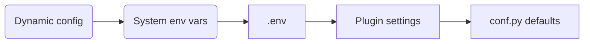

::: tip
When configuring plugins or deployment parameters, have AI check `backend/core/conf.py`, `.env`, plugin `[settings]`, and configuration priority together with [fba skills](https://skills.sh/fastapi-practices/skills/fba) to reduce environment-related issues.
:::

fba configuration lives in `backend/core/conf.py`.
All application and plugin settings should be placed in this file. Settings tagged with <Badge type="warning" text="env" /> default to environment variable configuration.

## Configuration Standards

fba splits configuration into **static** and **dynamic**. Static configuration is resolved when `Settings` is initialized; dynamic configuration is loaded on demand from the parameter-config plugin during business runtime.

### Configuration Priority

Effective priority from highest to lowest:



Static configuration priority is defined by `Settings.settings_customise_sources()`:

```text
System env vars -> .env -> Plugin settings -> conf.py defaults
```

Earlier sources take higher priority. Plugin `[settings]` in `plugin.toml` only provide hot-pluggable defaults and cannot override system environment variables or `.env`.

Dynamic configuration is not a Pydantic Settings source. It is a **runtime override layer** applied after static configuration is resolved. When business code calls the dynamic config loader, values from the parameter-config plugin override same-named values already resolved into the `settings` singleton. Fields that are not configured or not mapped are left unchanged by that load.

### Usage Boundaries

- System environment variables: for container, CI/CD, and production injection — secrets, connection info, and environment-specific settings
- `.env`: for local or single-machine deployment; do not commit real secrets
- Plugin `[settings]`: non-sensitive, public, hot-pluggable default values for plugins
- `conf.py`: field declarations, type constraints, and built-in defaults — the global configuration contract
- Dynamic configuration: business settings that need to be adjusted at runtime via the admin UI; only fields explicitly declared in the loader with type converters may be overridden

## Environment Configuration

### `ENVIRONMENT` <Badge type="info" text="Literal['dev', 'prod']" /> <Badge type="warning" text="env" />

Environment mode. When set to `prod`, OpenAPI-related online docs are disabled.

## FastAPI Configuration

### `FASTAPI_API_V1_PATH` <Badge type="info" text="str" />

API version path configuration

### `FASTAPI_TITLE` <Badge type="info" text="str" />

OpenAPI online docs title

### `FASTAPI_DESCRIPTION` <Badge type="info" text="str" />

OpenAPI online docs description

### `FASTAPI_DOCS_URL` <Badge type="info" text="str" />

Swagger docs URL

### `FASTAPI_REDOC_URL` <Badge type="info" text="str" />

ReDoc docs URL

### `FASTAPI_OPENAPI_URL` <Badge type="info" text="str | None" />

OpenAPI JSON data URL

### `FASTAPI_STATIC_FILES` <Badge type="info" text="bool" />

Whether to enable FastAPI static file serving

## Database Configuration

### `DATABASE_TYPE` <Badge type="info" text="Literal['mysql', 'postgresql']" /> <Badge type="warning" text="env" />

Database type. Only `postgresql` and `mysql` are supported. Check third-party plugin compatibility.

### `DATABASE_HOST` <Badge type="info" text="str" /> <Badge type="warning" text="env" />

Database host address

### `DATABASE_PORT` <Badge type="info" text="int" /> <Badge type="warning" text="env" />

Database port number

### `DATABASE_USER` <Badge type="info" text="str" /> <Badge type="warning" text="env" />

Database username

### `DATABASE_PASSWORD` <Badge type="info" text="str" /> <Badge type="warning" text="env" />

Database password

### `DATABASE_ECHO` <Badge type="info" text="bool | Literal['debug']" />

Whether to output SQLAlchemy operation logs

### `DATABASE_POOL_ECHO` <Badge type="info" text="bool | Literal['debug']" />

Whether to output SQLAlchemy pool operation logs

### `DATABASE_SCHEMA` <Badge type="info" text="str" />

Database name to connect to

### `DATABASE_CHARSET` <Badge type="info" text="str" />

Database charset (MySQL only)

### `DATABASE_PK_MODE` <Badge type="info" text="Literal['autoincrement', 'snowflake']" />

Database primary-key mode. More details: [Switch primary key](./pk.md)

::: caution
Do not change this setting casually!!! It can cause fatal issues!!!
:::

## Redis Configuration

### `REDIS_HOST` <Badge type="info" text="str" /> <Badge type="warning" text="env" />

Redis server host address

### `REDIS_PORT` <Badge type="info" text="int" /> <Badge type="warning" text="env" />

Redis server port number

### `REDIS_PASSWORD` <Badge type="info" text="str" /> <Badge type="warning" text="env" />

Redis password

### `REDIS_DATABASE` <Badge type="info" text="int" /> <Badge type="warning" text="env" />

Default Redis logical database index used globally (0–15)

### `REDIS_TIMEOUT` <Badge type="info" text="int" />

Socket read/write timeout and Redis TCP connection timeout

## Cache Configuration

### `CACHE_LOCAL_ENABLED` <Badge type="info" text="bool" />

Whether to enable local cache

### `CACHE_LOCAL_MAXSIZE` <Badge type="info" text="int" />

Local cache maximum capacity

### `CACHE_LOCAL_TTL` <Badge type="info" text="int" />

Local cache TTL (seconds)

### `CACHE_REDIS_TTL` <Badge type="info" text="int" />

Redis cache TTL (seconds)

### `CACHE_CONFIG_REDIS_PREFIX` <Badge type="info" text="str" />

Redis prefix for system config cache

### `CACHE_DICT_REDIS_PREFIX` <Badge type="info" text="str" />

Redis prefix for dictionary cache

### `CACHE_PUBSUB_CHANNEL` <Badge type="info" text="str" />

Cache invalidation pub/sub channel

### `CACHE_PUBSUB_RECONNECT_DELAY` <Badge type="info" text="int" />

Cache pub/sub reconnect delay (seconds)

### `CACHE_PUBSUB_MAX_RECONNECT_ATTEMPTS` <Badge type="info" text="int" />

Cache pub/sub maximum reconnect attempts

## Snowflake

### `SNOWFLAKE_ENABLED` <Badge type="info" text="bool" />

Whether to enable the Snowflake algorithm as the distributed primary-key generation strategy

### `SNOWFLAKE_DATACENTER_ID` <Badge type="info" text="int | None" /> <Badge type="warning" text="env" />

Snowflake datacenter ID

### `SNOWFLAKE_WORKER_ID` <Badge type="info" text="int | None" /> <Badge type="warning" text="env" />

Snowflake worker ID

::: warning
`SNOWFLAKE_DATACENTER_ID` and `SNOWFLAKE_WORKER_ID` must both be non-None or both be None.

When both are non-None, Snowflake uses these values (suitable for single-machine, single-process scenarios).

When both are None, Snowflake allocates them automatically (suitable for multi-thread, multi-process, and distributed scenarios).
:::

### `SNOWFLAKE_REDIS_PREFIX` <Badge type="info" text="str" />

Redis prefix for Snowflake configuration storage

### `SNOWFLAKE_HEARTBEAT_INTERVAL_SECONDS` <Badge type="info" text="int" />

Heartbeat interval (seconds) after Snowflake configuration is stored in Redis

::: warning
This value should not be greater than `SNOWFLAKE_NODE_TTL_SECONDS`
:::

### `SNOWFLAKE_NODE_TTL_SECONDS` <Badge type="info" text="int" />

TTL (seconds) for Snowflake configuration stored in Redis

## Token Configuration

### `TOKEN_SECRET_KEY` <Badge type="info" text="str" /> <Badge type="warning" text="env" />

Secret key for token generation and parsing, used to prevent token tampering. Generate with: `secrets.token_urlsafe(32)`

::: danger
Keep this value secure to avoid malicious attacks.
:::

### `TOKEN_ALGORITHM` <Badge type="info" text="str" />

Token encryption algorithm

### `TOKEN_EXPIRE_SECONDS` <Badge type="info" text="int" />

Token expiration time (seconds)

### `TOKEN_REFRESH_EXPIRE_SECONDS` <Badge type="info" text="int" />

Refresh token expiration time (seconds)

### `TOKEN_REDIS_PREFIX` <Badge type="info" text="str" />

Redis prefix for token storage

### `TOKEN_EXTRA_INFO_REDIS_PREFIX` <Badge type="info" text="str" />

Redis prefix for token extra info storage

### `TOKEN_ONLINE_REDIS_PREFIX` <Badge type="info" text="str" />

Redis prefix for token online status storage

### `TOKEN_REFRESH_REDIS_PREFIX` <Badge type="info" text="str" />

Redis prefix for refresh token storage

### `TOKEN_REQUEST_UNDERLYING_SECURITY` <Badge type="info" text="bool" />

Whether to enable request-level underlying security checks

### `TOKEN_REQUEST_PATH_EXCLUDE` <Badge type="info" text="list[str]" />

JWT / RBAC route whitelist. Requests matching these paths will not have token authenticity checked.

::: warning
fba uses JWT middleware to parse tokens, obtain user info, and assign it to the FastAPI request object. If a route is included in this configuration, `request.user` will be unavailable.
:::

### `TOKEN_REQUEST_PATH_EXCLUDE_PATTERN` <Badge type="info" text="list[Pattern[str]]" />

JWT / RBAC route whitelist as regex patterns matched from the start of the route. Matching request paths will not have token authenticity checked. Same caveats as above.

## User Security Configuration

### `USER_LOCK_REDIS_PREFIX` <Badge type="info" text="str" />

Redis prefix for user lock storage

### `USER_LOCK_THRESHOLD` <Badge type="info" text="int" />

Password-error lock threshold. `0` disables locking.

### `USER_LOCK_SECONDS` <Badge type="info" text="int" />

User lock duration (seconds)

### `USER_PASSWORD_EXPIRY_DAYS` <Badge type="info" text="int" />

Password validity period in days. `0` means never expires.

### `USER_PASSWORD_REMINDER_DAYS` <Badge type="info" text="int" />

Password expiry reminder in days. `0` means no reminder.

### `USER_PASSWORD_HISTORY_CHECK_COUNT` <Badge type="info" text="int" />

Number of historical passwords checked to prevent reuse

### `USER_PASSWORD_MIN_LENGTH` <Badge type="info" text="int" />

Minimum password length

### `USER_PASSWORD_MAX_LENGTH` <Badge type="info" text="int" />

Maximum password length

### `USER_PASSWORD_REQUIRE_SPECIAL_CHAR` <Badge type="info" text="bool" />

Whether passwords require special characters

## Login Configuration

### `LOGIN_CAPTCHA_ENABLED` <Badge type="info" text="bool" />

Whether to enable login captcha

### `LOGIN_CAPTCHA_REDIS_PREFIX` <Badge type="info" text="str" />

Redis prefix for login captcha storage

### `LOGIN_CAPTCHA_EXPIRE_SECONDS` <Badge type="info" text="int" />

Login captcha expiration time (seconds)

### `LOGIN_FAILURE_PREFIX` <Badge type="info" text="str" />

Redis prefix for login failure storage

## JWT Configuration

### `JWT_USER_REDIS_PREFIX` <Badge type="info" text="str" />

Redis prefix used by JWT middleware to store user info

## RBAC Configuration

[More details](./RBAC.md){.read-more}

### `RBAC_ROLE_MENU_MODE` <Badge type="info" text="bool" />

Whether to enable RBAC role-menu mode

### `RBAC_ROLE_MENU_EXCLUDE` <Badge type="info" text="list[str]" />

When role-menu mode is enabled, permission identifiers that skip RBAC authorization (when the API permission identifier matches the user's menu permission identifier)

## Cookie Configuration

### `COOKIE_REFRESH_TOKEN_KEY` <Badge type="info" text="str" />

Cookie key name when storing the refresh token

### `COOKIE_REFRESH_TOKEN_EXPIRE_SECONDS` <Badge type="info" text="int" />

Cookie expiration time for the refresh token (seconds)

## Data Permission Configuration

### `DATA_PERMISSION_MODEL_EXCLUDE` <Badge type="info" text="list[str]" />

SQLAlchemy models excluded from data filtering

### `DATA_PERMISSION_COLUMN_EXCLUDE` <Badge type="info" text="list[str]" />

SQLAlchemy model columns excluded from data filtering, e.g. id, password

### `DATA_PERMISSION_MODEL_TEMPLATE_VARIABLES` <Badge type="info" text="list[dict[str, str]]" />

Template variables available for data-rule models

### `DATA_PERMISSION_COLUMN_TEMPLATE_VARIABLES` <Badge type="info" text="list[dict[str, str]]" />

Template variables available for data-rule columns

### `DATA_PERMISSION_TEMPLATE_VARIABLES` <Badge type="info" text="list[dict[str, str]]" />

Template variables available for data-rule values

## Socket.IO Configuration

### `WS_NO_AUTH_MARKER` <Badge type="info" text="str" />

Marker that skips user authentication when connecting to the Socket.IO service

::: danger
Keep this value secure to avoid malicious attacks.
:::

## CORS Configuration

### `CORS_ALLOWED_ORIGINS` <Badge type="info" text="list[str]" />

Allowed origins for cross-origin requests, without a trailing `/`, e.g. `http//127.0.0.1:8000`

### `CORS_EXPOSE_HEADERS` <Badge type="info" text="list[str]" />

Exposed headers for cross-origin responses; these headers may be added to request headers

## Middleware Configuration

### `MIDDLEWARE_CORS` <Badge type="info" text="bool" />

Whether to enable the CORS middleware

## Request Limiter Configuration

### `REQUEST_LIMITER_REDIS_PREFIX` <Badge type="info" text="str" />

Redis prefix for recording request rate information

## Time Configuration

### `DATETIME_TIMEZONE` <Badge type="info" text="str" />

Global timezone

### `DATETIME_FORMAT` <Badge type="info" text="str" />

Format used when converting datetime to string

## File Upload Configuration

::: warning
Some settings may be overridden by nginx.
:::

### `UPLOAD_READ_SIZE` <Badge type="info" text="int" />

Buffer size when reading file content during upload

### `UPLOAD_IMAGE_EXT_INCLUDE` <Badge type="info" text="list[str]" />

Allowed image file types for upload

### `UPLOAD_IMAGE_SIZE_MAX` <Badge type="info" text="int" />

Maximum allowed image file size

### `UPLOAD_VIDEO_EXT_INCLUDE` <Badge type="info" text="list[str]" />

Allowed video file types for upload

### `UPLOAD_VIDEO_SIZE_MAX` <Badge type="info" text="int" />

Maximum allowed video file size

## Demo Mode Configuration

### `DEMO_MODE` <Badge type="info" text="bool" />

Whether to enable demo mode. When enabled, only `GET` and `OPTIONS` requests are allowed.

### `DEMO_MODE_EXCLUDE` <Badge type="info" text="set[tuple[str, str]]" />

APIs that are not rate-restricted when demo mode is enabled

## IP Location Configuration

### `IP_LOCATION_PARSE` <Badge type="info" text="Literal['online', 'offline', 'false']" />

Mode for resolving the requester's location information

### `IP_LOCATION_REDIS_PREFIX` <Badge type="info" text="str" />

Redis prefix for location information storage

### `IP_LOCATION_EXPIRE_SECONDS` <Badge type="info" text="int" />

Location information cache duration (seconds)

## Trace ID

### `TRACE_ID_REQUEST_HEADER_KEY` <Badge type="info" text="str" />

Trace ID request header key name

### `TRACE_ID_LOG_LENGTH` <Badge type="info" text="int" />

Trace ID log length; must be less than or equal to 32

### `TRACE_ID_LOG_DEFAULT_VALUE` <Badge type="info" text="str" />

Default Trace ID value in logs

## Logging

### `LOG_FORMAT` <Badge type="info" text="str" />

Log content format (shared by console and file)

## Logging (Console)

### `LOG_STD_LEVEL` <Badge type="info" text="str" />

Log level

## Logging (File)

### `LOG_FILE_ACCESS_LEVEL` <Badge type="info" text="str" />

Access log level

### `LOG_FILE_ERROR_LEVEL` <Badge type="info" text="str" />

Error log level

### `LOG_ACCESS_FILENAME` <Badge type="info" text="str" />

Access log filename

### `LOG_ERROR_FILENAME` <Badge type="info" text="str" />

Error log filename

## Operation Logs

### `OPERA_LOG_PATH_EXCLUDE` <Badge type="info" text="list[str]" />

Operation log path exclusions. Request paths in this list will not record operation logs.

### `OPERA_LOG_REDACT_KEYS` <Badge type="info" text="list[str]" />

Keys to redact from API request parameters in operation logs

### `OPERA_LOG_QUEUE_MAXSIZE` <Badge type="info" text="int" />

Operation log queue maximum capacity

### `OPERA_LOG_QUEUE_BATCH_CONSUME_SIZE` <Badge type="info" text="int" />

Operation log queue batch consume size. When the limit is reached, operation logs are written to the database in batches.

### `OPERA_LOG_QUEUE_TIMEOUT` <Badge type="info" text="int" />

Operation log queue timeout. When the limit is reached, operation logs are written to the database in batches.

### `OPERA_LOG_BODY_MAX_SIZE` <Badge type="info" text="int" />

Maximum number of bytes of request body content recorded in operation logs

## Plugin Configuration

### `PLUGIN_REQUIRED` <Badge type="info" text="list[str]" />

Plugins that must be loaded when the project starts

### `PLUGIN_PIP_CHINA` <Badge type="info" text="bool" />

Whether to use a China mirror when downloading plugin dependencies via pip

### `PLUGIN_PIP_INDEX_URL` <Badge type="info" text="str" />

Index URL when downloading plugin dependencies via pip

### `PLUGIN_PIP_MAX_RETRY` <Badge type="info" text="int" />

Maximum pip download retry count

### `PLUGIN_REDIS_PREFIX` <Badge type="info" text="str" />

Redis prefix for plugin information storage

## I18n Configuration

### `I18N_DEFAULT_LANGUAGE` <Badge type="info" text="str" />

Default language for internationalized responses

## Grafana Configuration

### `GRAFANA_METRICS_ENABLE` <Badge type="info" text="bool" />

Whether to enable the Grafana suite

::: warning
If you do not need observability integration, we recommend leaving this disabled.
:::

### `GRAFANA_OTLP_GRPC_ENDPOINT` <Badge type="info" text="str" />

Grafana OTLP gRPC endpoint for sending telemetry data

### `GRAFANA_PROMETHEUS_APP_NAME` <Badge type="info" text="str" />

Application name identifying the backend service in Prometheus

### `GRAFANA_CELERY_OTEL_SERVICE_NAME` <Badge type="info" text="str" />

Service name used when Celery workers report OpenTelemetry data

### `GRAFANA_METRICS_PATH` <Badge type="info" text="str" />

Path Prometheus uses to scrape FastAPI metrics

### `GRAFANA_PROMETHEUS_EXEMPLAR_TRACE_ID_KEY` <Badge type="info" text="str" />

Label key name for correlating Trace IDs in Prometheus exemplars

## App: Task

### `CELERY_BROKER_REDIS_DATABASE` <Badge type="info" text="int" /> <Badge type="warning" text="env" />

Redis logical database used by the Celery broker

### `CELERY_RABBITMQ_HOST` <Badge type="info" text="str" /> <Badge type="warning" text="env" />

Host address for Celery connecting to RabbitMQ

### `CELERY_RABBITMQ_PORT` <Badge type="info" text="int" /> <Badge type="warning" text="env" />

Port for Celery connecting to RabbitMQ

### `CELERY_RABBITMQ_USERNAME` <Badge type="info" text="str" /> <Badge type="warning" text="env" />

Username for Celery connecting to RabbitMQ

### `CELERY_RABBITMQ_PASSWORD` <Badge type="info" text="str" /> <Badge type="warning" text="env" />

Password for Celery connecting to RabbitMQ

### `CELERY_BROKER` <Badge type="info" text="Literal['rabbitmq', 'redis']" />

Celery broker mode (defaults to Redis in development; forced to RabbitMQ in production)

### `CELERY_RABBITMQ_VHOST` <Badge type="info" text="str" />

vhost for Celery connecting to RabbitMQ

### `CELERY_REDIS_PREFIX` <Badge type="info" text="str" />

Redis prefix for Celery data storage

### `CELERY_TASK_MAX_RETRIES` <Badge type="info" text="int" />

Maximum retry count when a Celery task fails

## Plugin: Code Generator

### `CODE_GENERATOR_DOWNLOAD_ZIP_FILENAME` <Badge type="info" text="str" />

ZIP archive filename when downloading generated code

## Plugin: OAuth2

### `OAUTH2_GITHUB_CLIENT_ID` <Badge type="info" text="str" /> <Badge type="warning" text="env" />

GitHub client ID

### `OAUTH2_GITHUB_CLIENT_SECRET` <Badge type="info" text="str" /> <Badge type="warning" text="env" />

GitHub client secret

### `OAUTH2_GOOGLE_CLIENT_ID` <Badge type="info" text="str" /> <Badge type="warning" text="env" />

Google client ID

### `OAUTH2_GOOGLE_CLIENT_SECRET` <Badge type="info" text="str" /> <Badge type="warning" text="env" />

Google client secret

### `OAUTH2_STATE_REDIS_PREFIX` <Badge type="info" text="str" />

Redis prefix for OAuth2 state information storage

### `OAUTH2_STATE_EXPIRE_SECONDS` <Badge type="info" text="int" />

OAuth2 state information expiration time in Redis (seconds)

### `OAUTH2_GITHUB_REDIRECT_URI` <Badge type="info" text="str" />

GitHub redirect URI; must match the GitHub OAuth Apps configuration

### `OAUTH2_GOOGLE_REDIRECT_URI` <Badge type="info" text="str" />

Google redirect URI; must match the Google OAuth 2.0 client configuration

### `OAUTH2_FRONTEND_LOGIN_REDIRECT_URI` <Badge type="info" text="str" />

Frontend redirect URI after successful login

### `OAUTH2_FRONTEND_BINDING_REDIRECT_URI` <Badge type="info" text="str" />

Frontend redirect URI after successful binding

## Plugin: Email

### `EMAIL_USERNAME` <Badge type="info" text="str" /> <Badge type="warning" text="env" />

Email sender username

### `EMAIL_PASSWORD` <Badge type="info" text="str" /> <Badge type="warning" text="env" />

Email sender password

### `EMAIL_HOST` <Badge type="info" text="str" />

Email service host address

### `EMAIL_PORT` <Badge type="info" text="int" />

Email service host port

### `EMAIL_SSL` <Badge type="info" text="bool" />

Whether to enable SSL when sending email

### `EMAIL_CAPTCHA_REDIS_PREFIX` <Badge type="info" text="str" />

Redis prefix for email captcha storage

### `EMAIL_CAPTCHA_EXPIRE_SECONDS` <Badge type="info" text="int" />

Email captcha cache duration (seconds)
