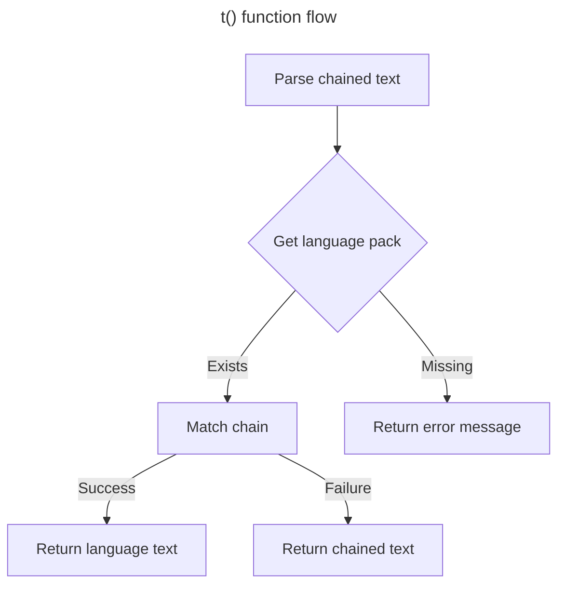

In modern web development, internationalization is usually a frontend concern. In global scenarios, however, backend i18n is also essential — it lets users receive messages in their native language and greatly improves the experience for worldwide users.

## Syntax

Usage is largely the same as common frontend patterns: use the `t()` function with chained text keys, for example:

- `t('response.success')`

Get the `success` field under `response` in the language pack.

- `t('error.captcha.expired')`

Get the `expired` field under `error.captcha` in the language pack.

## Default Language

You can set the default language in the [configuration file](./conf.md).

## Dynamic Switching

fba automatically reads the `Accept-Language` header and applies the first language value as the current language. If the header is missing, the default language is used.

## Language Packs

Language packs live under `backend/locale`.

### Naming

Language pack filenames usually follow country/region codes. For example, `en-US` means English and `zh-CN` means Simplified Chinese.

### Formats

Language packs currently support two formats:

- json
- yaml / yml
