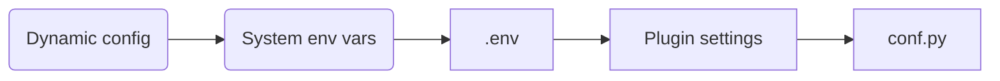

::: tip
When developing or reviewing plugins, have AI use the plugin reference in [fba skills](https://skills.sh/fastapi-practices/skills/fba). It covers plugin.toml validation, depends_on, hot-plugging config, hooks, SQL scripts, and README conventions.
:::

::: info
The official repository includes several built-in plugins under `backend/plugin`. Reading this document alongside the official repository works best.
:::

## Backend

::: steps

1. Pull the latest fba project locally and set up the development environment
2. Learn how the plugin system works via [Plugin Types](#plugin-types), [Plugin Routing](#plugin-routing), and [Database Compatibility](#database-compatibility)
3. Develop the plugin according to [Plugin Directory Structure](#plugin-directory-structure)
4. Complete adaptation via [Plugin Configuration](#plugin-configuration), [Hot-Plugging](#hot-plugging), and [Hook Functions](#hook-functions)
5. [Share the plugin](./share.md) <Badge type="warning" text="optional" />

:::

### Plugin Types

::: tabs#plugin
@tab <Icon name="carbon:app" />Application-level plugins
In [Project Structure](../backend/summary/intro.md#project-structure), first-level folders under the app directory are treated as applications. The same principle applies to the plugin system.

Such plugins are injected into the system like applications. We call them **application-level plugins**.

@tab <Icon name="fluent:table-simple-include-16-regular" />Extension-level plugins
These plugins are injected into an existing application under the app directory. The target application is specified by `[app].extend` in `plugin.toml`. We call them **extension-level plugins**.

@tab <Icon name="material-symbols:extension-outline" />Capability plugins
These plugins do not inject routes. They only provide capabilities that other code can import — utility functions, SDK wrappers, providers, adapters, or general capability packages. We call them **capability plugins**.
:::

### Plugin Routing

If an application-level or extension-level plugin meets plugin development requirements, its routes are automatically injected into the FastAPI application. Note that startup time may increase as more plugins are added, because fba parses all plugins in real time before each start.

::: tabs#plugin
@tab <Icon name="carbon:app" />Application-level plugins
Fully follow [Route Structure](../backend/reference/router.md#route-structure) for development, and expose the `APIRouter` instance declared by `[app].router` in `api/router.py`.

@tab <Icon name="fluent:table-simple-include-16-regular" />Extension-level plugins
Must 1:1 mirror the target application's api directory structure. Each API file must define a `router`, and provide matching `[api.xxx]` config in `plugin.toml`. See the built-in [notice](https://github.com/fastapi-practices/fastapi-best-architecture/tree/master/backend/plugin/notice/api) plugin in fba.

@tab <Icon name="material-symbols:extension-outline" />Capability plugins
Do not inject routes and do not need an `api` directory. Other plugins or business code can import the modules, functions, classes, or config they provide via Python import.
:::

### Database Compatibility

fba built-in plugins support both MySQL and PostgreSQL. Application-level and extension-level plugins must declare supported databases in `[plugin].database` in `plugin.toml`. Capability plugins without models or SQL may omit `[plugin].database`. To support multiple databases, see the SQLAlchemy 2.0 docs: [TypeDecorator](https://docs.sqlalchemy.org/en/20/core/custom_types.html#typedecorator-recipes), [with_variant](https://docs.sqlalchemy.org/en/20/core/type_api.html#sqlalchemy.types.TypeEngine.with_variant).

If a plugin includes a `model` directory, it must declare `[plugin].database` and provide complete init and destroy SQL for at least one database, including `init.sql`, `destroy.sql`, `init_snowflake.sql`, and `destroy_snowflake.sql`. Databases declared in `[plugin].database` should match the SQL scripts actually provided.

### Plugin Directory Structure

Plugins live under `backend/plugin`. The directory structure is as follows.

The plugin name is also a Python package name. Prefer lowercase letters, digits, and underscores only, and keep it consistent with the plugin directory and repository name.

::: file-tree

- xxx # Plugin name <Badge type="danger" text="required" />
    - api/ # APIs <Badge type="danger" text="required for app-level and extension-level" />
    - crud/ # CRUD
    - model # Models
        - __init__.py # Import all model classes here <Badge type="danger" text="required if directory exists" />
        - …
    - schema/ # Data transfer
    - service/ # Services
    - sql # Recommended if the plugin has models or needs SQL
        - mysql
            - destroy.sql # Auto-increment id destroy (auto-run on uninstall)
            - destroy_snowflake.sql # Snowflake id destroy
            - init.sql # Auto-increment id init (auto-run on install)
            - init_snowflake.sql # Snowflake id init
        - postgresql
            - ... # Same file names as mysql
    - utils/ # Utilities
    - .env.example # Environment variables
    - __init__.py # Required as a Python package <Badge type="danger" text="required" />
    - … # More content, e.g. enums.py...
    - hooks.py # Hook functions
    - plugin.toml # Plugin config file <Badge type="danger" text="required" />
    - README.md # Usage instructions and your contact info <Badge type="danger" text="required" />
    - requirements.txt # Dependency file

:::

### Plugin Configuration

`plugin.toml` is the plugin configuration file. Every plugin must include it.

The plugin system determines plugin level from `plugin.toml` structure: top-level `[api]` means extension-level; `[app].router` means application-level; neither `[app]` nor `[api]` means capability plugin.

::: tabs#plugin
@tab <Icon name="carbon:app" />Application-level plugins

```toml
# Plugin info
[plugin]
# Icon (path inside the plugin repo or icon URL), optional
icon = 'assets/icon.svg'
# Summary (short description)
summary = ''
# Version, must be x.y.z format, e.g. 0.0.1
version = '0.0.1'
# Description
description = ''
# Author
author = ''
# Tags
# Currently supported: ai, mcp, agent, auth, storage, notification, task, payment, other
tags = ['']
# Database support
# Currently supported: mysql, postgresql
database = ['']
# Dependent plugins, optional, controls startup and injection order
depends_on = []

# Application config
[app]
# Final router instance
# See source: backend/app/admin/api/router.py, usually named v1 by default
router = ['v1']

# In-code settings (ALL CAPS)
# Optional; see: Hot-Plugging
[settings]
XXX = 'value'
```

@tab <Icon name="fluent:table-simple-include-16-regular" />Extension-level plugins

```toml
# Plugin info
[plugin]
# Icon (path inside the plugin repo or icon URL), optional
icon = 'assets/icon.svg'
# Summary (short description)
summary = ''
# Version, must be x.y.z format, e.g. 0.0.1
version = '0.0.1'
# Description
description = ''
# Author
author = ''
# Tags
# Currently supported: ai, mcp, agent, auth, storage, notification, task, payment, other
tags = ['']
# Database support
# Currently supported: mysql, postgresql
database = ['']
# Dependent plugins, optional, controls startup and injection order
depends_on = []

# Application config
[app]
# Which application to extend
extend = 'application folder name'

# API config
[api.xxx]
# xxx is the API file name under the plugin api directory (without extension)
# e.g. if the file is notice.py, xxx should be notice
# Multiple API files require multiple API configs
# Route prefix, must start with '/'
prefix = ''
# Tag for Swagger docs
tags = ''

# In-code settings (ALL CAPS)
# Optional; see: Hot-Plugging
[settings]
XXX = 'value'
```

@tab <Icon name="material-symbols:extension-outline" />Capability plugins

```toml
# Plugin info
[plugin]
# Icon (path inside the plugin repo or icon URL), optional
icon = 'assets/icon.svg'
# Summary (short description)
summary = ''
# Version, must be x.y.z format, e.g. 0.0.1
version = '0.0.1'
# Description
description = ''
# Author
author = ''
# Tags
# Currently supported: ai, mcp, agent, auth, storage, notification, task, payment, other
tags = ['']
# Database support
# Currently supported: mysql, postgresql
database = ['']
# Dependent plugins, optional, controls startup and injection order
depends_on = []

# In-code settings (ALL CAPS)
# Optional; see: Hot-Plugging
[settings]
XXX = 'value'
```

:::

### Plugin Dependencies

If a plugin depends on other plugins, declare their names in `[plugin].depends_on`:

```toml
[plugin]
depends_on = ['dict']
```

Dependency config affects route injection, hook registration, and startup order. A plugin cannot depend on itself, on non-existent plugins, or form circular dependencies.

### Global Configuration

fba uses a single global config file (similar to Django). The standard practice is to add plugin global config in `backend/core/conf.py`, for example:

```python
##################################################
# [ Plugin ] email
##################################################
# .env
EMAIL_USERNAME: str
EMAIL_PASSWORD: str

# Base config (in plugin.toml)
EMAIL_HOST: str
EMAIL_PORT: int
EMAIL_SSL: bool
EMAIL_CAPTCHA_REDIS_PREFIX: str
EMAIL_CAPTCHA_EXPIRE_SECONDS: int
```

The structure is: plugin config comment section, plugin env var config and comments, plugin base config and comments. In a published plugin we cannot modify the user's `backend/core/conf.py` directly — we can only document in the README how users should complete global plugin configuration.

### Hot-Plugging

Starting from ==v1.13.0=={.note}, configuring as follows automatically enables hot-plugging. See the official fba plugin: [oss](https://github.com/fastapi-practices/oss)

- Plugin environment variables

  If the plugin needs env vars, add a `.env.example` in the plugin root with variables that can be appended directly to `backend/.env`, for example:

    ```dotenv:no-line-numbers
    # [ Plugin ] email
    EMAIL_USERNAME=''
    EMAIL_PASSWORD=''
    ```

- Plugin base configuration

  If the plugin needs base config, add it under `settings` in [Plugin Configuration](#plugin-configuration), for example:

  ::: warning
  Configuration in `plugin.toml` and `backend/core/conf.py` works very differently. Be careful not to mix them up.
  :::

    ```toml:no-line-numbers
    [settings]
    EMAIL_HOST = 'smtp.qq.com'
    EMAIL_PORT = 465
    EMAIL_SSL = true
    EMAIL_CAPTCHA_REDIS_PREFIX = 'fba:email:captcha'
    EMAIL_CAPTCHA_EXPIRE_SECONDS = 180  # 3 minutes
    ```

- Setting purpose documentation

  If `plugin.toml` has a non-empty `[settings]`, the plugin README must add a “Settings” section after the existing configuration notes, explaining each item’s purpose in the same order as `plugin.toml`. Only describe what each setting controls or affects — do not repeat type, default, source, or configuration method.

    ```md:no-line-numbers
    ## Settings

    - `EMAIL_HOST`: Mail server host
    - `EMAIL_PORT`: Mail server connection port
    - `EMAIL_SSL`: Whether to use SSL for the mail connection
    - `EMAIL_CAPTCHA_REDIS_PREFIX`: Redis key prefix for email captcha
    - `EMAIL_CAPTCHA_EXPIRE_SECONDS`: Email captcha validity duration
    ```

After completing the above, if the plugin needs no further changes, installing via [CLI, ZIP, or Git](./install.md) enables hot-plugging config loading. The installer appends `.env.example` to `backend/.env`, but you still need to replace placeholder values per the plugin README.

::: important Global configuration priority



`settings_customise_sources()` only covers the static chain “system env vars → .env → plugin settings → conf.py defaults”. Dynamic config is an on-demand override layer during business runtime and is not a Pydantic Settings source.

Plugins should use dynamic config only when admin-side runtime adjustment is truly needed. Dynamically overridable fields must declare type conversion maps in the load function and complete loading before reading fields. Full standards: [Configuration](../backend/reference/conf.md#configuration-standards).

:::

::: tip
We still recommend adding [Global Configuration](#global-configuration) during development and documenting it in the published plugin README. This step is necessary if both plugin authors and users should get IDE type hints for config items.
:::

### Hook Functions

Starting from ==v1.13.3=={.note}, plugins support hook functions for more flexible configuration and less manual adaptation. We also provide helpers in `backend/plugin/patching.py`, such as `replace_middleware` in `setup` for swapping middleware.

Hook functions must be defined in `hooks.py` at the plugin root. They apply only to enabled plugins and run according to [Plugin Dependencies](#plugin-dependencies) resolution. Currently supported:

#### `def lifespan()`

[Lifespan function](https://fastapi.tiangolo.com/advanced/events/#lifespan). Signature matches FastAPI lifespan: receives the `FastAPI` app instance and is registered automatically before app startup.

#### `def setup()`

Startup function. Receives the `FastAPI` app instance, supports sync and async, runs automatically before app startup.

#### `def otel()`

OpenTelemetry initialization function. Receives the `FastAPI` app instance, supports sync and async, runs automatically during observability initialization.

## Frontend

::: steps

1. Pull the latest fba frontend project locally and set up the development environment
2. Develop the plugin according to [Plugin Directory Structure](#plugin-directory-structure-1)
3. Finish plugin development
4. [Share the plugin](./share.md) <Badge type="warning" text="optional" />

:::

### Plugin Directory Structure

Plugins live under `apps/web-antdv-next/src/plugins`. The directory structure is as follows.

::: file-tree

- xxx # Plugin name
    - api # APIs
        - index.ts
    - langs # i18n
        - en-US
            - plugin-name.json
        - zh-CN
            - plugin-name.json
    - public
        - images/ # Page preview images
    - routes # Routes
        - index.ts
    - views # Views
        - index.vue
        - …
    - … # More content
    - plugin.toml # Plugin config file <Badge type="danger" text="required" />

:::

### Plugin Configuration

`plugin.toml` is the plugin configuration file. Every plugin must include it.

```toml
# Plugin info
[plugin]
# Icon (path inside the plugin repo or icon URL), optional
icon = 'assets/icon.svg'
# Summary (short description). Prefer the matching backend service plus UI, e.g. AI UI
summary = ''
# Version, must be x.y.z format, e.g. 0.0.1
version = '0.0.1'
# Description. Prefer stating this is the frontend of the corresponding backend plugin, e.g. frontend for the fba AI plugin
description = ''
# Author
author = ''
# Tags
# Currently supported: ai, mcp, agent, auth, storage, notification, task, payment, other
tags = ['']
# Dependent plugins, optional, controls plugin load order
depends_on = []
```

## Notes

::: caution
Unless necessary, avoid referencing existing architecture methods in plugin code. If those methods change, the plugin must change too — otherwise the plugin will break.
:::

::: tip
If you plan to share the plugin publicly or submit it to the marketplace, also read the pre-publish checklist and maintenance responsibility notes in [Sharing Plugins](./share.md).
:::
