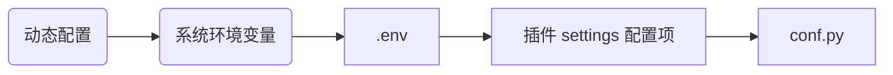

::: tip
开发或审查插件时，建议让 AI 使用 [fba skills](https://skills.sh/fastapi-practices/skills/fba) 的 plugin 参考；其中整理了 plugin.toml 校验、depends_on、热插拔配置、hooks、SQL 脚本和 README 规范
:::

::: info
在官方仓库中，包含多个内置插件，位于 `backend/plugin` 目录下，结合官方仓库阅读此文档，效果更佳
:::

## 后端

::: steps

1. 拉取最新的 fba 项目到本地并配置好开发环境
2. 通过 [插件类型](#插件类型)、[插件路由](#插件路由)、[数据库兼容性](#数据库兼容性) 了解插件系统的运作机制
3. 根据 [插件目录结构](#插件目录结构) 进行插件开发
4. 根据 [插件配置](#插件配置)、[热插拔](#热插拔)、[钩子函数](#钩子函数) 完成插件适配
5. [插件分享](./share.md) <Badge type="warning" text="可选" />

:::

### 插件类型

::: tabs#plugin
@tab <Icon name="carbon:app" />应用级插件
在 [项目结构](../backend/summary/intro.md#项目结构) 中，app
目录下的一级文件夹被视为应用，此原理同样应用于插件系统。

此类插件会像应用一样被注入到系统中，我们称这类插件为【应用级插件】

@tab <Icon name="fluent:table-simple-include-16-regular" />扩展级插件
此类插件会被注入到 app 目录下已存在的应用中，目标应用由 `plugin.toml` 中的 `[app].extend` 指定，我们称这类插件为【扩展级插件】

@tab <Icon name="material-symbols:extension-outline" />能力型插件
此类插件不会注入路由，只提供可被其他代码导入的能力，例如工具函数、SDK 封装、Provider、Adapter 或通用能力包，我们称这类插件为【能力型插件】
:::

### 插件路由

如果应用级插件或扩展级插件符合插件开发的要求，则插件中的路由会自动注入到 FastAPI 应用中。但值得注意的是，启动时间可能会随着插件数量的递增而增加，因为
fba 会在每次启动前对所有插件进行实时解析

::: tabs#plugin
@tab <Icon name="carbon:app" />应用级插件
应完全遵循 [路由结构](../backend/reference/router.md#路由结构) 进行开发，并在 `api/router.py` 中暴露 `[app].router` 声明的 `APIRouter` 实例

@tab <Icon name="fluent:table-simple-include-16-regular" />扩展级插件
必须将目标应用中的 api 目录结构进行 1:1 复制，每个接口文件都需要定义 `router`，并在 `plugin.toml` 中提供对应的 `[api.xxx]` 配置，可参考 fba
中的内置插件 [notice](https://github.com/fastapi-practices/fastapi-best-architecture/tree/master/backend/plugin/notice/api)

@tab <Icon name="material-symbols:extension-outline" />能力型插件
不会注入路由，也不需要 `api` 目录。其他插件或业务代码可通过 Python import 使用它提供的模块、函数、类或配置
:::

### 数据库兼容性

fba 内置插件同时兼容 MySQL 和 PostgreSQL。应用级和扩展级插件必须在 `plugin.toml` 的 `[plugin].database` 中声明支持范围，能力型插件如果不包含模型或 SQL，则可以省略 `[plugin].database`；如果需要同时兼容多种数据库，请参考
SQLAlchemy 2.0 
官方文档：[TypeDecorator](https://docs.sqlalchemy.org/en/20/core/custom_types.html#typedecorator-recipes)、
[with_variant](https://docs.sqlalchemy.org/en/20/core/type_api.html#sqlalchemy.types.TypeEngine.with_variant)

如果插件包含 `model` 目录，则必须声明 `[plugin].database`，并至少为一种数据库提供完整的初始化和销毁 SQL 脚本，包括 `init.sql`、`destroy.sql`、`init_snowflake.sql`、`destroy_snowflake.sql`。`[plugin].database` 中声明的数据库应与实际提供的 SQL 脚本保持一致

### 插件目录结构

插件统一放置在 `backend/plugin` 目录下，以下是插件的目录结构

插件名也是 Python 包名，建议仅使用小写字母、数字和下划线，并保持与插件目录名、仓库名一致

::: file-tree

- xxx # 插件名 <Badge type="danger" text="必须" />
    - api/ # 接口 <Badge type="danger" text="应用级和扩展级插件必须" />
    - crud/ # CRUD
    - model # 模型
        - __init__.py # 在此文件内导入所有模型类 <Badge type="danger" text="目录存在则必须" />
        - …
    - schema/ # 数据传输
    - service/ # 服务
    - sql # 如果插件包含 model 或需要执行 SQL 则建议
        - mysql
            - destroy.sql # 自增 id 销毁（卸载自动执行）
            - destroy_snowflake.sql # 雪花 id 销毁
            - init.sql # 自增 id 初始化（安装自动执行）
            - init_snowflake.sql # 雪花 id 初始化
        - postgresql
            - ... # 文件命名与 mysql 相同
    - utils/ # 工具包
    - .env.example # 环境变量
    - __init__.py # 作为 python 包保留 <Badge type="danger" text="必须" />
    - … # 更多内容，例如 enums.py...
    - hooks.py # 钩子函数
    - plugin.toml # 插件配置文件 <Badge type="danger" text="必须" />
    - README.md # 插件使用说明和您的联系方式 <Badge type="danger" text="必须" />
    - requirements.txt # 依赖包文件

:::

### 插件配置

`plugin.toml` 是插件的配置文件，每个插件都必须包含此文件

插件系统通过 `plugin.toml` 的配置结构判断插件级别：存在顶层 `[api]` 配置时为扩展级插件；存在 `[app].router` 时为应用级插件；不存在 `[app]` 和 `[api]` 时为能力型插件

::: tabs#plugin
@tab <Icon name="carbon:app" />应用级插件

```toml
# 插件信息
[plugin]
# 图标（插件仓库内的图标路径或图标链接地址），可选
icon = 'assets/icon.svg'
# 摘要（简短描述）
summary = ''
# 版本号，必须为 x.y.z 格式，例如 0.0.1
version = '0.0.1'
# 描述
description = ''
# 作者
author = ''
# 标签
# 当前支持：ai、mcp、agent、auth、storage、notification、task、payment、other
tags = ['']
# 数据库支持
# 当前支持：mysql、postgresql
database = ['']
# 依赖的插件列表，可选，用于控制插件启动和注入顺序
depends_on = []

# 应用配置
[app]
# 路由器最终实例
# 可参考源码：backend/app/admin/api/router.py，通常默认命名为 v1
router = ['v1']

# 代码中的配置项（全大写）
# 该配置项为可选，详情请查看：热插拔
[settings]
XXX = 'value'
```

@tab <Icon name="fluent:table-simple-include-16-regular" />扩展级插件

```toml
# 插件信息
[plugin]
# 图标（插件仓库内的图标路径或图标链接地址），可选
icon = 'assets/icon.svg'
# 摘要（简短描述）
summary = ''
# 版本号，必须为 x.y.z 格式，例如 0.0.1
version = '0.0.1'
# 描述
description = ''
# 作者
author = ''
# 标签
# 当前支持：ai、mcp、agent、auth、storage、notification、task、payment、other
tags = ['']
# 数据库支持
# 当前支持：mysql、postgresql
database = ['']
# 依赖的插件列表，可选，用于控制插件启动和注入顺序
depends_on = []

# 应用配置
[app]
# 扩展的哪个应用
extend = '应用文件夹名称'

# 接口配置
[api.xxx]
# xxx 对应的是插件 api 目录下接口文件的文件名（不包含后缀）
# 例如接口文件名为 notice.py，则 xxx 应该为 notice
# 如果包含多个接口文件，则应存在多个接口配置
# 路由前缀，必须以 '/' 开头
prefix = ''
# 标签，用于 Swagger 文档
tags = ''

# 代码中的配置项（全大写）
# 该配置项为可选，详情请查看：热插拔
[settings]
XXX = 'value'
```

@tab <Icon name="material-symbols:extension-outline" />能力型插件

```toml
# 插件信息
[plugin]
# 图标（插件仓库内的图标路径或图标链接地址），可选
icon = 'assets/icon.svg'
# 摘要（简短描述）
summary = ''
# 版本号，必须为 x.y.z 格式，例如 0.0.1
version = '0.0.1'
# 描述
description = ''
# 作者
author = ''
# 标签
# 当前支持：ai、mcp、agent、auth、storage、notification、task、payment、other
tags = ['']
# 数据库支持
# 当前支持：mysql、postgresql
database = ['']
# 依赖的插件列表，可选，用于控制插件启动和注入顺序
depends_on = []

# 代码中的配置项（全大写）
# 该配置项为可选，详情请查看：热插拔
[settings]
XXX = 'value'
```

:::

### 插件依赖

如果插件需要依赖其他插件，请在 `[plugin].depends_on` 中声明依赖插件名称

```toml
[plugin]
depends_on = ['dict']
```

依赖配置会影响插件路由注入、钩子函数注册和启动顺序。插件不能依赖自身，不能依赖不存在的插件，也不能形成循环依赖

### 全局配置

fba 采用全局单配置文件（类似 Django），我们的标准做法是在 `backend/core/conf.py` 中统一添加插件的全局配置，示例如下：

```python
##################################################
# [ Plugin ] email
##################################################
# .env
EMAIL_USERNAME: str
EMAIL_PASSWORD: str

# 基础配置（in plugin.toml）
EMAIL_HOST: str
EMAIL_PORT: int
EMAIL_SSL: bool
EMAIL_CAPTCHA_REDIS_PREFIX: str
EMAIL_CAPTCHA_EXPIRE_SECONDS: int
```

整个结构分为【插件配置说明注释】、【插件环境变量配置及注释】、【插件基础配置及注释】。在发布的插件中，我们无法直接修改使用者项目里的
`backend/core/conf.py`，只能通过 `README` 进行说明，提醒用户如何完成插件全局配置

### 热插拔

从 ==v1.13.0=={.note} 开始，按以下要求进行配置，将自动适配热插拔特性，可参考 fba
官方插件：[oss](https://github.com/fastapi-practices/oss)

- 插件环境变量

  如果插件需要添加环境变量，则需在插件根目录添加 `.env.example` 文件，并添加可直接追加到 `backend/.env` 的环境变量配置，参考如下：

    ```dotenv:no-line-numbers
    # [ Plugin ] email
    EMAIL_USERNAME=''
    EMAIL_PASSWORD=''
    ```

- 插件基础配置

  如果插件需要添加基础配置，则需在 [插件配置](#插件配置) 中的 `settings` 配置项中添加基础配置，参考如下：

  ::: warning
  `plugin.toml` 和 `backend/core/conf.py` 中的配置方式完全不同。请格外注意，避免混淆
  :::

    ```toml:no-line-numbers
    [settings]
    EMAIL_HOST = 'smtp.qq.com'
    EMAIL_PORT = 465
    EMAIL_SSL = true
    EMAIL_CAPTCHA_REDIS_PREFIX = 'fba:email:captcha'
    EMAIL_CAPTCHA_EXPIRE_SECONDS = 180  # 3 分钟
    ```

- 配置项用途说明

  如果 `plugin.toml` 包含非空的 `[settings]`，插件 README 必须在现有“配置说明”之后增加“配置项说明”，按照
  `plugin.toml` 中的顺序逐项说明用途。此处只说明配置项控制或影响的功能，不重复类型、默认值、配置来源或配置方式

    ```md:no-line-numbers
    ## 配置项说明

    - `EMAIL_HOST`：邮件服务主机地址
    - `EMAIL_PORT`：邮件服务连接端口
    - `EMAIL_SSL`：是否使用 SSL 连接邮件服务
    - `EMAIL_CAPTCHA_REDIS_PREFIX`：邮箱验证码 Redis 缓存键前缀
    - `EMAIL_CAPTCHA_EXPIRE_SECONDS`：邮箱验证码有效时长
    ```

完成以上配置后，如果插件无需更多修改，通过 [CLI、ZIP 或 Git](./install.md) 方式安装插件时，即可适配热插拔配置加载。安装器会将 `.env.example` 追加到 `backend/.env`，但仍需要根据插件 README 修改占位值

::: important 全局配置应用优先级



`settings_customise_sources()` 只负责“系统环境变量 -> .env -> 插件 settings 配置项 -> conf.py 默认值”这一静态配置链。动态配置是业务运行期间按需加载的覆盖层，不属于 Pydantic Settings 配置源

插件只有在确实需要管理端运行时调整时才应接入动态配置。可动态覆盖的字段必须在加载函数中显式声明类型转换映射，并在读取字段前完成加载。完整标准参见[配置](../backend/reference/conf.md#配置标准)

:::

::: tip
除此之外，我们仍建议在开发阶段添加[全局配置](#全局配置)，并在发布的插件 README 中说明这些配置。如果希望插件作者和使用者都能通过
IDE 获取配置项类型提示，这一步是必要的
:::

### 钩子函数

从 ==v1.13.3=={.note} 开始，插件支持钩子函数，它们将提供更灵活的配置，以减少插件手动适配。同时，我们还会在
`backend/plugin/patching.py` 中提供一些辅助函数，来帮助大家更好的进行配置，例如在 `setup` 中替换中间件的 `replace_middleware`

钩子函数必须在插件根目录 `hooks.py` 文件中定义，只会对已启用插件生效，并会按照 [插件依赖](#插件依赖) 的解析结果执行，目前支持如下：

#### `def lifespan()`

[生命周期函数](https://fastapi.tiangolo.com/zh/advanced/events/#lifespan)，函数签名与 FastAPI lifespan 一致，接收 `FastAPI` 应用实例，并在应用启动前自动注册

#### `def setup()`

启动函数，接收 `FastAPI` 应用实例，支持同步和异步，在应用启动前自动执行

#### `def otel()`

OpenTelemetry 初始化函数，接收 `FastAPI` 应用实例，支持同步和异步，在可观测性初始化阶段自动执行

## 前端

::: steps

1. 拉取最新的 fba 前端项目到本地并配置好开发环境
2. 根据 [插件目录结构](#插件目录结构-1) 进行插件开发
3. 完成插件开发
4. [插件分享](./share.md) <Badge type="warning" text="可选" />

:::

### 插件目录结构

插件统一放置在 `apps/web-antdv-next/src/plugins` 目录下，以下是插件的目录结构

::: file-tree

- xxx # 插件名
    - api # 接口
        - index.ts
    - langs # 多语言
        - en-US
            - 插件名.json
        - zh-CN
            - 插件名.json
    - public
        - images/ # 页面效果预览
    - routes # 路由
        - index.ts
    - views # 视图
        - index.vue
        - …
    - … # 更多内容
    - plugin.toml # 插件配置文件 <Badge type="danger" text="必须" />

:::

### 插件配置

`plugin.toml` 是插件的配置文件，每个插件都必须包含此文件

```toml
# 插件信息
[plugin]
# 图标（插件仓库内的图标路径或图标链接地址），可选
icon = 'assets/icon.svg'
# 摘要（简短描述），建议写成对应后端服务的 UI，例如 AI UI
summary = ''
# 版本号，必须为 x.y.z 格式，例如 0.0.1
version = '0.0.1'
# 描述，建议说明这是对应后端插件的前端实现，例如 fba AI 插件的前端实现
description = ''
# 作者
author = ''
# 标签
# 当前支持：ai、mcp、agent、auth、storage、notification、task、payment、other
tags = ['']
# 依赖的插件列表，可选，用于控制插件加载顺序
depends_on = []
```

## 注意事项

::: caution
非必要情况下，插件代码中尽量不要引用架构中的现有方法，如果架构中的现有方法发生变更，则插件也必须同步变更，否则插件将被损坏
:::

::: tip
如果插件计划公开分享或提交到插件市场，请同时阅读 [插件分享](./share.md) 中的发布前检查和维护责任说明
:::
